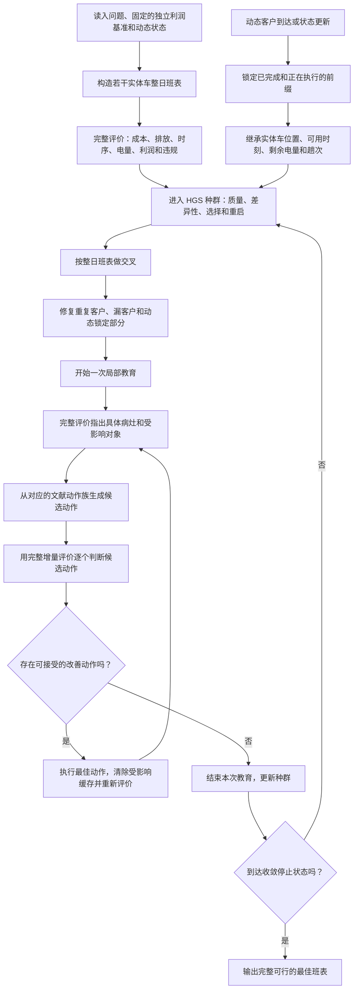

# 候选算法设计稿：供用户批准后再施工

状态：用户已批准继续施工，静态可运行原型已经完成，并经 Claude Opus 5 顾问与 Codex Luna Max 监督复核后获准进入技术试跑。正式算法比较、统一算例、三大实验和论文回填仍未开始。

日期：2026-08-06

变更记录：v2 2026-08-07——登记用户原话“批准1”，并继承用户随后对封存范围的明确裁决：只保留重要、不可替代和本轮直接相关的材料，不复制无用缓存与可重建环境。

变更记录：v3 2026-08-07——登记后续施工收口：种群、选择、交叉、修复、教育、完整评价、真实入群、运行轨迹和有类型终止已在隔离原型中接通，29 项测试及一项独立完整循环复验通过。原第六节的压力反馈当前只保留为离线诊断，不进入主运行链，也不承担创新主张。原型只保存动态锁定承诺，完整动态状态须在动态需求实验前另行接入。P20、真值哨兵的正式使用方式和算法主张大小仍由用户决定。

## 一、先说结论

这次不再做“三视角”、SP 拼接或开源算法外面套一层包装。候选算法暂称“实体车整日班表 HGS”，英文工作名暂写 Duty-HGS。这个名字只是方便讨论，不是论文定名。

它不改用户的研究问题，也不改已经存在的模型约束。最核心的变化，是把搜索对象从“若干条彼此独立的路线”改成“每辆实体车一整天的工作班表”：一辆车当天跑几趟、每趟服务谁、什么时候充电、从哪个车场出发、在动态事件发生后哪些部分已经锁死，全部放在同一个个体里。完整评价器不再只在搜索结束后给候选判分，而是进入每次候选动作的接受判断，并把具体病灶返回给下一步搜索。

这条路线值得进入隔离施工，但现在不能把它写成已经成立的算法创新。原因很直白：HGS、整日车链、非线性充电标签、固定路线上的充电优化、子问题反馈等单项都能在文献中找到前人。当前真正可能形成项目特色的地方，是“整日班表作为遗传个体和评价单位”，以及同一个搜索对象同时承载时变碳强度、混合车队、动态锁定、多车场协同和利润参与条件。它能不能上升为算法贡献，必须由施工后的对照结果决定。

我的判断分四层：把它做成正确、能稳定运行的求解器，可能性较大；在结构丰富的私有算例上优于充分收敛的 PyVRP 母体，可能性中等偏上；在尚未确定的公开富问题算例上击败已发表强对手，可能性中等；仅凭当前设计就证明一项独立、明确的新算法贡献，可能性还只是中等偏低。最后一层不能靠措辞补救，只能靠公平对照和消融结果提高。

## 二、这次改的是算法，不是建模

用户的研究问题保持不变：主要观察时变碳强度、混合车队和动态需求；多车场、多趟车、非线性充电、车场协同配送和车场利益公平分配作为重要基础共同进入完整问题。后五项不因篇幅有限而从模型或求解器中消失，只是不各自另开一组独立大实验。

现有 Solution 已经能记录路线、车型、所属车场、充电动作和跨场服务，证据见 solver/src/setp_solver/solution.py 第 28–46、77–87 行。现有 exact_china81_score 会重建实体车的多趟关系，再经过完整检查器和完整成本评价，证据见 solver/src/setp_solver/china81_completion.py 第 140–196 行。现有动态状态也已经保存实体车编号、车型、所属车场、可用时刻、剩余电量和下一趟编号，证据见 solver/src/setp_solver/search/dynamic_multitrip_schedule.py 第 67–89 行。因此本方案是在既有模型和数据结构上重做搜索表达与反馈接线，不是另造问题。

公平基础沿用 v2 已有定义：车场利润等于前期累计利润加服务收入减归属成本，参与条件为各车场利润不低于 theta 乘独立经营利润。代码证据见 solver/src/setp_solver/profit.py 第 64–81、203–213 行和 solver/src/setp_solver/check.py 第 54–67、1241–1266 行。本设计不增加自由转账变量，不混入事后 Shapley 分账，也不把硬参与条件偷偷改成软目标。

SP 的去留仍是 P21 未决事项。本设计既不把 SP 写进主算法，也不宣布它已经退役；主算法不依赖 SP，等用户将来单独决定 P21。

## 三、这次必须避开的旧坑

第一，不能再用预算差制造领先。旧 MV-HGS-SP 在表面上领先约 1.2411%，但约 92% 可由预算差解释；另一次预算曲线表明，2000 次迭代只吃到最终改善的约 55.3%，20000 次约 56.4%，需要约 20 万至 35 万次才进入收敛区。证据汇总在 docs/handoff/t0_delta_20260806_evening_before_codex_takeover.md 第五节。以后母体必须直接用 PyVRP 0.12.2 HGS 跑到不再改善，不能仍拿默认小预算当对手。

第二，不能把完整评价留到末尾。当前路线骨架补全器只接收客户分组、访问顺序和所属车场，随后才构造全燃油车基线并尝试电动车变体，证据见 solver/src/setp_solver/china81_completion.py 第 330–344 行。历史测量中 70 个候选有 65 个被完整模型拒绝，SP 对最终解贡献为 0；这说明只在末端“补全—打回”会浪费搜索，但不等于模型错了。证据同样见最新增量文档第五节。

第三，不能再做没有作用通道的引导。旧双重引导曾把一项常数加到所有候选上，目标排序完全没变；SPARC 三层方案则没有回答“为什么不让 HGS 多跑一会儿”。本次每一种反馈都必须能落到具体实体车、具体趟次、具体客户、具体充电会话或具体车场利润缺口，找不到对象的反馈不进入动作生成。

第四，不能把已有模块重新命名成创新。PyVRP 0.12.2 官方版本页已经明确列出“沿途回到补货车场”的多趟能力，0.12.0 同代 API 也公开给出 reload_depots 和 max_reloads；整日车链与趟间非线性充电见 Diefenbach et al. (2023) 第 828–829、846 页；固定路线非线性充电优化见 Froger et al. (2019) 作者稿第 3–5、15–18 页；车辆类型、路线和充电联合求解见 Hiermann et al. (2016) 作者稿第 3–6 页；按客户排列同时分割路线并插入充电也已见 Uroić and Đurasević (2026) 第 3–8 页。因此这些只能当依据，不能单独当创新主张。

第五，不能让代理目标继续骗搜索。现有 EV 弧代理在选择碳强度时取全时段最小值，是乐观下界；但路线搜索层的燃油车弧和电动车弧都已经含碳成本，不能再误说“路线搜索没有碳”。证据见 baselines/algorithm_prototypes/china81_mechanism_hybrid_20260720/pyvrp_adapter.py 第 966–995 行。新算法必须以实际选中的时间段、充电量和非线性充电时长进入完整评价。

## 四、候选算法的整体结构

这里有两条不能混淆。HGS 负责种群、多样性、父代选择、交叉、罚值控制和重启，是成熟搜索骨架；项目特化部分负责整日班表表达、完整评价、病灶定位和能直接作用于病灶的动作。论文若最终主张算法贡献，只能主张后者经实验证明有效的部分，不能把复制来的 HGS 骨架算成自己的贡献。

## 五、最关键、也最大胆的设计

最大胆的设计不是新增一个算子，而是换掉搜索的基本对象。

传统路线个体回答“这些客户按什么顺序走”；本方案的整日班表个体回答“这辆实体车今天按什么顺序完成哪些趟次，每趟服务谁，趟间在哪里、何时、充多少电，动态更新后哪些动作已经不可改”。这样，多趟车固定成本、电量跨趟连续、非线性充电、车场利润归属和动态锁定不再等到最后才重建。

它的来源不是拍脑袋拼接。Vidal et al. (2014) 作者稿第 6、13–15 页说明多属性路线问题需要组件化评价与 HGS/Split 结构；Hiermann et al. (2016) 把车型、路线和充电共同求解；Diefenbach et al. (2023) 直接研究同一辆电动车的趟链和趟间非线性充电；Froger et al. (2019) 证明固定路线的充电决策本身就可能明显改写已有最好解；Soriano et al. (2023) 第 4 页式 (15)–(16) 证明车场利润公平可以在插入动作阶段改变客户归属。本方案把这些文献所支持的作用通道放到同一个“实体车整日班表”对象上。

但边界也要说清：上述文献已经覆盖了各个零件。当前尚未找到一篇同时把实体车整日班表作为 HGS 遗传个体，并在同一对象上处理时变碳、混合车队、动态锁定和车场利润参与条件的论文。这只能说明组合值得试，不能仅凭“没搜到完全一样的论文”就宣布原创。

## 六、病灶怎样真正影响下一步搜索

完整评价不再只返回一个总成本。候选接口 PressureSignal 还要说明：问题发生在哪个实体车班表、哪一趟、哪个客户、哪个充电会话、哪个时间段或哪个车场，以及重新变好最直接需要改变什么对象。

容量、时间窗或趟次衔接有问题时，候选动作来自 relocate、swap、2-opt、跨趟移动、开关趟次和整段交换；车型或电量有问题时，候选动作来自车型更换、客户跨班表移动、充电站/时间/充电量调整；时变碳或电价过高时，只在真实可行时间窗内重排充电；车场利润不足时，按照 Soriano 式作用通道，优先检查能改变服务车场和客户归属的跨场插入、交换和整段转移；动态状态下，只允许修改未执行后缀。

本设计不把不同病灶凭空加权成一个“综合压力分”。每个有效病灶分别生成候选动作，最终仍由同一个完整增量评价器比较这些动作对完整目标和可行性的真实影响。这样可以避免再造一套没有文献依据的权重或阈值。

若一个反馈不能映射到实际候选动作，它只记录为诊断，不得包装成算法组件。若压力动作与随机打乱后的同数量动作没有区别，则压力反馈不成立；这不是停止整项研究的自造门槛，而是对“反馈是否真的提供搜索信息”的直接对照。

## 七、伪代码

    输入：问题数据 I，时变电价与碳强度 G，非线性充电曲线 C，
          固定的独立经营利润基准 Pi0，可选动态状态 S，随机种子 seed
    输出：完整可行的最佳实体车整日班表 x_best

    1.  建立 InstanceContext，统一时间轴、单位、精度、参数签名和 Pi0。
    2.  若为动态阶段，读入 S，并锁定已经完成和正在执行的部分；
        不从零重新推导车辆位置、电量或趟次。
    3.  用构造法、合法旧解和必要的随机扰动生成初始 DutyIndividual 种群 P。
    4.  对 P 中每个个体：
          4.1 把每辆实体车的多趟路线和充电会话解码成 Solution；
          4.2 用 FullEvaluate 计算完整成本、排放、资源连续性、车场利润和违规；
          4.3 保存能落到具体对象的 PressureSignal；
          4.4 更新 HGS 的质量、多样性和可行性记录。
    5.  在尚未达到批准后的收敛停止口径时循环：
          5.1 按 HGS 的质量与多样性规则选择父代 p1、p2；
          5.2 用 duty-level SREX 交换完整班表或班表片段，得到子代 c；
          5.3 修复重复客户、漏客户、实体车编号冲突和动态锁定冲突；
          5.4 对 c 做完整评价；
          5.5 开始一次局部教育：
                a. 从当前 PressureSignal 为每类真实病灶生成候选动作；
                b. 同时保留通用局部动作，避免错误反馈把搜索锁死；
                c. 对每个候选动作，只重算受影响班表、充电会话和车场利润；
                d. 用相同完整评价口径比较候选动作；
                e. 接受本轮最佳的合法改善动作；
                f. 清除受影响缓存，做一次完整复算并刷新 PressureSignal；
                g. 若不存在合法改善动作，结束本次教育。
          5.6 把 c 放入相应种群，更新多样性、罚值、精英和重复个体记录；
          5.7 长期没有改善时按 HGS 既有控制逻辑重启，但保留完整可行精英。
    6.  若动态需求到达：
          6.1 生成当前执行证书并冻结不可修改前缀；
          6.2 继承每辆实体车的当前位置、可用时刻、剩余电量和下一趟编号；
          6.3 删除或修复与新状态冲突的种群成员；
          6.4 只对可修改后缀继续第 5 步。
    7.  返回完整检查器确认无违规、利润参与条件满足的最低成本解 x_best。

伪代码中的“收敛停止口径”仍受 P20 约束，本稿不替用户新增数值阈值。现有证据只说明 20 万至 35 万次是观察到的收敛量级，不等于已经批准的统一停止规则。

## 八、接口与变量对接表

| 接口 | 必须包含的字段 | 直接接到哪里 | 必须守住的关系 |
|---|---|---|---|
| InstanceContext | 车场、客户、车型、距离/时间、价格、时变碳强度、充电曲线、theta、固定 Pi0、时间范围、seed、配置哈希 | 现有 instance、prices、time profile、carbon profile 和 bundle | 时间单位、碳单位、货币单位、舍入方式全程一致；Pi0 不随合作搜索漂移 |
| DutyIndividual | duties、未服务客户、完整目标分解、违规、HGS 适应度/多样性、压力缓存、版本、来源 | 新的主算法内部个体 | 每个客户恰好出现一次；一份 duty 对应一辆实体车；动态锁定部分不可改 |
| Duty | physical_vehicle_id、vehicle_type、home_depot_id、按顺序排列的 trips、趟间 charging sessions | 转成现有 Route 和 ChargingAction | 同一实体车跨趟时间、电量和固定成本连续；不能把每趟当成新车 |
| Trip | trip_index、客户顺序、出发/返回车场、出发和结束时刻、载重、电量轨迹 | 现有 Route；完整评价时进入多趟调度器 | 客户顺序、趟次、所属车场和实体车编号不得错接 |
| ChargingSession | station_id、开始/结束电量、开始时刻、持续时间、曲线编号 | 现有 ChargingAction | 使用实际时段碳强度和电价；持续时间由非线性曲线算，不用线性近似偷换 |
| DynamicState | epoch、锁定前缀、在途位置/预计到达、DynamicAssetState、已出现和已承诺客户 | 现有 CertificateCut 和 DynamicAssetState | 不从时刻 0 重算；车场不退出；两臂看到相同到达信息和需求 |
| FullEvaluation | 总成本与分项、排放分项、资源违规、各车场利润、参与余量、完整/增量来源、调用计数 | exact_china81_score、check_solution、evaluate、calculate_depot_profits | 增量结果必须能被完整复算逐项对上；最终解只认完整复算 |
| PressureSignal | scope、对象编号、资源种类、原始缺口/边际代价、所在时段、可作用对象、缓存版本 | 新的候选动作生成器 | 每条压力必须能落到具体动作；动作后立即失效并重算 |
| SearchAccounting | seed、迭代、完整/增量评价次数、各动作提出/接受数、压力来源、重启、方案臂、配置哈希 | 新的留痕层 | 不把不同算法含义不同的“迭代一次”直接当等算力；同时保留评价次数和墙钟记录 |

现有 solution.py、china81_completion.py、profit.py、check.py 和 dynamic_multitrip_schedule.py 是对接对象，不在本次设计阶段修改。正式施工时先写适配层和等价测试，再优化速度，不能一上来重写完整评价器。

## 九、哪些能从 PyVRP 拿，哪些必须自己写

按照用户授权和三轮 Opus 讨论，最初设想是直接复制 PyVRP 0.12.2 的 Python 控制模块。最后一轮本机接口核验发现，这个说法必须收窄：GeneticAlgorithm.py 第 64–219 行的遗传循环、重启位置和“交叉—教育—入群”顺序是 Python 层，可以按 MIT 许可证复制剥离；但 Population.py 第 5、24–33 行实际调用编译扩展中的 PopulationParams 和 SubPopulation，PenaltyManager.py 第 9–10 行也绑定编译扩展中的 CostEvaluator、ProblemData 和 Solution。它们不能直接接收新的 DutyIndividual。直接复制文件名不等于接口就能用。

因此，候选施工改为：复制并剥离可泛化的 Python 遗传循环、统计结构和控制顺序，保留来源、版本、许可证及逐文件修改说明；种群、可行/不可行子群、质量—多样性排序、父代选择和罚值更新则依据 Vidal 的 HGS 论文与 PyVRP 公开源码，在项目内重写成能接收 DutyIndividual 的小型实现。默认参数也不自动照抄成项目决定，后续如需使用，必须说明文献或母体来源。安装环境中的 PyVRP 保持原样，只作为母体基线。

实体车整日班表个体、duty-level SREX、局部动作、完整增量评价、压力映射、缓存失效、动态前缀锁定和利润参与检查必须围绕本项目的数据结构自己实现。PyVRP 的 C++ 局部搜索无法看见完整班表和完整评价时，不进入主算法接受链；最多只能在以后经单独核验后作为候选动作生成器，最终是否接受仍由完整评价决定。

这样做的好处是成熟 HGS 结构有明确来源，但主算法不会假装一个不兼容的二进制接口已经接通；真正承担研究主张的部分也能单独查看和验证。代价是 Python 热路径可能慢于 PyVRP 的 C++ 内核，公开算例上的墙钟表现存在真实风险。若后续需要加速，也应先证明算法逻辑有效，再只加速已经确认的热点。

## 十、为什么它有机会打赢“让母体多跑一会儿”

充分收敛的 PyVRP HGS 是必须打的对手，但“多跑”只能更充分地优化它看见的目标。若母体仍把实体车多趟关系、实际充电时段、非线性充电、动态继承或车场利润放在搜索后补全，它跑得再久也可能在错误代理目标上收敛。本方案的机会正来自把完整问题放进每次动作判断，而不是来自给母体更少预算。

为了不把母体故意做弱，正式比较至少保留以下四种同源方案：

| 方案 | 做什么 | 回答的问题 |
|---|---|---|
| 母体强对照 | PyVRP 0.12.2 HGS 跑到不再改善，再接与主算法相同的完整补全/修复和最终评价 | 单纯让母体充分收敛能做到什么 |
| 完整评价对照 | 使用同一 HGS 控制层和整日班表，但候选动作不看病灶，只用通用动作或等量随机顺序 | 只把完整模型放进搜索有没有价值 |
| 完整候选算法 | 完整评价、整日班表、可定位病灶和对应动作全部开启 | 整体是否优于母体和无反馈版本 |
| 打乱反馈对照 | 完整评价次数、动作数量和算力与候选算法相同，但把病灶与对象映射随机打乱 | 真正有用的是问题信息，还是仅仅多算了几次 |

这四种不是新增论文大实验，而是证明主算法有没有独立作用的最小算法核验。比较时必须同时记录完整评价次数、增量评价次数、迭代、墙钟和最终完整目标；不能用一个含义不同的“迭代次数”假装等算力。公开强对手还要按同一公开算例、同一数据版本和论文原口径复现或引用。

## 十一、施工前后怎样防止再踩坑

用户批准后，第一件事不是大规模跑实验，而是在冻结副本上做最小施工。先用完整重算写出唯一真值，再做增量评价；每一种增量更新都必须逐项等于完整重算。再检查整日班表和现有 Solution 双向转换，确保客户、实体车、车型、车场、趟次、充电会话和动态锁定一个都不丢。

随后才做很小的反馈真实性检查：同一批真实候选动作，分别看压力顺序、随机顺序和完整真值顺序；保留整条排序曲线，不设代理自造的合格百分比。若压力顺序没有提供可重复的信息，就回到病灶定位或动作接口，而不是换算例、挑种子或改统计口径。

再往后才进入算法对照。先让母体真正收敛，再比较完整评价对照、完整候选算法和打乱反馈对照。只有这一步确认候选算法有独立改善，才值得扩大到公开算例和私有三大实验；否则应把失败留痕后交用户决定是否重设算法，而不是靠模型、机制或论文叙事救场。

本轮之后不新开额外合同、门禁、审计器或实验计划。用户若批准，授权范围只到隔离副本中的接口、等价测试和候选算法施工；统一算例、正式预算、正式实验和论文回填仍须另行逐项批准。

## 十二、需要用户拍板的三个选项

选项一：批准本设计进入隔离施工。施工只做接口、整日班表个体、完整/增量评价等价、HGS 控制层剥离和最小反馈核验；完成后回来汇报，由用户决定是否进入正式算法比较。这是代理当前倾向，因为代价可控、可回滚，而且能最快知道核心反馈到底有没有信息。

选项二：认可总体方向，但暂不写代码，先继续寻找比“整日班表加完整反馈”更强、更清楚的原创核心。这样能降低做出“好用但不新”的风险，代价是算法与后续实验继续等待，而且现有文献已经覆盖许多自然想到的组合。

选项三：不批准这条候选路线，重新讨论另一套算法。这样不会继续投入施工成本，但需要重新从关闭路线台账和文献中找一个既有明确作用通道、又不同于母体的核心。

无论选哪一个，SP 的 P21 仍然不随本次拍板自动改变；P20 的精确收敛口径、公开统一算例和正式实验也不随本次拍板自动生效。

## 十三、文献依据与边界

1. Vidal et al. (2012), A hybrid genetic algorithm for multidepot and periodic vehicle routing problems, Operations Research 60(3), 作者稿第 8–10、14–16 页：HGS 种群、多样性、可行/不可行子群和搜索控制。
2. Vidal et al. (2014), A unified solution framework for multi-attribute vehicle routing problems, European Journal of Operational Research 234, 作者稿第 6、13–15 页：组件化路线评价与 HGS/Split 框架。
3. Hiermann et al. (2016), The Electric Fleet Size and Mix Vehicle Routing Problem with Time Windows and Recharging Stations, EJOR 252, 作者稿第 3–6 页：车型、路线、充电和局部搜索的联合处理。
4. Froger et al. (2019), Improved formulations and algorithmic components for the electric vehicle routing problem with nonlinear charging functions, Computers & Operations Research 104, 作者稿第 3–5、15–18 页：固定路线的非线性充电优化与标签求解。
5. Zhen et al. (2020), The multi-depot multi-trip vehicle routing problem with time windows and release dates, Transportation Research Part E 135, 第 3–13 页：多车场、多趟和时序调度。
6. Diefenbach et al. (2023), Assigning electric vehicles to pre-planned routes with nonlinear charging and capacitated charging stations, EJOR 306, 第 828–829、846 页：同一实体车趟链和趟间非线性充电。
7. Soriano et al. (2023), The multi-depot vehicle routing problem with profit fairness, International Journal of Production Economics 255:108669，第 4 页式 (15)–(16)、第 8 页图 4/表 3、第 11 页：公平修正进入插入搜索并改变客户分配。
8. Wang et al. (2026), Electric vehicle routing with heterogeneous charging stations, Computers & Operations Research 189:107374：固定路线时间调度子问题嵌入迭代搜索，并联合考虑非线性充电、分时电价和时变等待。因此“分时价格加非线性充电子问题”不能单独算本项目创新。
9. Uroić and Đurasević (2026), Joint route splitting and charging insertion for electric vehicle routing, arXiv:2605.26816，第 3–8 页：固定客户排列上的路线分割和充电标签；该稿尚属预印本，用来提示撞车风险，不作为唯一背书。

## 十四、AGENTS.md 第八节九条自检

1. 每个 FACT 是否都指到了文件行号 / 产物哈希 / 论文页码？——列出无法指到出处的那几条。

实际答案：正文中关于现有接口、旧失败和当前缺陷的事实均给出源码行号或最新增量文档位置；文献事实均给出论文页码。关于“公开算例获胜概率中等”“算法创新概率中等偏低”是代理判断，已明确写成判断，不标 FACT。P20 尚无用户批准的精确停止数值，因此没有把 20 万至 35 万次写成正式阈值。

2. 有没有把自己的建议或担忧写成“已决”或“状态”？——逐个复查你写的每张表。

实际答案：没有。文件状态明确写为“代理方案，等待用户批准”；模块剥离、整日班表和四种对照均是候选设计。P19 只按用户已决边界继承，P21 明确保留未决，创新性担忧只写成风险判断。

3. 改动范围有没有超出任务文本？——超出的每一处单独列出并说明理由。

实际答案：没有。只新增本设计稿，在 HANDOFF.md 与 docs/handoff/memory/MEMORY.md 追加一条状态记录，并按仓库修改纪律生成这两份记录文件的任务前备份；未改算法、模型、论文、实验数据或参数，未跑求解器、测试和实验。

4. 有没有碰受保护文件（cost.py / check.py / search/evaluation.py）？——报改动前后哈希；没碰就写“未碰，哈希与任务开始时一致”。

实际答案：未碰，哈希与任务开始时一致。cost.py 为 e7ea406da87a3172cd1ff7dc87fe7def536e74f197f6c67b29da2394fe42b00d；check.py 为 1cdb6236a662eec7363dfdf99c0c0df287b32aeffbc7bd48572320696c0b1072；search/evaluation.py 为 c7215263c39d1d5a1429b41ca8ac40d950dbdf2bdc288337e56fbe9733406fc3。

5. 待决事项是否转成了 2–4 个具体候选并写清代价？——列出你留给用户的选项。

实际答案：是。本稿给出三个选项：批准进入隔离施工；认可方向但先补更强原创核心；不批准并重找算法。每个选项均写明收益和代价。P21 没有借本任务重新打开，仍保持原四候选未决状态。

6. 有没有用自造词或内部任务号跟用户说话？

实际答案：对外正文只使用“实体车整日班表 HGS”这一临时描述性名称，并当场解释；没有使用内部任务号。P19、P20、P21 只在必须说明既有决策边界时出现，并用大白话解释其含义。

7. 失败、跳过、超时、异常结果有没有如实保留？——列出来，不许省略。

实际答案：已保留旧 MV-HGS-SP 领先主要由预算差解释、低预算饥饿、70 个候选中 65 个被完整模型拒绝、SP 零贡献、常数引导失效、SPARC 无法回答强母体对照、EV 碳强度乐观下界等失败和异常。本轮没有求解、测试或实验，因此没有新的跳过、超时或异常运行。

8. 四件套齐了吗？——逐个报文件名（无实验则写“本任务不产生实验包”）。

实际答案：本任务不产生实验包；没有 metadata.json、raw_runs.csv、decision.json、artifact_hashes.json，因为本轮没有启动实验。设计报告为 docs/handoff/algorithm_design_for_user_approval_20260806.md。

9. HANDOFF.md 变更日志和 docs/handoff/memory/ 同步了吗？——报写入位置。

实际答案：已同步。HANDOFF.md 追加“2026-08-06 晚（算法设计待批）”记录；docs/handoff/memory/MEMORY.md 追加“2026-08-06 晚 — 实体车整日班表 HGS 候选设计待批”索引。两处都明确写明尚未获批、未施工、未跑实验。
