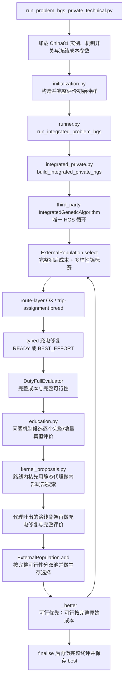
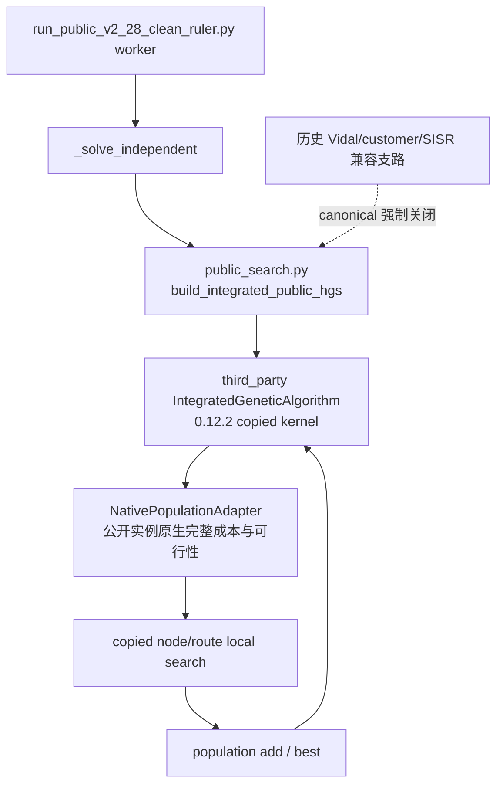

# ReSETP 算法管线唯一地图（2026-08-17）

`MAP_CURRENT_VERIFIED` — 本文件是 Round 12 清理后的唯一算法管线事实源。以后若真实入口、调用关系或模块身份改变，只更新本文件，不另建“最新版管线图”。

## 1. 状态口径

- `ACTIVE`：现行 canonical 入口可达且会执行。
- `ACTIVE_DESIGN_GAP`：现行入口可达，但已由代码和运行证据证明与既定算法要求之间仍有结构断口。
- `RETIRED_COMPAT`：canonical 入口不执行；旧测试或历史 helper 仍引用，暂留只为兼容和复核，不能冒充活跃贡献。
- `QUARANTINED`：已按原仓库路径移入 `_quarantine_20260817/`，可逆保存，生产 import 图不可达。
- `PROTECTED`：活跃且冻结，本轮只核哈希。

这里的“完整评价”是同一候选的完整总成本、全部硬约束和量化缺口；“入群”是 copied HGS 的可行／不可行双池，不是教育器内部的一次局部接受。

## 2. 私有算例：现行唯一执行链

### 2.1 P31“完整一本账”逐环核验

| 环节 | 真实接线 | 当前判定 |
|---|---|---|
| 初始化 | 初始 `DutyIndividual` 先由 `DutyFullEvaluator` 完整评价，再交给内核 | `FACT / CONNECTED` |
| 问题机制候选接受 | 教育器用完整 `total_cost`、完整违规和罚后成本比较 | `FACT / CONNECTED` |
| 入群 | `ExternalPopulation.add` 用完整 `feasible` 分可行／不可行池 | `FACT / CONNECTED` |
| 生存 | 完整罚后成本形成成本排名，再与多样性组成 copied biased fitness | `FACT / CONNECTED` |
| 父代选择 | 同一 biased fitness 做锦标赛；不是只看成本，但成本是真实完整账 | `FACT / CONNECTED` |
| 全局 best | 可行严格优于不可行；可行按完整 `total_cost`，不可行按完整罚后成本 | `FACT / CONNECTED` |
| 路线邻域内部搜索 | `kernel_proposals.py:397-456` 明确丢弃传入的 `evaluation`；native local search 使用静态路线代理 | `FACT / ACTIVE_DESIGN_GAP` |
| 路线代理内容 | `kernel_proposals.py:819-855` 写入边距离、时间和推进成本代理，不能表示真实跨趟时钟、SOC 与非线性充电 | `FACT / ACTIVE_DESIGN_GAP` |

`CORRECTION`：旧地图把 P31 整体写成已接通，过度概括了事实。准确结论是：完整账已经控制候选接受、双池、生存、父代和 best，但没有控制路线 local search 内部的大量邻域筛选。外层真值只能复核代理最终吐出的少数骨架，不能找回已被代理提前排除的移动。这是本轮查出的设计层根洞，尚未修复。

### 2.2 P31 成熟修法与当前接口边界

Froger et al.（2022）§4.1.1 与 Appendix C Algorithms 5–6 给出了最贴合本项目既定语义的结构：先用可证明的安全下界排除不可能改进的动作，再对所有幸存动作做受影响路线的 true evaluation，由真值决定实际执行哪个动作。Goeke & Schneider（2015）§5.4.2 的 top-λ + exact shortlist 是成熟的降本折中，但会漏掉代理排位靠后的真值改进；其 λ=50 不能当作本项目参数。Hiermann et al.（2016）§4.1、§4.4 和 Froger et al.（2019）§5.3–5.4 分别提供可拼接资源筛选与固定路线非线性充电 oracle，均不能单独表示本项目完整人民币账和跨趟共享资源。

现行 copied C++ `LocalSearch` 见到代理改进便立即应用，pybind 仅暴露整段 `search/intensify`，没有“只枚举、不执行”的候选出口；而 Python 下游的 `education.evaluate_move` 与 `DutyIncrementalEvaluator` 已能对粒度正确的 `DutyMove` 做充电修复、增量完整评价和冷重算核对。故待修点精确为 native 候选收集接口。由于 `third_party` 本轮冻结，未静默修改；用 Python 重写全部邻域又会改变算法血统，也未擅自选择。

### 2.3 P81 近可行充电：已接通

`CONNECTED`：不修改冻结 `charging.py`，复用既有 `repair_changed_duties_outcome()`；静态初始化、education、route-layer crossover 和 trip-assignment fallback 现在都把 `READY` 与 `BEST_EFFORT` 送入完整评价。`FLEET_SLOT`、`INTERFACE` 等结构错误仍拒绝，动态链保持旧语义。

- 生产 200 圈记录 `charging_gap_a2_evaluations=648`，不再是旧链的 0。
- 三个含 `CHARGING_ENERGY_GAP + CHARGING_WINDOW_GAP` 的 EV 候选真实进入 `ExternalPopulation.infeasible`，均被保留到终池。
- 全局 best 仍为完整可行、0 违规，证明这是“保留探索材料”，不是放宽终解标准。
- 原 charging-gap 测试与新生产接线测试合计 `13 passed`；相关扩大验证由施工代理完成 `43/43 passed`。

### 2.4 EV 生存与回退：已追到去向

同实例、seed 11、全开静态设置的 `1 → 10 → 100 → 200` 短追踪给出以下事实：

| 搜索圈数 | 最好成本 | best 服务 EV 客户 | 终池含 EV 成员 | 换型接受 |
|---:|---:|---:|---:|---:|
| 1 | 4202.811850785510 | 6 | 2 | 0 |
| 10 | 4202.811850785510 | 6 | 2 | 0 |
| 100 | 3917.086383873550 | 0 | 13 | 4，全部不可行 |
| 200（P81 接通后） | 3534.599543302979 | 0 | 37 | 32：27 不可行、5 可行 |

首个被接受的换型候选含 10 个 EV 客户、1 个 `CAPACITY` 违规：它进入不可行池，被保留，两次被选作第一父代，并一直留在最终种群；它从未成为 best。五个完整可行的换型候选也全部入可行池，但没有一个成为 best。终池仍有 37 个 EV 成员，其中 18 个可行；最便宜的可行 EV 解为 3959.556226371292，高于 0-EV best 3534.599543302979。

200 次父代选择中，第一父代含 EV 44 次、第二父代含 EV 41 次；“第一父代 0-EV／第二父代 EV”为 29 次，反向为 32 次，两边都含 EV 为 12 次。路线层 OX 的车型、车场和物理槽提示来自有序第一父代，第二父代主要贡献客户次序。第 20 圈已经观测到：第一父代 0-EV、第二父代为当时 6-EV-customer 可行 best，子代沿第一父代成为 0-EV，并以更低完整成本取代 best。

`INFERENCE`：EV 没有在入群门口被全部丢掉；真正的压力同时来自“多数换型先落不可行池”和“第一父代主导车型提示，0-EV 子代更容易沿当前成本地形改进 best”。这不替用户决定三臂语义。

## 3. 公开算例：清理后的 canonical 链

`CONNECTED / P42`：canonical public runner 现在显式传 `enable_vidal_compound=False`、`enable_customer_relocation=False`；worker 元数据固定记录 P42 退役，命令构造器若试图重开会直接报错。PR11A 公开验收中，route rotation、customer relocation 的所有调用与接受计数均为 0；SISR 默认也为 0。

历史实现仍是 `RETIRED_COMPAT`，因为冻结 197 回归清单仍直接测试这些旧接口。它们不属于当前公开生产算法，也不能作为论文贡献或正式预算消费者。

## 4. 文件与模块身份

| 路径或模块 | 清理后身份 | 依据与处置 |
|---|---|---|
| `solver/scripts/run_problem_hgs_private_technical.py` | `ACTIVE` | 私有 canonical 入口 |
| `problem_hgs/{runner,initialization,integrated_private,education,evaluation}.py` | `ACTIVE` | 私有构造、HGS 适配、完整评价与教育主链 |
| `problem_hgs/kernel_proposals.py` | `ACTIVE_DESIGN_GAP` | 路线 native local search 活跃，但内部仍用静态代理 |
| `problem_hgs/{hybrid_decoder,fleet_registry,contracts,model,operators,proposals}.py` | `ACTIVE` | 解码、物理槽与候选契约 |
| `problem_hgs/{bi_objective_population,population}.py` | `ACTIVE / MIXED` | `ExternalPopulation` 工厂、罚系数和参数活跃；旧 `DutyPopulation` 仅历史/预检，不是生产种群 authority |
| `problem_hgs/{crossover,repair,dcrex}.py` | `ACTIVE_LIBRARY / MIXED` | trip fallback 与 controller/helper 仍被活链复用；旧 DCREX 外循环本身退役，不能整文件误删 |
| `problem_hgs/{schedule_oracle,schedule_capture}.py` | `ACTIVE` | education/integrated private 仍直接引用 |
| `problem_hgs/{dynamic,dynamic_insertion,mechanical_baseline}.py` | `ACTIVE_OTHER_ENTRY` | 动态管线活跃，不属于本轮两条静态图但不能删除 |
| `problem_hgs/frvcpy_adapter.py`、`readiness.py` | `ACTIVE_CONDITIONAL` | CLI/scout 条件路径可达 |
| `problem_hgs/charging.py` | `PROTECTED` | typed outcome 所在；本轮零修改 |
| `problem_hgs/public_search.py` | `ACTIVE` | 公开 copied-kernel builder；canonical 退役支路已强制关闭 |
| `problem_hgs/{vidal_compound,public_assignment,sisr,public}.py` | `RETIRED_COMPAT` | 仅旧测试/helper 可达，canonical 不执行 |
| `problem_hgs/{feedback,independent}.py` | `QUARANTINED` | 仓库 Python import 图零入边，按原路径移入隔离区 |
| `solver/src/setp_solver/algorithms/duty_hgs/` | `QUARANTINED` | 旧重复 Duty-HGS 外循环整包，连 3 个入口和 6 个专项测试成组隔离 |
| 六个旧 public component/scout launcher | `QUARANTINED` | 只服务 P42/P82 已关闭公开部件 |
| `third_party/setp_hgs_kernel/` | `PROTECTED` | 两条链共用的 copied HGS 0.12.2 内核 |
| `solver/src/setp_solver/{cost,check}.py`、`search/evaluation.py` | `PROTECTED` | 完整评价冻结文件 |

## 5. import 图与清理边界

- 只有同时满足“canonical 不可达、仓库 Python import 零入边、不是冻结/证据文件”的源码才直接隔离。
- 动态 import、包再导出、CLI/环境变量条件路径和人工脚本入口都已纳入判断；不能只凭文件名或一次 `rg` 宣布孤儿。
- 不能整文件隔离 `dcrex.py`、`schedule_oracle.py`、`population.py` 或 `resetp_alns/`：现行链仍复用其中小部件。
- `_quarantine_20260817/` 保持原仓库相对路径；永久删除须等用户检查后第二次明确确认。

## 6. 清理后验收

| 验收 | 结果 |
|---|---|
| 冻结旧回归 | `197 passed, 2 deselected`；两个 deselected 是今天另件新增的初始化闭包测试，不冒充旧 197 |
| P81 专项 | `13 passed`；静态 typed gap 已进真实不可行池 |
| 公开关停专项 | `4 passed` |
| 私有静态 200 圈 | `TECHNICAL_TRIAL_COMPLETE`；50/50 客户，13264/13264 kg，可行、0 违规；成本 3534.599543302979；旧 oracle 3532.2672464613343 因 P81 生产路径真实改变而不再逐位相等，差 2.332296841645 |
| 公开 PR11A 单题 | `FORMAL_RUN_COMPLETE` probe；102.846 秒，360/360 客户、4806/4806 需求，31/31 路线原精度可行；退役精修 calls=0 |

五个冻结哈希在施工和验收后均为：

- `cost.py`：`13ae664bae0e9c8b5033780fbbc43cedcd43c626ac1eb23023a4a667bd2d1bbd`
- `check.py`：`1cdb6236a662eec7363dfdf99c0c0df287b32aeffbc7bd48572320696c0b1072`
- `search/evaluation.py`：`c7215263c39d1d5a1429b41ca8ac40d950dbdf2bdc288337e56fbe9733406fc3`
- `problem_hgs/charging.py`：`3a7da9df0241bed566240d9e9359be4b7dc6e0edd8a385d085ddce48482fc2a5`
- `resetp_alns/support/charging.py`：`7c2d8df0427626ef7c1ab487dbb44360ea82e07d6e9ce3b0e889502f27cfc171`

## 7. 仍未替用户决定的事

- 三臂“每臂从头重搜”还是“共享车型参考后只比充电策略”继续 `PARKED`。
- P31 路线内核应采用哪一种完整资源评价结构，需要先按既定规矩核成熟文献方法、计算代价和与 copied HGS 的接口，再把真实选项交用户；本地图只确认断口，不替用户选算法设计。
- `.git` 历史重写本轮未执行。AppleDouble 已清，剩余大头是 Git 松散对象与历史；任何 repack/迁盘/重写均另走用户授权。
