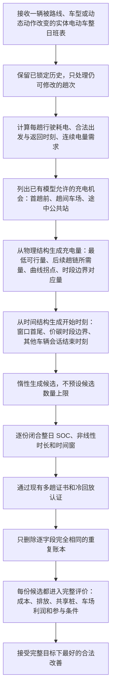

# Duty-HGS 充电搜索修订稿：供用户批准后施工

状态：`AGENT PROPOSAL — AWAITING USER APPROVAL`

日期：2026-08-08

## 一、结论先说清楚

现有 Duty-HGS 已经能运行，也能在三地区 50 客户技术探路中找到更好的完整可行班表；但它的充电动作还不是真正的搜索。当前动作只是删掉未锁定充电会话，再调用同一个确定性修复器，所以同一班表通常又得到同一份充电方案。三地区该通道分别只有 9、7、1 次真实评价，29、45、45 次没有产生变化，接受数都是 0。证据见三份 `unified_education_*50_01_20260807/raw_runs.csv` 第 2 行，以及 `duty_hgs/operators.py:253-278`、`duty_hgs/charging.py:101-167`。

Claude Opus 5 与 Codex 经过三轮正反讨论后共同支持一个最小修订：把“一辆实体电动车整日多趟的充电修复”改成“整日充电候选搜索”。它先生成多份完整可行的充电账本，再由现有完整评价器逐份判断。这样它同时做两件事：先让混合车队、路线调整和多趟重排后的电动车更容易形成可行班表；再在可行方案中根据真实电价和时变碳强度选择。它不改变用户的问题和数学模型，不新增出发时刻、等待变量、正式参数或充电曲线。

这项修订不能帮助公开 Vidal V13 MDVRPTW 算例，因为那些算例没有电动车、充电或碳强度。公开表能否打过充分收敛的 PyVRP，仍取决于路由母核，必须另做一次同算例、同口径测量，不能拿私有算例的充电效果替它过门。

## 二、用户已经明确的轻重顺序

`USER DECISION`：优先保证时变碳强度、混合车队、动态需求三大实验产生明显、直观的效应。多车场、多趟、非线性充电、协同和公平是重要基础，但只要求文献有据、实现合格、不拖后腿并尽量辅助三大实验，不为它们另开庞大工程。

`USER DECISION`：非线性充电首先是仿真真实性要求，本身不要求单独产生节能减排效应。正式曲线先追求可信、好解释；只有候选同等可信时，才比较哪一条更有利于三大实验。当前 90% 拐点没有正式车型或电池包曲线支持，不能继续冒充正式参数；80%、85% 或 93% 也不能凭常识替换。

`USER DECISION`：China81 是构造算例，允许在物理合理、文献有据并如实披露的前提下调整构造，使三大主要机制都有发挥空间。具体地区、算例、车队混合档和曲线仍未由用户选择。

## 三、为什么不是继续打磨旧充电动作

旧动作没有携带新的站点、充电量或充电时刻，只清空未锁定会话。随后 `_repair_one_ev_duty()` 仍按同一政策逐趟修复，再串起同一辆车的电量账，因此“动作不同、结果相同”是当前接口的自然结果，而不是预算不足。证据见 `duty_hgs/operators.py:253-278`、`duty_hgs/charging.py:170-315`。

技术探路还显示，混合车队、多趟、跨场和路序候选中有大量方案在充电重建阶段被拒。三轮 Opus 讨论据此更正了最初的狭窄表述：新组件不应只叫“碳感知择时”，而应是“先闭合整日可行充电账，再在多份可行账本中按真实电价和碳代价搜索”。只有返回多份真实候选、让外层完整评价裁决，才从修复器变成搜索动作。

本轮没有再围绕跨场公平扩线。珠三角 150 客户的 21 个已知降本单动作全部让一个车场受益、另一个受损，18 个还违反载重；公平通道当前绑定的是利润与容量，不是缺一个更花哨的充电动作。证据见 `cross_depot_profit_replay_prd150_20260808/raw_runs.csv` 和 `decision.json`。这项问题保留，但不阻塞三大主实验。

## 四、修订后的算法流程图



动态需求阶段采用同一价碳评分思想，但严格留在现有动态合同内：已执行历史、站点、充电量、路线和车辆都不改，只在精确动态排班已经生成的未来车场充电窗口内搜索结构时刻。这样不偷加动态公共站或主动等待变量，也不会让充电支线拖住动态主实验。

## 五、伪代码

```text
函数 生成整日充电候选(当前班表, 改动前班表, 充电政策, 完整实例, 当前个体):
    原样保留已经锁定的客户、趟次和充电会话
    对仍可修改的每一趟计算行驶耗电、合法时钟和连续电量需求
    充电机会 = 首趟前车场窗口 + 各趟间车场窗口 + 现有规则允许的公共站候选

    对每一种合法充电机会组合，按可行性优先顺序惰性展开:
        充电量候选来自:
            刚好保持整日可行的最低电量
            满足后续多趟所需的电量
            输入充电曲线的物理拐点
            使充电结束贴合价碳时段边界的电量

        若前向连续 SOC 账不闭合:
            记录失败原因，继续下一份

        开始时刻候选来自:
            合法窗口最早、最晚时刻
            窗口内的电价与碳强度时段边界
            窗口内其他车辆充电会话的结束时刻

        对每个结构时刻组装完整充电账本
        若多趟证书通过、冷回放通过且不是逐字段重复:
            立即交给现有完整评价器

    返回完整目标下最好的合法改善；若全部失败，返回逐原因失败台账
```

本设计不设能量网格、时间网格、候选数量上限或新的停止阈值。若施工后的真实分支规模证明必须截断，只能根据本算法、本算例、本机器的分支规模与收敛测量另行说明，不能先拍数字，也不能看完效果倒调。

## 六、接口和模型边界

静态 `DutyChargingSession` 已经保存趟次、站点、充电量、占用时长、开始时刻、日期偏移、充前/充后电量、曲线编号和锁定状态，见 `duty_hgs/model.py:80-103`。公共站在路线中的位置由 `DutyTrip.route_visits` 保存，转成 `Solution` 时路线和会话会原样写出，见 `duty_hgs/model.py:33-77,216-249`。因此静态整日充电搜索可以替换 `_repair_one_ev_duty()` 的内部逻辑，不需要先改问题模型。

混合车队的整日 EV/CV 任务交换已经会清空旧充电会话，并把受影响车辆交给充电重建；新组件接入后会被自动调用，见 `duty_hgs/operators.py:281-329`、`duty_hgs/education.py:50-109`。完整评价会统一处理共享充电容量、真实成本、各车场利润和参与条件，见 `duty_hgs/evaluation.py:234-387`，无需把这些全局量塞回单车班表。

下列内容明确不在本次施工内：

- 不新增显式出发时刻或主动等待变量；当前 Route 没有该字段，`multitrip_schedule.py:381-489` 只生成一个规范可行时钟。
- 不允许一趟重复访问同一个公共站；当前解模式无法区分同站的第几次访问。
- 不改变充电曲线、车场窗口、碳价、参与条件、车队混合档或动态触发规则。
- 不修改受保护的 `cost.py`、`check.py` 和 `search/evaluation.py`。
- 不引入 Wang 式慢速 MILP。现模型没有主动等待自由度，当前候选规模尚未证明需要第二套排程器；现在加入属于过度施工。

因为候选时刻会读取其他车辆的充电会话，现有单车缓存键不再完整。施工时必须把相关其他会话的时间签名纳入缓存身份，或在这一情形关闭缓存；否则可能把旧候选错误复用到新个体。这是接线正确性，不是新增研究约束。

## 七、文献依据和能主张到哪里

Froger et al. (2019) 作者稿第 16—19 页支持在固定客户顺序下选择充电站和充电量；第 24—25 页说明重新优化充电可改善部分既有最好解，并讨论把固定路线充电子问题嵌入局部搜索。这里借用的是“地点和电量作为搜索决策”的结构，不照搬其标签算法，也不声称本项目获得其精确性。

Wang, Adulyasak and Cordeau (2026) 作者稿第 11—17 页说明非线性充电与分时电价共同出现时，固定路线排程没有一般最优子结构；其快速排程用于扰动和局部搜索，慢速精细优化只用于较好解。这里借用的是“外层搜路线、内层按真实分时信号排充电”的分解思想，以及对启发式性质的诚实表述；不搬入主动等待和慢速 MILP。

本项目可以主张的候选特色很窄：在同一实体车的整日多趟共享电量账上，联合生成充电地点、充电量和合法窗口内的时刻候选，并把多份候选暴露给包含混合车队、共享资源、利润和动态状态的完整评价器。不能主张新的非线性充电模型、精确充电算法或时变碳调度理论。最终是否把它写成算法贡献，仍由开关对照和母体对比结果决定。

## 八、成功把握与剩余风险

`INFERENCE`：把它做成可靠求解组件的把握较高。现有静态字段、整日班表接口、多趟证书、完整评价和冷回放都已存在，主要工程风险是候选分支数量和缓存身份，不是模型缺口。

`INFERENCE`：让当前时变碳充电通道不再恒等、产生真实候选的把握较高；但“能产生候选”不等于“三大实验一定有明显效应”。时变碳的实际效果还受 EV 占比、可移动充电电量和地区碳曲线共同限制。

`INFERENCE`：改善混合车队动作可行性的机会真实存在，因为当前大量候选死于充电重建；改善幅度仍未知，不能预告。动态安全子集足以让动态主对照使用同一价碳评分且不改合同，但它不会获得静态完整动作的站点和电量自由度。

`UNKNOWN`：当前 Duty-HGS 的纯路由母核能否在公开 V13 算例上接近或打过充分收敛的 PyVRP。新的充电搜索对此没有帮助。最小取证是在一个 v2 同款公开算例上直接并排测量最终差距、完整评价次数和墙钟，再决定是优化母核、调整公开表的论文定位，还是停止该主张；后两项仍归用户决定。

## 九、需要用户批准的选择

### 选项一：批准施工修订后的整日充电候选搜索

施工内容仅包括：静态完整候选生成、动态安全子集、逐字段去重、缓存身份修正、逐原因记账和小规模开关技术试跑。不包含慢速 MILP，不改变模型、曲线、正式参数、正式算例或公开表定位。Claude Opus 5 与 Codex 均支持该选项。

### 选项二：不批准，保留现有确定性充电修复

这样改动最小，但已知后果是时变碳充电通道继续大多为同一方案重放，混合车队等动作仍大量死在充电重建阶段。后续可以继续做公开路由母核测量，但私有三大实验会带着这一已知算法缺口进入下一步。

车队混合档不在本次一起请用户盲选。代理先按现有 25%、50%、75% 三档计算可移动充电量、价碳改善空间和曲线实际触发情况，再一次性给用户选择。

## 十、AGENTS.md 第八节九条自检

1. 每个 `FACT` 是否都指到了文件行号 / 产物哈希 / 论文页码？——列出无法指到出处的那几条。

实际答案：代码和运行事实均给出当前源码行号或产物行；Froger 与 Wang 的方法事实给出作者稿页码。对可靠性、效应和公开母核的判断分别标为 `INFERENCE` 或 `UNKNOWN`，没有把它们写成事实。无法直接指到当前实验结果的只有“施工后改善幅度”，已明确写为未知。

2. 有没有把自己的建议或担忧写成“已决”或“状态”？——逐个复查你写的每张表。

实际答案：没有。整日充电候选搜索、动态安全子集和暂不做慢速 MILP 都是 Claude Opus 5 与 Codex 的代理建议，文件状态明确为等待用户批准；公开母核缺口是技术担忧，不是用户决定。用户已决的只有三大实验优先、非线性充电的研究身份和构造算例可调整边界。

3. 改动范围有没有超出任务文本？——超出的每一处单独列出并说明理由。

实际答案：没有修改算法、模型、论文正文或正式参数。本轮只完成只读接口与文献核验、Claude 三轮讨论、跨场利润诊断落盘、待决登记和本设计稿。没有施工尚未批准的新充电动作。

4. 有没有碰受保护文件（`cost.py` / `check.py` / `search/evaluation.py`）？——报改动前后哈希；没碰就写“未碰，哈希与任务开始时一致”。

实际答案：未碰，哈希与任务开始时一致。`cost.py` 为 `e7ea406da87a3172cd1ff7dc87fe7def536e74f197f6c67b29da2394fe42b00d`；`check.py` 为 `1cdb6236a662eec7363dfdf99c0c0df287b32aeffbc7bd48572320696c0b1072`；`search/evaluation.py` 为 `c7215263c39d1d5a1429b41ca8ac40d950dbdf2bdc288337e56fbe9733406fc3`。

5. 待决事项是否转成了 2–4 个具体候选并写清代价？——列出你留给用户的选项。

实际答案：是。选项一是批准最小施工，得到真正的充电搜索但承担候选分支和缓存改造成本；选项二是保留确定性修复，改动最小但继续带着零动作和大量充电拒绝。车队混合档没有在缺少三档天花板数据时要求用户选择。

6. 有没有用自造词或内部任务号跟用户说话？

实际答案：报告使用“整日充电候选搜索”这一描述性名称，并直接解释其含义；没有把内部任务编号、状态机或工程代号作为用户汇报正文。

7. 失败、跳过、超时、异常结果有没有如实保留？——列出来，不许省略。

实际答案：保留了三地区充电通道 0 次接受、混合车队等通道大量充电拒绝、当前 25% 档非线性折减区 0 次触发、跨场 21/21 参与条件违反且 18/21 载重违反、动态完整动作尚未施工、公开母核性能未知。Claude 首轮长时读取与三轮讨论均正常完成，没有把顾问意见当成实测结果。

8. 四件套齐了吗？——逐个报文件名（无实验则写“本任务不产生实验包”）。

实际答案：跨场利润技术诊断包齐全：`metadata.json`、`raw_runs.csv`、`decision.json`、`artifact_hashes.json` 和 `report.md` 均存在；另有 `profit_vectors.csv`、`cross_depot_trip_pairs.csv`、`trip_inventory.csv` 与 `start_solution_properties.json`。本设计与接口核验本身不产生新的实验包。

9. `HANDOFF.md` 变更日志和 `docs/handoff/memory/` 同步了吗？——报写入位置。

实际答案：已同步到 `HANDOFF.md` 文末“2026-08-08（充电搜索三轮圆桌待批）”，并同步到 `docs/handoff/memory/MEMORY.md` 的同名索引；待决选择登记为 `pending_decisions.md` 的 P26。
