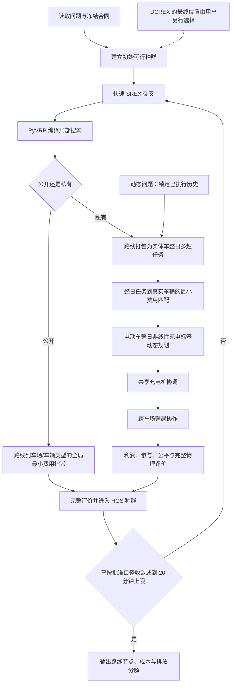

# Duty-HGS 反推重设计：提交用户批准的完整方案

日期：2026-08-09  
状态：`SUPERSEDED_BY_USER_INDEPENDENT_ARCHITECTURE_BOUNDARY`
本轮边界：只做问题界定、证据诊断、文献复核、方案综合、流程图和伪代码；没有修改算法代码，没有启动新实验，也没有替用户处置 DCREX。

> **2026-08-09 后续更正**：用户明确要求“开源 HGS 和新算法完全剥离，各成体系，不相互调用”。因此，本文件提出的“快速 SREX＋PyVRP 编译局部搜索＋PyVRP 种群”的运行时复用架构已被用户退回，不得据此施工。文件保留为历史诊断与资料库；其中 DCREX 的去留仍未由用户决定，不能把本文件曾推荐退出写成既成状态。新的自研算法设计必须先满足独立入口、独立运行时和不调用 PyVRP，再重新提交完整流程图、伪代码、可行性论证与小规模试跑方案。

## 一、先说结论

当前算法的问题已经能够分成两条主因，而不是继续笼统地说“性能不好”。

第一，公开算例的路线主循环被 DCREX 的高成本拖慢。28 个算例中，自研算法 12 胜、16 负；在双方都完整跑满 1200 秒的 13 个大算例中，自研算法 0 胜、13 负。PR17A 十种子归因里，“SREX＋DCREX”相对只用快速 SREX 为 5 胜、5 负，平均成本只好 1.4，但平均耗时是 2.18 倍。证据见 `solver/reports/duty_hgs_public_v13_28_trial_max20m_20260808/raw_runs.csv:2-29` 和 `solver/reports/duty_hgs_public_dcrex_attribution_20260808/raw_runs.csv:2-11`。

第二，私有算例不是机制接口全部失效，而是完整充电排班被两层笛卡尔积穷举；每接受一个排班，又从头生成和评价几乎相同的邻域。成渝被中止的 20 轮包有 110525 行轨迹，其中第 5 轮就有 108784 行，接受 373 个动作：370 个充电、2 个路线、1 个整车类型交换。实现中的反复教育循环见 `education.py:176-225`，跨趟充电选项乘积见 `charging.py:287-345`，跨会话开始时刻乘积见 `charging.py:390-469`；保存结果见 `solver/reports/duty_hgs_combined_trial_20260809/raw_runs.csv:15`。

因此，本方案不再增加通用局部动作，也不再给穷举器加新的候选数量、触发频率或预算参数。建议把算法改成下面的分工：

1. 路线层只用快速 SREX、PyVRP 编译局部搜索和 HGS 种群管理，负责广泛寻找客户顺序；
2. 每个子代形成后，用一个全局指派子问题一次性决定路线归哪个车场、整日任务归哪辆实体车；
3. 电动车的整日非线性充电用标签动态规划一次求完整排班，不再逐格爬；
4. 多车场协作、利润、参与条件与公平仍由完整评价器统一裁决；
5. 动态需求不另造一套算法，只冻结已经执行的历史，把同一套步骤用在未来部分。

这是一套完整问题适配算法，不是把原版 HGS 多开几个通用动作。原版 PyVRP 0.12.2 HGS 继续冻结为基线；新部件全部放在本项目自己的算法目录，基线文件和自研文件分开。

## 二、PDCA 中本轮已经做到哪里

### P：定义范畴和识别问题——已经完成

研究问题不变，仍是时变电网碳强度下的动态多车场混合车队多趟车辆路径问题。公开算例只检验路线性能；私有算例同时承载时变碳强度、混合车队、动态需求，并保留多车场、多趟、非线性充电、协同和公平等基础机制。输出仍是车辆访问节点，以及完整成本和排放分解。

本轮识别的主因是“公开侧单位时间路线搜索不足”和“私有侧完整排班被重复穷举”。碳强度方向、动态需求方向或某一地区的机制效应属于后续算例与实验互动问题，不能拿来掩盖算法主因。

### D：查资料并形成综合设计——本文件已经完成，等待批准

方案不是从零发明：

- Wouda、Lan 与 Kool（2024，*INFORMS Journal on Computing* 36(4):943–955）支持以成熟 HGS、SREX、局部搜索和种群管理作为高性能路线内核。
- Froger 等（2019）作者稿第 16—19 页给出固定客户顺序下的非线性充电标签方法，第 24—25 页报告重新优化充电计划能够改善既有路线解；仓库旧原型已实现时间—SOC 标签、充电扩展和支配剪枝，见 `baselines/algorithm_prototypes/carbon_nonlinear_charging_20260718/prototype.py:475-609`。
- Hiermann 等（2016）作者稿第 3—6 页把客户路线与异构车型选择联合考虑，并给出 `Resize`、`RelocateAndResize` 等车型—路线动作；它支持“车型不能等到末尾随便贴”的判断，但本项目不会照搬其线性、到站充满的充电假设。
- Zhao 等（2024，*EJOR* 317:921–935，§4–§7）用 HGS 加动态规划 Split 处理多趟与时变旅行时间，支持“上层搜索客户顺序、下层动态规划完成给定顺序”的分解方式；它不直接替代本项目的充电子问题。
- Lei、Hao 与 Wu（2026）作者稿第 15—16 页 Algorithm 3、第 22—25 页支持 DCREX 在其 MDFIHA 中的设计和消融；但本项目实测已经表明，它按当前频率接入后不具备足够的单位时间增量，这个实测不能被文献阳性结果覆盖。

Froger／Hiermann 的本地文献复核账见 `docs/handoff/algorithm_exploration_20260718/fleet_charging/report.md:9-31`；Zhao 的方法对应见 `docs/handoff/e2_genuine_hybrid_literature_basis_20260724.md:13`；DCREX 页码账见 `docs/handoff/duty_hgs_public_core_roundtable_20260808.md:29-33`。

### C 和 A：批准后才执行

批准后先施工，再用短小、可复算的技术试跑检查路线吞吐、全局指派、整日充电、共享桩、动态锁定和完整评价是否接对。随后才用公开算例和三地区私有样本看性能与效应。看到数据后，由用户决定保留、调整或回退；代理不预设新的通过阈值。

20 分钟是单次运行硬上限，不是鼓励算法跑满 20 分钟。私有 50—100 客户算例如果仍接近这个上限而没有稳定收敛，优先回查算法结构和实现，不靠继续加时掩盖问题。正式早停口径仍须由收敛轨迹产生并交用户确认，本方案不新造分钟数或迭代数。

## 三、完整算法结构

### 3.1 路线主层

路线主层保留成熟部分：HGS 种群、惩罚、多样性管理、SREX 和 PyVRP 编译局部搜索。它只负责客户访问顺序和路线结构，不再同时承担完整实体车、跨趟 SOC 和充电排班的穷举。

公开原版 HGS 的运行入口和依赖环境继续冻结，不接入以下自研部件。自研算法只通过独立包装调用固定版本的 PyVRP 模块；需要复制剥离的第三方模块单独保留许可证、版本和哈希，不直接改开源包源码。

### 3.2 公开算例：路线—车场全局指派

给定一组客户顺序已经确定的路线，把每条路线一次性指派到某个车场／车辆类型，而不是当前只在超编时逐条贪心换车场。当前贪心修复见 `public.py:496-559`，同一条路线在不同车场下的固定成本、距离、时长、超时和罚项已经可以由 `public.py:1091-1125` 计算。

设路线为 \(r\)，车场／车辆类型为 \(k\)，\(c_{rk}\) 是路线 \(r\) 从 \(k\) 出发并返回时的完整代理成本，\(m_k\) 是该类型可用车辆数：

\[
\min \sum_r\sum_k c_{rk}x_{rk}
\]

\[
\sum_k x_{rk}=1\quad\forall r,\qquad
\sum_r x_{rk}\le m_k\quad\forall k,\qquad
x_{rk}\in\{0,1\}.
\]

这是给定客户顺序后的最小费用指派／运输问题，可以用最小费用流精确求解，不增加科学参数。它在每个自研子代之后工作，严格比较完整代理成本；不修改冻结母体，也不立即额外再跑一遍局部搜索，下一次正常 HGS 教育自然接着调整路线顺序。

### 3.3 私有算例：整日任务—实体车辆指派

私有侧的左边不是一条孤立路线，而是一个车场内已经按时间衔接好的整日多趟任务；右边是登记表里的真实车辆。每个任务必须分给一辆兼容车辆，每辆车至多承担一个整日任务壳。边只有在车场、载重、动态锁定和既有承诺都兼容时才存在。

燃油车边权直接计算。电动车边权调用下一节的整日充电动态规划；若给定任务对该电动车没有合法充电方案，该边不存在。没有共享充电桩耦合，或把其他车辆会话固定时，这一层是精确的最小费用匹配。只有静态且完全相同的车辆才可以压缩成同型槽位；动态锁定车辆不能丢掉实体身份。

这里不能简单地把所有任务按“电动车成本减燃油车成本”排序。那种简化只有在车辆完全同质、没有锁定、没有共享桩耦合时才成立。本方案使用一般的二部匹配／最小费用流，以免把接口接错。

### 3.4 电动车整日非线性充电动态规划

对一辆实体电动车的完整多趟任务，标签状态至少保存：当前趟次、当前事件位置、时刻、SOC、累计成本、累计排放和已经形成的充电会话。扩展动作使用现有的真实事件点：非线性曲线拐点、碳强度／电价时段边界、可用充电站以及其他车辆释放充电桩的时刻，不另造 80%、90% 或任意 SOC 网格。

标签支配的基本含义是：如果两个标签走到同一任务位置，一个标签不更晚、SOC 不更低、成本和排放也不更差，那么另一个标签可以删除。最终得到给定整日路线和实体车辆下的最好合法充电排班，包括站点、充电量、开充时刻、占用时长和跨趟 SOC。

仓库已有的隔离原型包含 `_Label`、`_extend_charge`、`_dominates` 和 `label_oracle`，见 `prototype.py:475-609`；它过去只验证过单条固定路线，不能原样冒充正式多趟算法。施工需要补多趟状态、动态锁定、跨日会话和正式目标适配，但不改变成本模型、检查器或评价器。

### 3.5 共享充电桩、多车场协作、公平和动态需求

共享充电桩会让不同车辆的充电方案互相影响，因此“每辆车各自最优”不再等于全局精确。拟采用无新数值参数的协调办法：先固定其他车辆会话，解一辆车的整日充电；更新占用后，只重解受影响车辆；只有完整目标严格下降且完整检查通过才接受，直到没有可接受改进。论文中应如实称为协调式启发式，不称全局精确。

跨车场整趟协作仍放在外层，因为它会改变客户由哪个车场服务。每次协作后，重新进行整日任务—车辆匹配和充电排班，再交完整评价器计算各车场利润、参与条件和公平分配。这样公平确实能影响客户归属，但不把公平包装成路线内核的性能贡献。

动态需求到来时，已经执行的路线、充电和车辆状态保持锁定。算法只对未来客户和未来整日任务运行相同的路线搜索、车辆指派、充电排班和协作步骤；不是另造一套动态求解器。

## 四、算法流程图



图中的 DCREX 不在主循环里自动占位。若用户选择“完全退出”，Q 删除；若选择“只用于初始多样化”，Q 只生成初始候选；若选择“只在原生重启使用”，Q 接到重启处，但大规模算例 20 分钟内很可能不会触发。

## 五、算法伪代码

```text
算法：面向完整问题的 HGS 求解流程
输入：实例、车辆登记表、非线性曲线、时变价格/碳、动态锁定、利润与公平合同
输出：实体车辆的节点序列、充电会话、成本与排放分解

1  P ← 构造并完整验证初始种群
2  若用户选择“DCREX 只用于初始多样化”：
3      用冻结初始父代产生 min_pop_size 个 DCREX 子代，教育后与 P 合并选择
4  while 未达到批准的收敛条件且墙钟 < 20 分钟：
5      child ← SREX(从 P 选择的父代)
6      child ← PyVRP_局部搜索(child)
7      if 公开算例：
8          child ← 最小费用流_全局指派路线到车场(child)
9      else：
10         duties ← 把路线打包成实体车整日多趟任务壳(child)
11         repeat
12             对受影响的 duty—车辆兼容边：
13                 CV 边权 ← 完整行驶成本
14                 EV 边权与会话 ← 整日非线性充电标签DP
15             duties ← 最小费用流_匹配任务壳到真实车辆
16             只重解共享桩占用被改变的车辆
17         until 没有完整目标严格下降且检查通过的协调更新
18         child ← 尝试跨车场整趟协作，并重做 10—17
19         若为动态问题：拒绝任何改动已执行历史或锁定状态的 child
20     score ← 统一完整评价(child：服务量、物理约束、成本、排放、利润、公平)
21     P ← HGS_种群更新(P, child, score)
22  独立重算最优个体并输出完整分解
```

## 六、为什么这套方案有希望有效

1. **把公开侧主要矛盾对准了。** 当前 960 客户 PR16A 自研只完成 2705 轮，母体完成 16014 轮，成本高 3.047793%；新方案把高频昂贵 DCREX 从主循环拿开，把时间还给快速路线搜索，再用一次全局指派补上母体没有显式精确求的车场分配层。证据见公开汇总 `raw_runs.csv:12`。
2. **把私有侧的重复劳动直接消掉。** 当前实现是“完整排班候选很多次生成＋每接受一次又全扫”；新方案是“给定整日任务，动态规划一次求完整排班”。它改善的是复杂度来源，不是缩小候选表面数量。
3. **时变碳、混合车队和动态需求都进入真实决策。** 时变碳进入充电标签的时间成本，混合车队进入任务—车辆匹配，动态需求通过未来后缀重优化改变路线和车辆安排。三项主实验不靠事后包装。
4. **次要机制有位置但不抢主线。** 多趟和非线性充电是排班可行性的基础；协作、公平和参与条件放在外层完整评价，不要求每个都单独发展成一套庞大算法。
5. **公开与私有不是两套互不相干的算法。** 两者共享路线主层和“给定路线后做全局完成”的思想；公开完成器退化为路线—车场指派，私有完成器扩展为实体车辆、跨趟 SOC 和充电排班。

仍然没有证据保证它一定打赢公开 28 例，也没有证据保证三个地区会同时出现理想机制效应。施工后的试跑就是为了快速证伪这些推断；不能在运行前把“有希望”写成“已经成功”。

## 七、DCREX 的三个处置选项

### A. 完全退出当前正式算法——Codex 与 Opus 最终推荐

主循环只保留快速 SREX，算法的自研价值由全局车场／车辆指派和整日非线性充电完成器承担。它最直接解决公开吞吐问题，代码和归因最干净；代价是放弃 DCREX 偶尔产生大跳跃的可能性，并重开用户 2026-08-08 对 P27 的旧决定。用户本次已经因真实试跑不理想主动要求重新设计，因此可以重新选择，但代理不能自行删除。

### B. 只用于初始种群多样化

主循环仍只用 SREX；在开始时，用已有 `min_pop_size` 作为数量，生成同样数量的 DCREX 子代，教育后与普通初始解一起竞争，不另设次数参数。优点是保留一次大范围重组机会而不持续吞吐；风险是 DCREX 文献原本支持主循环使用，不是专门的初始化器，现有 20×5 的学习控制器在少量初始调用中也难以学到稳定偏好。

### C. 只在 PyVRP 原生重启时使用——不推荐

平时只用 SREX，等母体自己的无改善重启点再用 DCREX 重建种群，不改触发数字。问题是 960 客户算例 20 分钟只有 2705—5228 轮，而原生重启要到 20000 次无改善才触发，所以这一选择在最需要帮助的大算例上基本不会工作。若为了让它触发而修改 20000，就会引入另一项需要用户批准的参数决定。

## 八、需要用户一次性拍板的两件事

1. **完整架构是否批准施工。**
   - 选“批准”：按本文件实施“快速路线搜索＋全局车场/车辆指派＋整日充电动态规划＋外层协作公平”，不改模型和受保护评价文件。
   - 选“退回”：不施工，继续调整设计。
   - 建议：批准。它直接对准两条已证实的主要病灶，没有增加未经批准的科学阈值。

2. **DCREX 选 A、B 还是 C。**
   - A：完全退出；速度和归因最干净。
   - B：只做初始多样化；保留一次大跳跃机会，但文献支持较弱。
   - C：只在原生重启；大算例 20 分钟内基本不触发。
   - 建议：A。

用户可以直接回复：“批准整体方案，DCREX 选 A／B／C”。在收到这两个选择前，不开始算法施工。

## 九、Claude Opus 辩论记录

本轮进行了三轮关键讨论，前两轮使用 `high`，第三轮因需要处理子问题可分性、共享桩耦合和 DCREX 位置的反驳，临时升到 `xhigh`，没有使用 `max`。顾问原始会诊稿保存在 `~/.claude/plans/claude-opus-ethereal-scone.md`。

Opus 最初把私有车型指派简化成按 \(c_{EV}-c_{CV}\) 排序；Codex 根据实体车辆身份、动态锁定和共享桩容量指出该说法只在完全同质槽位下成立，最终方案改为一般二部匹配／最小费用流。Opus 最初提出 DCREX 放在原生重启；双方用 960 客户实际迭代数复核后确认，在 20 分钟上限下几乎不会触发，因此保留为不推荐选项。双方一致保留的核心是：停止继续堆通用动作，把全局指派与固定路线充电改成完整子问题。

顾问没有替用户批准方案，也没有参加代码施工。

## 十、交付前九条自检（后台核账）

1. 每个 `FACT` 是否都指到了文件行号 / 产物哈希 / 论文页码？——是。公开数字指向两个 `raw_runs.csv` 的具体行，私有数字指向合并包第 15 行和轨迹文件，代码病灶指向 `education.py`、`charging.py`、`public.py` 行号，方法依据给出论文页码或章节。没有出处的成功概率写成未证明的推断，没有标成 `FACT`。
2. 有没有把自己的建议或担忧写成“已决”或“状态”？——没有。整体架构和 DCREX A/B/C 均标为待用户批准；“推荐 A”和“建议批准”只是代理建议。P27 旧决定如实保留，并说明只有用户本次重开后才能改。
3. 改动范围有没有超出任务文本？——没有。只新增本设计报告，并同步待决登记、交接和记忆；没有修改算法、模型、实验或论文正文。
4. 有没有碰受保护文件？——未碰。任务开始和交付前哈希一致：`cost.py=e7ea406da87a3172cd1ff7dc87fe7def536e74f197f6c67b29da2394fe42b00d`；`check.py=1cdb6236a662eec7363dfdf99c0c0df287b32aeffbc7bd48572320696c0b1072`；`search/evaluation.py=c7215263c39d1d5a1429b41ca8ac40d950dbdf2bdc288337e56fbe9733406fc3`。
5. 待决事项是否转成了 2—4 个具体候选并写清代价？——是。整体架构为“批准／退回”两项；DCREX 为 A 完全退出、B 只用于初始多样化、C 只在原生重启三项，每项写明收益和代价。
6. 有没有用自造词或内部任务号跟用户说话？——没有。报告保留 HGS、SREX、DCREX 等已有算法名，并在正文说明各自作用；没有创造论文理论名称。
7. 失败、跳过、超时、异常结果有没有如实保留？——是。保留公开 12 胜 16 负、同 1200 秒 0 胜 13 负、PR17A 小增量高耗时、exact 口径不可直接对强对手、成渝长轨迹中止、私有机制最终效应尚未证明等不利结果。
8. 四件套齐了吗？——本任务不产生实验包，也没有启动实验，因此不生成 `metadata.json`、`raw_runs.csv`、`decision.json`、`artifact_hashes.json` 和 `report.md` 新五件套；只引用既有完整技术包。
9. `HANDOFF.md` 变更日志和 `docs/handoff/memory/` 同步了吗？——是。同步写入 `HANDOFF.md` 文末、`docs/handoff/memory/duty_hgs_pdca_redesign_20260809.md` 和 `docs/handoff/memory/MEMORY.md` 索引。
