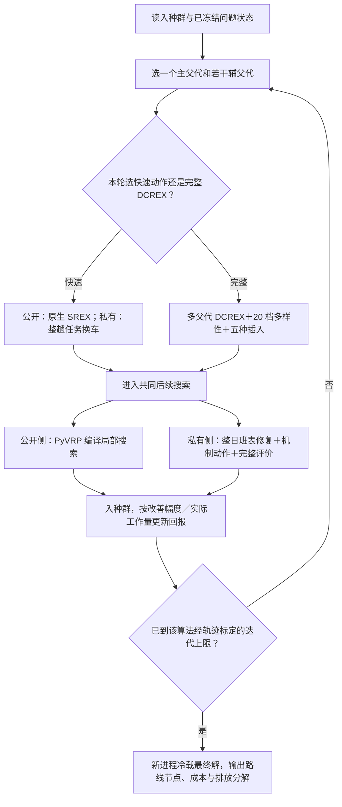

# Duty-HGS 公开路由核心最终圆桌

状态：`IMPLEMENTED — TECHNICAL TRIALS COMPLETE — FORMAL COMPARISON NOT STARTED`

日期：2026-08-08

## 一、用户在 2026-08-08 作出的决定

`USER DECISION`：正式公开路由核心选择完整 DCREX，替换当前随机整车块交叉。完整版本包括多父代路线交换、20 个多样性档、折扣 UCB1 和 FBI／IBI／FRI／IRI／RI 五种插入；公开与私有算法共用同一交叉核心，原版 PyVRP 0.12.2 HGS 保持冻结，只作基线。

`USER DECISION`：停机参照陈雨蝶的做法。每种算法根据自己的收敛轨迹确定并冻结自身迭代上限，各自跑到自身收敛；不要求相同墙钟或相同迭代次数。收敛图横轴使用实际运行时间。具体迭代上限只能由本算法、本算例、本机器的轨迹标定产生。

`USER DECISION`：独立经营利润基准按车场分别求解。每个车场只服务自己的责任客户、使用自己的车辆和设施，运行最终 Duty-HGS 10 个种子，取最好利润冻结。

`USER DECISION`：最终交叉不是只留 DCREX，而是“完整 DCREX＋快速交叉动作”。公开算例的快速动作调用 PyVRP 0.12.2 原生 SREX；私有与动态问题不用这个只懂路线的 SREX，而是把一整趟任务转给同车场、同车型的另一辆实体车。两条动作由折扣 UCB1 按“交给共同后续搜索前实际比较的完整子代数”计算回报，不按墙钟混算。

以下保留拍板前的证据与方案比较，作为决定依据和施工边界。

## 二、决定之前已经确认的现状

`FACT`：当前私有问题已用实体车整日班表表示，时变碳、混合车队、动态需求、多车场、多趟、非线性充电、协同和公平都已有真实的评价与搜索作用通道。最后的 Opus 复核已撤回“动态碳和公平没有抓手”的误判。

`FACT`：当前公开 V13 线仍以 PyVRP 0.12.2 的 HGS 为主体。PR17A 、seed 11、每臂 60 秒的技术试跑中，默认 HGS 为 6296，加 Exchange30—33 为 6323，后者高 27（差 0.42884%）；两臂都完整服务并可行。这只证明“打开更多通用局部动作”没有形成胜法，不是正式性能结论。

`FACT`：当前 Duty 交叉只是在固定车辆登记表中随机取一段连续整车班表，不是 SREX，也没有直接文献阳性证据。`duty_hgs/crossover.py:1-54` 已更正过度声明。

因此，充电与私有机制底座已不再是主要空洞；现在真正需要用户决定的，是用哪个有文献依据的公开路由核心取代随机整车块交叉。

## 三、DCREX 为什么有根据

`FACT`：Lei, Hao and Wu (2026) 作者稿第 15—16 页 Algorithm 3 把 DCREX 定义为多父代整路线交换：路线对分数同时考虑新引入边、遗漏客户、重复客户和冲突客户；交换后从 FBI、IBI、FRI、IRI、RI 五种插入中修复，并用折扣 UCB1（式 (4)，折扣因子 0.99）选多样性档和插入算子。

`FACT`：该文第 22 页表 3 在 28 个 V13 大型 MDVRPTW 算例上报 MDFIHA 相对 VCGP 平均 -0.22%，改进 19 个已知上界；第 23—25 页的消融直接把 DCREX 与 SREX、RARI 及两种破坏—修复变体比较，文中报 DCREX 更好地避免 SREX 的早熟。PyVRP 0.12.2 在多车辆 V13 上正使用 SREX，因此这不是跨问题类型的泛化借鉴，而是对当前母体交叉的直接阳性对照。

`UNKNOWN`：论文没有随文源码，补充材料当前也不在仓库；第 15 页打分式的印刷符号与正文“分数越低越好”的解释存在疑似矛盾，五种插入也只有文字描述。因此完整版仍需对四处细节作可复核重建，不得冒充“逐行复现原作者源码”。

## 四、MDM 为什么只作备选

`FACT`：MDM-HGS 的 MIT 开源实现会从精英解中挖频繁有向弧，在重启时用这些模式和随机 Clarke–Wright 重建新种群。它针对的病灶真实存在：PyVRP 0.12.2 重启只重放最初那批随机解。

`UNKNOWN`：当前仓库和开源包内没有 Maia et al. (2024) *Networks* 原文或“MDM 对同预算母体 HGS”的消融表；README 只能支持 DIMACS CVRP 排名第二。它还是单车场 CVRP 实现，移植到 MDVRPTW 必须自行补车场身份、时间窗和多趟含义。所以 MDM 有干净工程逻辑，却没有比 DCREX 更强的“胜过当前母体”证据。

## 五、批准施工的完整算法流程



```text
函数 系统HGS(问题, 初始种群, 本算法迭代上限, 随机种子):
    循环直到达到本算法迭代上限:
        主父代 <- 按质量与差异性选择
        交叉动作 <- 折扣UCB1在快速动作与完整DCREX之间选择
        若选择快速动作:
            公开算例用原生SREX产生并比较两个子代
            私有或动态问题把第二父代的一整趟任务转给第一父代的兼容实体车
            若没有兼容实体车，同一轮改做完整DCREX，不把“不可用”当作算法失败
        否则:
            目标多样性档, 插入算子 <- 折扣UCB1选择
            子代 <- 复制(主父代)
            对其他父代的候选路线对:
                计算新边、遗漏、重复和冲突客户
                选择与目标多样性范围相符的整路线交换
            删除重复客户，用选中的插入算子补齐遗漏客户
        若为公开算例:
            用PyVRP编译局部搜索教育
        否则:
            映射为实体车整日班表
            修复多趟、充电和动态状态
            生成跨场、车型—任务、充电和路线候选
            用完整成本、排放、利润与参与条件教育
        子代入种群，按改善幅度除以本动作实际比较的完整子代数更新回报
    返回冷重算通过的最好解
```

实现边界：真正共享代码的是 DCREX 的路线块选择、多样性档和插入选择逻辑，以及快速／完整动作的回报控制。公开快速动作是 PyVRP 编译 SREX；私有快速动作是本项目的整趟任务换车，二者文件和名称分开。公开侧使用 PyVRP 原生 Solution 与编译局部搜索；私有侧使用 DutyIndividual 与完整问题评价，不强行合并两种数据结构。

## 六、决定前的候选与最终选择

### 1. 公开路由核心——已选择 A

- **A：完整 DCREX**。按论文可读粒度实现多父代、20 档多样性、折扣 UCB1 和五种插入；公私两侧共用交叉核心。文献背书最强，胜出上限最高；代价是必须如实处理四处原文空白，输了时归因较难。Claude Opus 5 与 Codex 都推荐此项。
- **B：固定多样性档的 DCREX 骨架**。不做 UCB1 和五种选择。工作量小，但变成本项目自己的变体，不能把第 23 页完整消融当作直接背书。
- **C：先做 MDM 重启**。源码可逐行对照，归因干净；但没有相对同预算母体 HGS 的已核实阳性消融，且公私两侧共用面小。
- **D：保留当前随机整车块交换**。改动最小，但当前没有直接文献阳性依据，也没有公开算例获胜信号。两位顾问都不建议。

### 2. 停机方式——已选择各自收敛

- **最终口径**：先记录各算法在各规模上的完整收敛轨迹，再分别冻结其迭代上限；正式运行各自跑到该上限，CPU 时间如实报告，收敛图横轴使用实际时间。陈雨蝶论文给的是这种“各算法使用各自迭代设置、按时间展示收敛”的比较形式；本文不再把相同墙钟或相同迭代次数作为要求。

### 3. 正式独立经营利润基准——已选择 A

两个选项均保留 v2 的经营阵营：各车场不合作时只服务自己的责任客户，用最终 Duty-HGS 和同一完整评价器分别求解，合作时每个车场利润不低于 `theta × 单干利润`；无自由转账，车场不中途退出。

- **A：10 个种子取最好利润冻结**。代表车场在同算法下确实能找到的最好单干机会，参与线最严格。Opus 与 Codex 推荐。
- **B：10 个种子利润取均值冻结**。基准更宽松、更容易留出合作可行空间，但会低于已经实际找到的更好单干方案，经营解释较弱。

`FACT`：现有 `fairness.py:29-124` 还在调已退役 ALNS，默认单种子、8000 次评价和 180 秒；技术包 Pi0 又直接取自初始解并标为 `externally_frozen=False`。这些不能进正式比较，必须在用户选 A 或 B 后替换。

## 七、完整真值复核的商定结论

这不再留给用户作研究选择。搜索内的接受动作冷回放属于搜索路径，计入墙钟；最终保存后的新进程冷载只是结果核验，不计入两臂搜索墙钟，单独报耗时。最终逐项重算服务客户与需求、成本分解、排放分解、SOC、车场利润、参与余量和输入／代码／配置／Pi0／最终解哈希。未接受候选不追加随机抽检门槛。

## 八、施工与技术试跑结论

`FACT`：公开、私有和动态三条入口已经接到同一个“快速动作＋完整 DCREX”控制层。公开快速动作在 `solver/src/setp_solver/algorithms/duty_hgs/srex.py:1-26` 单独调用 PyVRP 0.12.2 原生 SREX；私有快速动作在 `crossover.py:329-414` 转移一整趟任务，并保护锁定客户、锁定充电和动态历史；不存在把私有动作冒充 SREX 的代码路径。

`FACT`：当前工作量口径已经统一为“进入共同后续搜索前实际比较的完整子代数”：公开 SREX 为 2，公开 DCREX、私有整趟任务换车和私有 DCREX 均为 1。回报是相对父代的百分比改善除以该工作量，见 `crossover_control.py:41-63`、`public.py:266-362` 和 `runner.py:343-462`。

`FACT`：当前源码的定向回归为 31/31 通过，Ruff 通过。把冻结原型的 75 项旧测试直接映射到当前源码时有 66 项通过；其余 9 项中，8 项仍调用已经撤掉的旧停机参数，1 项要求锁定充电重复时抛错，而当前批准语义是保护锁定充电。它们保留为旧契约差异，没有改测试凑数。

`FACT`：PR17A、seed 11 的两次 100 轮复现都得到成本 6816、完整服务 360/360 个客户和 4814/4814 需求，动作序列、五种插入和业务结果一致。当前源码继续运行至连续 5000 轮无改善后，自研算法在第 12335 轮停止，成本 6282；冻结原版 PyVRP 0.12.2 HGS 在第 14368 轮停止，成本 6286。两者都完整服务。这个单种子技术结果说明自研算法没有因母体自己跑到收敛而被反超，但 4 个成本单位的差距仍需正式多种子比较确认。

`FACT`：JJJ50 私有静态两轮试跑从 2675.9848129663887 改善到 2431.2175370626283，完整服务 50/50 个客户和 13264/13264 需求；两次运行的业务结果一致。动态两轮试跑及复现都从 2316.97883865434 改善到 2283.6863576513056，排放从 218.1172641893549 降到 213.6090171626724，完整服务量不变，已执行历史前后哈希完全一致。这些数字证明三条接线能工作，不替代后续三大实验和五因素的正式效应试跑。

`FACT`：Claude Opus 最终独立验货结论为 `APPROVE`。它逐个核了七个当前技术包的源码哈希、公开两次复现、双方收敛轨迹、私有两种交叉实际调用、动态历史保护和三个受保护文件；没有发现阻止公开多种子对比与私有机制试跑的确定性重大问题。它同时明确把 6282 对 6286 定为“母体收敛后自研算法没有塌”的单种子技术信号，不是正式性能优势。

`USER DECISION`：Opus 从本节点起恢复为必要时参与关键判断的高级顾问，不再担任每一步都要批准的监工。只在公开收敛异常、私有消融不能证明组件有效、三项主实验效果不理想和最终正式结果独立复核时介入；不得因为“还有一种可能没查”阻止必要的性能试跑。

## 九、AGENTS.md 第八节九条自检

1. 每个 `FACT` 是否都指到了文件行号 / 产物哈希 / 论文页码？——算法结构指到当前源码行号，试跑数字指到四件套产物，DCREX 方法与消融指到论文第 15—16、22—25 页；没有把未核实内容标成事实。
2. 有没有把自己的建议或担忧写成“已决”或“状态”？——没有；完整 DCREX＋快速动作、各自收敛和独立利润基准均来自用户明确决定，单种子优势仍写成技术信号。
3. 改动范围有没有超出任务文本？——没有；只实现获批算法、技术试跑、验货和交接，没有启动三大正式实验，也没有另造算法路线。
4. 有没有碰受保护文件？——未碰；`cost.py`、`check.py`、`search/evaluation.py` 哈希分别保持 `e7ea406da87a3172cd1ff7dc87fe7def536e74f197f6c67b29da2394fe42b00d`、`1cdb6236a662eec7363dfdf99c0c0df287b32aeffbc7bd48572320696c0b1072`、`c7215263c39d1d5a1429b41ca8ac40d950dbdf2bdc288337e56fbe9733406fc3`。
5. 待决事项是否转成了 2–4 个具体候选并写清代价？——本轮没有新增必须由用户决定的事项；统一私有算例和正式主表仍沿用原登记，不在本轮偷选。
6. 有没有用自造词或内部任务号跟用户说话？——没有；DCREX、SREX、HGS 第一次出现时均说明实际作用，私有快速动作直接称“整趟任务换车”。
7. 失败、跳过、超时、异常结果有没有如实保留？——保留早期通用 Exchange 动作使母体从 6296 变成 6323、一次动态单轮未进入系统动作层、两次被主动中止的旧私有实现，以及 9 项冻结旧契约差异；没有改写为通过。
8. 四件套齐了吗？——本轮完成的公开、私有、动态和母体技术包均有 `metadata.json`、`raw_runs.csv`、`decision.json`、`artifact_hashes.json`、`report.md`。
9. `HANDOFF.md` 变更日志和 `docs/handoff/memory/` 同步了吗？——已在同轮追加最终算法结构、试跑数字、证据边界和下一步位置。
