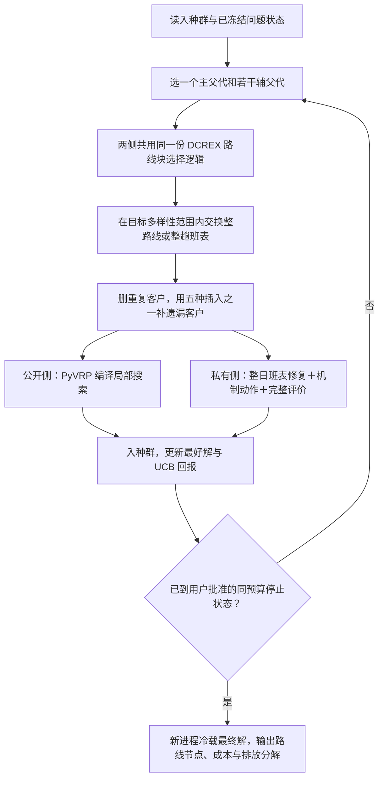

# Duty-HGS 公开路由核心最终圆桌

状态：`AGENT PROPOSAL — AWAITING USER DECISION`

日期：2026-08-08

## 一、为什么还需要用户决定

`FACT`：当前私有问题已用实体车整日班表表示，时变碳、混合车队、动态需求、多车场、多趟、非线性充电、协同和公平都已有真实的评价与搜索作用通道。最后的 Opus 复核已撤回“动态碳和公平没有抓手”的误判。

`FACT`：当前公开 V13 线仍以 PyVRP 0.12.2 的 HGS 为主体。PR17A 、seed 11、每臂 60 秒的技术试跑中，默认 HGS 为 6296，加 Exchange30—33 为 6323，后者高 27（差 0.42884%）；两臂都完整服务并可行。这只证明“打开更多通用局部动作”没有形成胜法，不是正式性能结论。

`FACT`：当前 Duty 交叉只是在固定车辆登记表中随机取一段连续整车班表，不是 SREX，也没有直接文献阳性证据。`duty_hgs/crossover.py:1-54` 已更正过度声明。

因此，充电与私有机制底座已不再是主要空洞；现在真正需要用户决定的，是用哪个有文献依据的公开路由核心取代随机整车块交叉。

## 二、DCREX 为什么是有根据的候选

`FACT`：Lei, Hao and Wu (2026) 作者稿第 15—16 页 Algorithm 3 把 DCREX 定义为多父代整路线交换：路线对分数同时考虑新引入边、遗漏客户、重复客户和冲突客户；交换后从 FBI、IBI、FRI、IRI、RI 五种插入中修复，并用折扣 UCB1（式 (4)，折扣因子 0.99）选多样性档和插入算子。

`FACT`：该文第 22 页表 3 在 28 个 V13 大型 MDVRPTW 算例上报 MDFIHA 相对 VCGP 平均 -0.22%，改进 19 个已知上界；第 23—25 页的消融直接把 DCREX 与 SREX、RARI 及两种破坏—修复变体比较，文中报 DCREX 更好地避免 SREX 的早熟。PyVRP 0.12.2 在多车辆 V13 上正使用 SREX，因此这不是跨问题类型的泛化借鉴，而是对当前母体交叉的直接阳性对照。

`UNKNOWN`：论文没有随文源码，补充材料当前也不在仓库；第 15 页打分式的印刷符号与正文“分数越低越好”的解释存在疑似矛盾，五种插入也只有文字描述。因此完整版仍需对四处细节作可复核重建，不得冒充“逐行复现原作者源码”。

## 三、MDM 为什么只作备选

`FACT`：MDM-HGS 的 MIT 开源实现会从精英解中挖频繁有向弧，在重启时用这些模式和随机 Clarke–Wright 重建新种群。它针对的病灶真实存在：PyVRP 0.12.2 重启只重放最初那批随机解。

`UNKNOWN`：当前仓库和开源包内没有 Maia et al. (2024) *Networks* 原文或“MDM 对同预算母体 HGS”的消融表；README 只能支持 DIMACS CVRP 排名第二。它还是单车场 CVRP 实现，移植到 MDVRPTW 必须自行补车场身份、时间窗和多趟含义。所以 MDM 有干净工程逻辑，却没有比 DCREX 更强的“胜过当前母体”证据。

## 四、推荐的完整算法流程



```text
函数 系统HGS(问题, 初始种群, 墙钟, 随机种子):
    循环直到同预算停止:
        主父代 <- 按质量与差异性选择
        目标多样性档, 插入算子 <- 折扣UCB1选择
        子代 <- 复制(主父代)
        对其他父代的候选路线对:
            计算新边、遗漏、重复和冲突客户
            选择与目标多样性范围相符的整路线交换
        删除重复客户，用选中的插入算子补齐遗漏客户
        若为公开算例:
            用PyVRP编译局部搜索教育
        否则:
            映射为实体车整日班表
            修复多趟、充电和动态状态
            生成跨场、车型—任务、充电和路线候选
            用完整成本、排放、利润与参与条件教育
        子代入种群，更新最好解与UCB回报
    返回冷重算通过的最好解
```

实现边界：真正共享代码的只是 DCREX 的路线块选择、多样性档和插入选择逻辑。公开侧使用 PyVRP 原生 Solution 与编译局部搜索；私有侧使用 DutyIndividual 与完整问题评价。种群、罚值和重启保持同语义并用契约测试防漂移，不强行合并两个已经稳定的控制循环。

## 五、一次需要用户决定的三组问题

### 1. 公开路由核心

- **A：完整 DCREX**。按论文可读粒度实现多父代、20 档多样性、折扣 UCB1 和五种插入；公私两侧共用交叉核心。文献背书最强，胜出上限最高；代价是必须如实处理四处原文空白，输了时归因较难。Claude Opus 5 与 Codex 都推荐此项。
- **B：固定多样性档的 DCREX 骨架**。不做 UCB1 和五种选择。工作量小，但变成本项目自己的变体，不能把第 23 页完整消融当作直接背书。
- **C：先做 MDM 重启**。源码可逐行对照，归因干净；但没有相对同预算母体 HGS 的已核实阳性消融，且公私两侧共用面小。
- **D：保留当前随机整车块交换**。改动最小，但当前没有直接文献阳性依据，也没有公开算例获胜信号。两位顾问都不建议。

### 2. “1% 改进＋5 分钟”怎样落地

- **A：先标定固定墙钟，每个规模档所有算法臂共用同一时间**。用每个规模的收敛长跑找到最后一次累计至少 1% 的改进，再留 5 分钟；正式比较时双方墙钟严格相同。符合已定的等预算和全流程墙钟；用户需确认“唯一墙钟”指同一口径，可按规模分档，而不是一个秒数覆盖 10 到 960 客户。Opus 与 Codex 都推荐此项。
- **B：每次运行自己停**。最近一次单次改进至少 1% 后，5 分钟没再出现就停。更贴近原句，但各臂墙钟不同，会破坏正式等预算。
- **C：五分钟固定窗口**。比较窗口首尾，改进不超过 1% 就停。最简单，但最容易把既有“长平台后突破”提前砍掉。

### 3. 正式独立经营利润基准

两个选项均保留 v2 的经营阵营：各车场不合作时只服务自己的责任客户，用最终 Duty-HGS 和同一完整评价器分别求解，合作时每个车场利润不低于 `theta × 单干利润`；无自由转账，车场不中途退出。

- **A：10 个种子取最好利润冻结**。代表车场在同算法下确实能找到的最好单干机会，参与线最严格。Opus 与 Codex 推荐。
- **B：10 个种子利润取均值冻结**。基准更宽松、更容易留出合作可行空间，但会低于已经实际找到的更好单干方案，经营解释较弱。

`FACT`：现有 `fairness.py:29-124` 还在调已退役 ALNS，默认单种子、8000 次评价和 180 秒；技术包 Pi0 又直接取自初始解并标为 `externally_frozen=False`。这些不能进正式比较，必须在用户选 A 或 B 后替换。

## 六、完整真值复核的商定结论

这不再留给用户作研究选择。搜索内的接受动作冷回放属于搜索路径，计入墙钟；最终保存后的新进程冷载只是结果核验，不计入两臂搜索墙钟，单独报耗时。最终逐项重算服务客户与需求、成本分解、排放分解、SOC、车场利润、参与余量和输入／代码／配置／Pi0／最终解哈希。未接受候选不追加随机抽检门槛。

## 七、AGENTS.md 第八节九条自检

1. 每个 `FACT` 是否都指到了文件行号 / 产物哈希 / 论文页码？——代码与试跑事实指到源码或技术包，DCREX 方法与消融指到论文第 15—16、22—25 页；MDM 缺少母体消融明确标 `UNKNOWN`。
2. 有没有把自己的建议或担忧写成“已决”或“状态”？——没有；本文状态为等用户决定，DCREX A、墙钟 A 和 Pi0 A 都是顾问建议。
3. 改动范围有没有超出任务文本？——本文只整理算法方案、文献与待决选项，未施工 DCREX、MDM、正式墙钟或 Pi0。
4. 有没有碰受保护文件？——未碰；`cost.py`、`check.py`、`search/evaluation.py` 哈希分别保持 `e7ea406da87a3172cd1ff7dc87fe7def536e74f197f6c67b29da2394fe42b00d`、`1cdb6236a662eec7363dfdf99c0c0df287b32aeffbc7bd48572320696c0b1072`、`c7215263c39d1d5a1429b41ca8ac40d950dbdf2bdc288337e56fbe9733406fc3`。
5. 待决事项是否转成 2–4 个具体候选并写清代价？——是；算法四选一、墙钟三选一、Pi0 两选一，均写明依据和代价。
6. 有没有用自造词或内部任务号跟用户说话？——文档只使用 DCREX、MDM、HGS、Pi0 等已有名称，并给出白话解释。
7. 失败、跳过、超时、异常结果有没有如实保留？——保留 PR17A 增强臂输 27、DCREX 无源码且有疑似符号问题、MDM 无同预算母体消融和当前 Pi0 不可正式使用。
8. 四件套齐了吗？——本文不产生实验包；PR17A 技术包的 `metadata.json`、`raw_runs.csv`、`decision.json`、`artifact_hashes.json`、`report.md` 齐全。
9. `HANDOFF.md` 变更日志和 `docs/handoff/memory/` 同步了吗？——已在同轮追加本次圆桌结论和三组待决事项。
