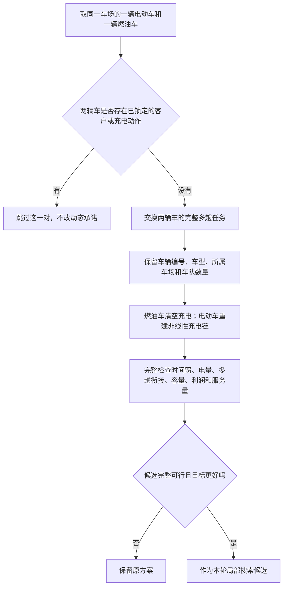

# 正式算法对比前：效应导向的最后一份设计说明

状态：等待用户拍板；尚未施工，尚未启动正式算法对比。

日期：2026-08-07

## 一、先说结论

这轮没有选成渝、珠三角或京津冀中的任何一个作为统一私有算例。用户对三地的印象已经进入待核事实：成渝的时变碳效应可能偏弱，珠三角已有结果印象较好，京津冀碳强度高但其他实验效果未知。在三大实验和五个因素使用同一套算法重新探索前，不能由一个旧充电结果或一个新算法动作替用户选地区。

在当前能冷载的旧见证和已经检查的几个方向中，还没有找到值得施工的纯充电动作。固定路线重新择时、调整充电方向、相邻趟重切和单趟 EV/CV 交换，要么与当前确定性充电重建重复，要么没有足够可行空间，要么只有零星小改善。这里不能为了满足“充电创新”四个字而换名字包装。

但查出了一个真实的算法缺口：当前 Duty-HGS 能逐个挪客户，却不能把同一车场一辆电动车和一辆燃油车的整套多趟任务互换。零搜索设计筛查在成渝旧见证中发现了四个约 1.05%—1.27% 的成本头房，同时减少约 20—22 千克排放。它不是正式算法效果，却足以支持一个很小的施工候选。

这个候选必须如实叫“整日车型—任务联合动作”。它把完整多趟任务换给另一种车型，然后重新生成电动车的非线性充电链。它不是单独决定充电时刻或充电量的动作；充电变化是车型和任务重新匹配后的结果。

Claude Opus 5 在看到整日动作证据后撤回了对这条路线的否决，同意把它提交用户批准后做最小施工。Opus 的意见是顾问建议，不是用户决定。Codex 同意这一建议，但不把它写成已经批准，也不把它预先写成算法创新。

## 二、为什么成渝不能因为这次命中就被选中

设计筛查使用的旧文件只有 73 份见证，原文件明确写着 `paper_claim_allowed=false`。按当前 Duty-HGS 完整评价器冷载时，只有 61 份能直接评价并通过：成渝 29 份、京津冀 21 份、珠三角 11 份；其余 12 份触发“旧充电记录被当前多趟准备过程改写”的错误。本轮没有修补这 12 份，也没有把它们算成通过。证据已保存到 `docs/handoff/effect_oriented_design_probe_20260807.json`，文件 SHA-256 为 `046e21d949ae5cb3e671dd32e01d88d0d7a720d9888e63ff550780ad83235cf6`。

整日动作在成渝出现较大头房，只说明旧解里的“哪套活交给电动车”可能没有调好。它不能说明成渝的时变碳强度主效应最强，也不能说明成渝在动态需求、跨车场协同和利润公平上都有明显效果。

因此当前能安全说的是：成渝重新回到候选池，不因旧印象直接淘汰，也不因这次动作命中直接入选；珠三角和京津冀同样保留。最终地区仍由用户在统一探索结果摆齐后决定。`pending_decisions.md` 的地区事项仍为未决。

## 三、前面几种想法为什么没有继续

### 1. 单独重新安排同一份充电

当前 `ChargingRetimeMove` 只删除未锁定的充电会话，见 `duty_hgs/operators.py` 第 249—274 行；随后现有充电修复会按同一策略把它重新生成。若班表和策略都没变，重复生成通常得到同一结果。现有技术试跑也已出现该动作不改变方案的记录。因此它不是新的搜索自由度。

### 2. 单趟 EV/CV 互换

在当前能冷载的旧见证上，三地共检查 1835 个同车场 EV/CV 趟对。通过完整评价的可行交换有 270 个，但只有 5 个同时降低成本；成渝 1 个、京津冀 4 个、珠三角 0 个，幅度也小。它是真动作，但头房不足，不建议施工。逐地区计数见设计筛查 JSON。

### 3. 整趟搬到另一辆车

此前对旧见证中的 541 个同车场插入位置做过不搜索的时序检查，541 个都先发生多趟时间重叠，随后充电修复也找不到可行车场充电窗口。这条想法没有可用空间。

### 4. 价格—碳强度双重充电搜索

旧的 20 组 `COST` 与 `COST_CARBON` 配对中，许多充电时刻发生变化，但电费中位变化近似为零，排放下降。当前可达到的时段里更像“电价打平后再按碳选择”，而不是价格与碳强度正面冲突。原先双重搜索的核心前提在这批旧见证上不成立，不能据此另造一个组件。

上述判断只约束当前已检查的旧见证和动作方向，不扩大成“整个问题的充电维度永远没有空间”。Opus 最终已接受这一更正，也撤回“73 份都冷载通过”的错误说法。

## 四、提交用户批准的动作

临时描述名：整日车型—任务联合动作。代码名若获批可用 `WholeDutyTypeExchangeMove`，代码名不进入论文。

它做的事情很简单：在同一个车场里挑一辆电动车和一辆燃油车，把两辆车尚未执行的整套多趟任务互换。车辆编号、车型、所属车场和可用车队数量都不变。燃油车接手电动车原来的任务后不保留充电；电动车接手燃油车任务后，按现有非线性充电规则重新生成整日充电链。最后仍由同一个完整评价器决定这个候选是否合法、是否更好。

伪代码如下：

    输入：当前完整班表 x，当前完整评价 E(x)
    输出：本轮最好的合法改善班表，若无改善则返回 x

    best <- x
    对每个车场 d：
        对 d 中每个电动车班表 e：
            对 d 中每个燃油车班表 f：
                若 e 或 f 含已经执行、正在执行或已经锁定的内容：
                    跳过这一对
                candidate <- 复制 x
                交换 e 与 f 的完整多趟任务内容
                保留 e、f 的车辆编号、车型、所属车场和注册位置
                删除 f 上的充电会话
                按现有规则重建 e 的整日非线性充电链
                result <- FullEvaluate(candidate)
                若 result 完整可行且目标优于 E(best)：
                    best <- candidate
    返回 best

这段伪代码不引入新权重、新阈值、新电量自由度或新停止条件。它沿用当前局部教育的“生成候选—完整评价—选本轮最好改善”逻辑。

### 接口如何保证不接错

- 实体车编号和车型不交换。`PhysicalVehicleDuty` 已把 `physical_vehicle_id`、`vehicle_type`、`home_depot_id` 和 `trips` 分开保存，并强制 EV/CV 前缀与车型一致，见 `duty_hgs/model.py` 第 104—135 行。
- 只交换 `trips` 的完整内容，不改车队注册表。当前交叉要求两位父代使用相同固定注册表，见 `duty_hgs/crossover.py` 第 36—61 行；新动作不破坏这个约束。
- 当前动作生成器只包含逐客户 relocate、逐客户 swap、开新趟、2-opt 和充电重建，见 `duty_hgs/operators.py` 第 345—483 行；没有整日 EV/CV 任务交换，因此不是重复实现现有动作。
- 动态状态下，只要任一班表存在锁定客户前缀或锁定充电会话，就整对跳过。第一版不做“只交换半个未来班表”，避免扩大施工。
- 交换后客户集合不变，完成客户数和完成需求量必须逐项等于交换前；完整评价仍检查多趟时序、电量、容量、车队、利润和其他硬约束。

### 文献支持到哪里

Hiermann et al. (2016) 在论文第 995 页把车队构成、实际车辆路线、充电时间与地点放在同一个问题中；第 1006 页明确说明，插入修复会在必要时改变车辆类型指派。Diefenbach et al. (2023) 第 828—829、846 页支持把预先规划的多趟路线分配给实体电动车，并联合处理趟链和非线性充电。Vidal et al. (2014) 作者稿第 6、13—15 页支持在 HGS 中用问题属性评价局部动作。

这些文献支持“车型—任务匹配必须和充电可行性共同评价”，但没有直接给出本项目这一个整日 EV/CV 双向交换动作。因此当前最准确的表述是：在实体车整日班表上，把车型—任务指派与趟间非线性充电链重建耦合成一个局部搜索动作。

不能写成“提出全新的充电算法”，也不能把混合车队、非线性充电或车型指派本身写成创新。只有后续开关动作的公平对照显示它有可重复贡献，才可以把它称为有效的问题特化组件；是否采用这句仍由用户决定。

## 五、为什么这个动作值得小规模施工

零搜索筛查没有让 HGS 运行，只把旧解中所有同车场 EV/CV 整日班表对逐个互换，再走当前充电修复和完整评价。

- 成渝：434 对中 130 对完成充电重建，102 对通过完整评价；5 对降成本。较强的 4 对成本下降 43.51—52.60，相对原解为 1.05%—1.27%，排放下降 19.96—22.25 千克。
- 京津冀：334 对中 126 对完成充电重建，78 对通过完整评价；5 对降成本，幅度为 1.35—10.54，排放下降 0.58—5.63 千克。
- 珠三角：112 对中 46 对完成充电重建，34 对通过完整评价；没有找到降成本或降排放的可行交换。

这些数字只能回答“这个动作有没有真实头房”，不能回答“加进 HGS 后最终能提高多少”。它们也不能用来选成渝。若用户批准施工，技术试跑会把开启与关闭该动作的结果并排交回用户；不预设代理自己的保留线或淘汰线，最终是否留下仍由用户拍板。

## 六、独立经营利润基准，用大白话说清楚

“独立经营利润基准”就是每个车场不合作时，自己能挣到的最好利润。合作方案若让某个车场低于这条线，这个车场没有参加合作的理由。

现有代码中的利润定义已经完整：服务收入记给实际服务车场，实体车固定、里程、燃油、电费、占用、跨场和碳成本记给车辆所属车场，见 `solver/src/setp_solver/profit.py` 第 64—81、203—213 行；参与条件检查的是 `合作利润 >= theta × 单干利润`，见 `solver/src/setp_solver/check.py` 第 54—67、1241—1266 行。本轮不改这个定义，不增加自由转账，也不改公平口径。

Codex 与 Opus 的共同建议是：

1. 每个车场只服务自己的责任客户，禁止跨场服务，分别用最终 Duty-HGS 求解。
2. 使用与合作方案相同的完整评价器、同一台 M1、同一内部停止口径和种子 1—10。
3. 每个车场取这 10 次中找到的最好利润作为固定单干基准；同时保存均值，供附录说明算法波动。
4. 把基准值、输入、代码版本和哈希一起冻结。后续合作搜索只能读取，不能随着合作结果调整。
5. v2 的种子编号 1—10 可以继承；旧的利润数字不能继承，因为算法和停止口径已经变化。

取最好值会比取均值严格，但它更接近“车场确实可以选择自己找到的最好单干方案”，不是为了制造公平效应。若严格基准使合作无可行解，应先查算法、算例和机制作用条件，不能事后把单干基准往下调来救结果。

## 七、“完整真值复核”到底是什么

搜索过程中为了速度会使用缓存和增量更新。“完整真值复核”就是在结果保存后，另起一个全新的 Python 进程，不带搜索缓存，重新读取原问题、配置、固定利润基准和最终解，从头计算一次。

每个正式种子的最终解都要逐项核对：

- 客户是否全部服务，完成客户数和完成需求量是否与原输入一致；
- 每辆实体车的编号、车型、所属车场、多趟次序和充电会话是否原样保存；
- 时间窗、载重、电量、多趟衔接、车队数量、参与条件是否零违规；
- 总成本及固定、里程、燃油、电费、碳成本等分项是否逐项一致；
- 总排放、燃油车直接排放、电动车间接排放是否逐项一致；
- 各车场利润和参与余量是否逐项一致；
- 输入、代码、配置、利润基准和最终解哈希是否对得上。

这能排除缓存残影、增量账错误、保存—读取丢字段和结果文件被换掉。它不能单凭“同一个评价器算了两遍”证明评价公式本身绝对正确；评价公式的可信度仍来自受保护文件哈希不变、现有公式核验和对应文献。当前没有必要另写第二套完整评价器，因为两套口径很容易漂移，也会扩大工程。

## 八、公开算例和私有算例怎样往下走

公开算例继续继承 v2 论文同款，强对手也继承 v2 主表；具体清单在正式协议冻结时逐项复核同一数据版本、同一公开口径和论文原结果。PyVRP 0.12.2 HGS 必须跑到用户批准的内部停止状态，不能用默认小预算把母体做弱；0.13.4 是 ILS，不能混称 HGS。

私有算例这轮不选地区。待算法动作和完整动态状态接通后，对 China81 候选统一查看三大实验和五个因素：

- 时变碳强度是否在全口径排放上产生直观变化；
- 混合车队是否同时使用 EV/CV，并改变车型—任务分工；
- 动态滚动规划是否相对机械插入改善成本与排放；
- 车场协同是否真的产生跨场服务或责任重分配；
- 利润参与条件是否改变客户归属或班表，同时保持合作可行。

用户没有批准任何效应权重或地区合格线，因此代理不设置综合评分、不规定哪个因素必须超过多少。所有候选的探索结果都保留并摆给用户，最后由用户选择一个尽量统一的私有算例。

为避免“先用一批种子挑中算例，再把同一批幸运结果写进论文”，Codex 与 Opus 建议把算例探索和正式论文运行分开：探索批只用于看作用条件和供用户选算例；用户选定后，再换一组没有参与选择的正式种子重跑，论文只使用正式批，探索批完整留档。这个做法目前仍是代理建议，等待用户决定。

## 九、现在需要用户决定的四件事

### A. 整日车型—任务联合动作

- A1：批准最小施工。只增加一个动作类、候选生成、动态锁保护、接入现有充电修复和完整评价、必要测试及一轮技术试跑；不改受保护文件，不加其他算法组件。Codex 与 Opus 建议 A1。
- A2：不批准。保留当前 Duty-HGS，只把算法作为可靠求解工具继续准备正式对比。代价是当前已知的整日车型—任务重分配缺口继续存在，可能影响混合车队曲线。

### B. 单干利润基准

- B1：每个车场独立跑种子 1—10，取最好利润冻结，正文写 10 次，附录同时报均值。Codex 与 Opus建议 B1。
- B2：取 10 次均值冻结。基准较宽松，但随机搜索表现不佳会把车场真实可达到的单干收益压低，合作更容易通过。

### C. 最终解完整复核

- C1：每个正式种子的最终解都用同一完整评价器在新进程冷载重算，逐字段对账，不另写第二套评价器。Codex 与 Opus建议 C1。
- C2：另写一套独立完整评价器再交叉复核。独立性更强，但施工量大、两套语义漂移风险高，会推迟算法比较。

### D. 统一私有算例的探索与正式运行

- D1：探索批用于挑算例；用户选定后换一组正式种子，论文只用正式批，探索批全部保留。Codex 与 Opus建议 D1。
- D2：探索和论文使用同一批种子，并在论文中披露算例是按这批效果选出的。省计算，但选择偏差会直接进入正式数字。

阶段划分不等于授权。即使用户选择 A1—D1，本次授权也只覆盖 A1 的最小施工和 B1/C1/D1 的协议落盘，不自动授权正式算法全量、统一算例最终选择、三大实验或论文回填。

## 十、交付前九条自检

1. 每个 `FACT` 是否都指到了文件行号 / 产物哈希 / 论文页码？——代码与利润事实均给出当前文件行号；设计筛查数字指向 `effect_oriented_design_probe_20260807.json` 及其 SHA-256；文献事实给出页码。无法从当前证据直接证明的是“加入 HGS 后能否稳定改善”和“哪个地区最终效果最好”，正文均明确写为尚未证明。
2. 有没有把自己的建议或担忧写成“已决”或“状态”？——没有。整日动作、单干基准、冷载复核和探索/正式分离均标为 Codex 与 Opus 的建议；地区仍未决；Opus 改签也没有写成用户批准。
3. 改动范围有没有超出任务文本？——没有修改模型、算法或论文正文；只做用户授权的文献/旧证据复核、Claude 互动、零搜索设计筛查和待批准设计报告。新增筛查 JSON 与本报告，并同步项目记录。
4. 有没有碰受保护文件？——未碰，任务结束哈希与开始时一致：`cost.py` 为 `e7ea406da87a3172cd1ff7dc87fe7def536e74f197f6c67b29da2394fe42b00d`；`check.py` 为 `1cdb6236a662eec7363dfdf99c0c0df287b32aeffbc7bd48572320696c0b1072`；`search/evaluation.py` 为 `c7215263c39d1d5a1429b41ca8ac40d950dbdf2bdc288337e56fbe9733406fc3`。
5. 待决事项是否转成了 2—4 个具体候选并写清代价？——是。第九节给出 A1/A2、B1/B2、C1/C2、D1/D2 四组判断题，每项说明了做法和代价。
6. 有没有用自造词或内部任务号跟用户说话？——没有把内部任务号用于对话。本报告的临时代码名只为施工定位，并明确不进入论文；正文使用“整日车型—任务联合动作”的直白描述。
7. 失败、跳过、超时、异常结果有没有如实保留？——已保留两次筛查命令自身错误：当前环境无 `python` 命令，以及错误读取 `Violation.kind`；两次都没有产生结果。也保留 12/73 旧见证不能由当前评价器冷载、珠三角零改善、单趟动作弱效应和其他候选失败，没有删除不利结果。
8. 四件套齐了吗？——本任务不产生正式实验包。`effect_oriented_design_probe_20260807.json` 是零搜索设计筛查记录，不是实验结果；没有把它包装成 `metadata.json`、`raw_runs.csv`、`decision.json`、`artifact_hashes.json` 实验包。
9. `HANDOFF.md` 变更日志和 `docs/handoff/memory/` 同步了吗？——已同步：`HANDOFF.md` 文末追加“2026-08-07（效应导向算法补充设计待批）”；`docs/handoff/memory/MEMORY.md` 追加同主题索引；`pending_decisions.md` 同步用户已明确的内部停止原话、地区仍未决和 SP 的条件性后续处置。
