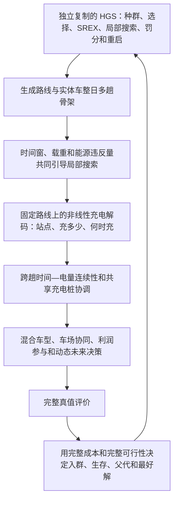

# 独立 HGS 当前根因与下一版算法候选

日期：2026-08-09  
性质：Codex 与 Claude Opus 的聚焦技术辩论结论；不是算法验收，不是算例修改申请，也不是用户已批准的新算法结构。

## 一、当前结论

`FACT`：当前独立算法还没有完成。

1. 公开侧的复制剥离 HGS 已能独立运行，但现有等价核对中与冻结 PyVRP 0.12.2 产生相同成本、相同路线和相同解文件。它证明复制没有接坏，不证明形成了强于母体的自研算法。
2. 私有侧仍由 `run_problem_hgs` 这套项目自写外层控制种群、交叉和机制教育。复制内核只产生路线骨架；其身份账明确把路线成本限定为“车辆固定成本＋按车型区分的非能源距离成本”（`kernel_proposals.py:114-126`），构边时也只写入该距离成本和行驶时间（`kernel_proposals.py:346-400`）。燃油、电能、时变碳、充电和公平没有进入这层局部搜索。
3. 候选回到 Duty 层后才重建充电并做完整评价（`runner.py:424-465`）；机制教育只在路线种群出现新优解后运行（`runner.py:776-907`），末尾还有一次机制精修（`runner.py:971-1016`）。因此当前结构能检查完整问题，却不能保证完整问题持续引导 HGS 搜索。
4. 复制种群本身又按复制解对象的 `is_feasible()` 分可行与不可行种群，并按复制成本更新适应度和选择父代（`third_party/setp_hgs_kernel/setp_hgs_kernel/Population.py:51-101,111-151`）。只在外面重算完整成本，不能自然改变复制种群内部的生存和选择。

`INFERENCE`：公开侧的根因是没有仍在工作的自研增量；私有侧的根因是“完整评价在场，但搜索方向仍主要看不见完整问题”。这比继续调 DCREX、加新动作或改算例更接近当前主要矛盾。

## 二、China81 目前只能怀疑，不能判错

`USER DECISION`：私有算例允许重新设计，但必须先证明确实是算例问题；任何修改前须提交申请说明和设计方案，并获得用户批准。

`FACT`：既有结构体检与机会体检各覆盖 27 个候选，均记为 27/27 通过；两份 `decision.json` 同时明确没有运行优化、没有效应阈值、没有选最终算例，也没有证明统一算例在数学或物理上不可能。因此它们只证明机制存在基本入口，不能证明作用空间充足。

`FACT`：最近三个 50 客户算例的弱效应和方向不一致，发生在上述私有搜索病灶仍存在的版本上。现有证据不能把责任从算法单独转给算例。

`PROCESS`：在算法侧的搜索病灶闭合前，不修改 China81。之后若仍怀疑算例，只做两个单向检验：

- 不运行搜索，直接用算术和物理边界检查某项机制是否具有可利用空间；若无论怎样决策都不可能产生差异，才形成“算例问题”的证明候选。
- 在不改原算例的隔离小探针中，人为放大一个已知作用条件，检查算法能否响应；若仍无响应，优先回到算法或实现。

只有第一类证据成立，才向用户提交算例调整申请。申请必须写清原算例病灶、数学或物理证据、文献来源、拟修改字段和范围、对三大实验及五个因素的影响、统一算例是否仍可行、生成器改法、敏感性范围和防止事后挑效果的冻结办法。用户批准前不改生成器、算例参数或候选算例名单。

## 三、下一版完整算法候选

这是一份 `DECISION` 候选，不代表用户已经批准。



关键不是再添加一个外围动作，而是让同一套独立 HGS 从生成子代到选择、生存都看见完整问题：

1. 保留复制剥离的成熟 HGS 主循环、种群、SREX 和局部搜索，继续与冻结 PyVRP 基线完全分离运行。
2. 依据 Hiermann 等的序列资源思想，把可累加的能源违反量接入局部移动的快速评价，而不是等整条路线结束后才判电量不足。Hiermann 等（2016）第 7—10 页式 (2.3)–(2.5)、(2.10)–(2.12)给出了序列能源资源、总能源违反量及其罚值接法。
3. 对固定客户顺序，使用 Montoya 等的固定路线充电问题思路和 Froger 等的标签算法思路，确定站点、充电量和非线性充电时间；精确版本用于离线真值复核，搜索内使用保持同一物理含义的快速解码，避免每个子代都跑昂贵精确算法。Montoya 等（2017）§3 及 Froger 等（2019）关于 fixed-route vehicle-charging problem 的算法部分是来源；具体页码须在施工设计定稿前从原文再次人工核实。
4. 同一辆实体车的前后多趟不能分别判断。当前仍需闭合的技术点，是把“前一趟结束电量、可用充电功率、下一趟最晚出发”形成可快速更新的时间—能量余量；Opus 提出的最低可行充电时间下界可作为候选，但尚未由当前源码和小反例证明足够，不能写成已定公式。
5. 完整成本与完整可行性必须进入同一个种群的入群、生存、父代选择和最好解更新，不能保留一套路线种群再在外面偶尔精修。机制动作也进入同一子代教育链，不能另造第二套外层循环。

伪代码：

```text
输入：公开或私有实例、完整评价器、随机种子、20 分钟硬上限
输出：最好完整可行解及节点、成本、排放和资源分解

建立唯一一套独立 HGS 种群
while 尚未自身收敛且未到 20 分钟：
    选择父代并执行独立 SREX
    在同一局部搜索中更新距离、时间窗、载重、能源和跨趟余量
    对固定路线骨架执行快速非线性充电解码
    执行混合车型、车场协同、公平参与和动态未来的已批准决策
    运行完整真值评价
    按完整成本、完整违反量和多样性决定入群与生存
    更新最好完整可行解
结束后用精确充电解码和完整评价冷复核最好解
```

## 四、公开侧仍有一项真实取舍

`FACT`：用户此前决定关闭旧的公开“客户先重分车场、再送局部搜索”动作；现有四个短试是 3 负 1 平。该旧动作不应换名字复活。

`FACT`：Vidal 等（2014）第 7 页 Proposition 1–2、式 (11)–(13)提出的不是上述事后重分配，而是在评价一个客户序列移动时，同时计算最佳车场、车型与路线旋转；预处理后，车场和旋转的摊还评价可为 O(1)。但该文第 12 页说明时间窗被移除，第 20 页又把有限车队列为后续研究，因此不能原样声称适用于本项目。

仍须用户决定：

- **A：只重新开放“Vidal 式复合局部评价”的有界设计。** 旧重分配动作继续关闭；新设计把客户移动、车场／实体车槽位和趟序放在同一次局部评价中，并为时间窗和有限车队补适配。好处是公开侧才有一个有文献来源、也服务私有多车场和混合车队的主动增量；代价是需要一轮接口设计和消融，且文献没有替我们证明有限车队时间窗版本一定有效。
- **B：维持公开客户—车场相关搜索全部关闭。** 好处是不重开已关闭方向，最省施工；后果是当前公开算法仍只是独立复制 HGS，现有证据没有另一项能够让它系统性超过冻结母体的主动差异。

Codex 与 Opus 不替用户选择。

## 五、边界与协作结论

`PROCESS`：Codex 与 Opus 已就“能源违反量是否存在成熟搜索梯度”互相纠正。Hiermann 的原文证明该梯度存在，Opus撤回“只能做完整事后评价”的说法；双方一致认为成熟方法不是不存在，而是当前源码没有接入。Opus随后指出跨趟时间—能量耦合仍需最小技术证明，这一反例保留。

`BOUNDARY`：本轮未修改算法、算例、参数、论文正文或受保护文件，未运行测试或实验。下一步施工只围绕唯一独立 HGS 与上述完整问题搜索接线；算例修改在证明、申请和用户批准之前冻结。

## 六、第八节九条自检（实际答案）

1. 每个 `FACT` 是否都有出处？——源码事实均给出文件与行号；公开等价、27 例结构与机会体检、三地效应均指向已保存产物；文献给出页码、章节或公式号。Montoya/Froger 的精确页码尚未本轮独立复核，已明确写成施工前待核，未把其页码写成 FACT。
2. 是否把代理建议写成已决或状态？——没有。下一版算法和公开复合局部评价均标为代理候选；China81 修改边界、独立运行等才标用户决定。
3. 是否超出范围？——没有。只完成用户要求的根因辨别、Claude 关键反驳和交接更正；未施工算法或改算例。
4. 是否碰受保护文件？——未碰。本轮开始与结束时 `cost.py` 为 `ad5b360dd255c7c4c975074a6eb3ad5e31354c2eaf7399af288670396140ccd1`，`check.py` 为 `1cdb6236a662eec7363dfdf99c0c0df287b32aeffbc7bd48572320696c0b1072`，`search/evaluation.py` 为 `c7215263c39d1d5a1429b41ca8ac40d950dbdf2bdc288337e56fbe9733406fc3`。
5. 待决事项是否转成具体候选并写清代价？——是。只保留公开侧 A/B 一项真实取舍；算例尚无修改申请，不要求用户拍不存在的方案。
6. 是否用自造词或内部任务号跟用户说话？——文档使用必要的源码名和文献术语；面向用户汇报不使用内部编号。
7. 失败、跳过、超时和异常是否如实保留？——保留公开无主动增量、旧重分配 3 负 1 平、私有机制未进入主搜索、China81 责任无法归因以及 Montoya/Froger 页码待复核。
8. 四件套是否齐全？——本轮不运行实验，不产生新的实验包。
9. 交接和记忆是否同步？——本结论同步追加到 `HANDOFF.md` 和 `docs/handoff/memory/MEMORY.md`。
