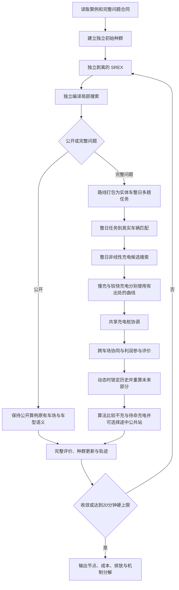

# 完全独立的问题适配 HGS：施工设计与验证顺序

> `CORRECTION / 2026-08-09`：本文件记录的是已经施工过的第一版设计，不能再作为“当前最终算法已完成”的依据。后续源码取证确认：公开复制内核目前与冻结 HGS 等价；私有路线内核的搜索成本不含能源、碳、充电和公平，完整问题机制主要在自写外层中事后评价。当前更正与下一版候选设计以 `docs/handoff/independent_hgs_root_cause_roundtable_20260809.md` 为准。本更正不撤销用户已经拍板的独立运行、DCREX 默认关闭、动态公共站、A1 信息边界和双充电曲线决定。

日期：2026-08-09  
状态：`AUTHORIZED_FOR_EXECUTION_BY_CURRENT_USER_INSTRUCTION`  
性质：工作设计，不是论文命名，不代表算法已经验收成功。

## 一、用户要得到的结果

`USER DECISION`：开源 PyVRP HGS 与自研算法完全剥离、各成体系、运行时不相互调用。Codex 与 Claude 围绕既定目标持续推进普通实现；会改变算法结构、模型含义、正式参数或公开比较身份的重大事项仍由用户决定。

算法必须同时完成两类工作：

1. 公开算例上具备强路线求解能力，至少能够正面对比冻结的开源 HGS 和 v2 同款强对手；
2. 私有算例上正确处理时变碳强度、混合车队和动态需求，并让多车场、多趟、非线性充电、协同和公平不拖累主线，最终输出车辆访问节点、完整成本和排放分解。

## 二、DCREX 为什么曾经进入设计、现在如何处置

`FACT`：引入 DCREX 不是为了换一个交叉名字。此前随机整车块交叉没有直接文献阳性证据；Lei、Hao 与 Wu（2026）作者稿第 15—16 页 Algorithm 3 给出了多父代整路线交换、二十个多样性档、五种插入和折扣 UCB1，第 22—25 页在同类多车场时间窗算例上给出消融阳性结果。因此当时选择 DCREX，是希望用大范围、保持整条路线结构的交换跳出 SREX 容易早熟的区域。

`FACT`：当前实现已经真实运行，不是纸面设计。PR17A 十种子中，DCREX＋快速交叉相对只用快速交叉为 5 胜 5 负，平均成本只好 1.4，平均耗时为 2.18 倍；现有记录还显示若干最好值的最后一次下降发生在 DCREX 轮次。它说明 DCREX 可能打开不同区域，但当前高频接法的平均收益不足以覆盖时间。

`CORRECTION`：这不等于 DCREX 从未产生过大范围跳跃，也不等于它的历史设计没有意义。更宽的 28 例试错显示，不带 DCREX 的快速版本以 17 胜 11 负、平均好 0.433% 的结果胜过带 DCREX 的版本；结合十种子 5 胜 5 负、平均耗时 2.18 倍，当前默认接法没有显示出值得保留的净增量。

`USER DECISION`：用户 2026-08-09 选择 3B。DCREX 源码和既有证据保留，但不进入最终算法默认运行路径。任何以后重新启用都须由用户决定，代理不得因为历史沉没成本自动恢复。

## 三、独立与复用的技术口径

### 3.1 两套系统的硬边界

- 冻结基线继续使用独立的 PyVRP 0.12.2 环境、入口、配置和产物；
- 自研算法使用独立 Python 包、独立编译扩展、独立入口、配置和产物；
- 自研运行环境不安装 PyVRP，自研源码不 `import pyvrp`，不动态加载其二进制；
- 两套系统只共享原始算例和外部比较口径，不在运行时交换种群、解对象或搜索状态。

### 3.2 高性能内核的来源

`DECISION`：按用户更早允许“复制和剥离模块”的口径，先从 PyVRP 0.12.2 的 MIT 许可源码复制必要的成熟 HGS 数据结构、SREX、局部搜索、罚分和种群模块，重命名、独立编译并固定来源提交。上游版权和许可证完整保留。它是自研算法的剥离式基础内核，不是运行时调用开源基线。

选择这一做法的原因是：完全用 Python 重写局部搜索会先损失公开性能，不能服务“尽快做强算法”的目标；直接调用 PyVRP 又违反最新边界。复制剥离保留成熟速度，问题特化部分通过普通路线适配器和完整 Duty 适配器进入同一套控制流程。

这项选择不把复制来的局部搜索宣称为本文创新；论文中的算法价值只来自经消融证明有效的问题适配结构。

## 四、完整算法分工



### 4.1 独立路线核心

包括独立解结构、随机数、可行/不可行双种群、自适应罚分、多样性、父代选择、SREX、编译局部搜索、修复、重启和收敛轨迹。随机初始解按上游语义直接入群，不再把“全部初始解先教育、不可行解再强制修复”作为默认规则。复制来的成熟模块不改成“自研贡献”，问题适配模块单独记录和消融。

### 4.2 DCREX 的当前处理

DCREX 不再进入默认管线。源码、历史产物和贡献归因记录保留，避免把旧的正负证据抹掉；本轮不再为它提速、改控制器或追加试跑。

### 4.3 公开问题适配

公开算例只检验路线核心。客户—车场重分配动作的源码和四个短试结果保留，但用户 2026-08-09 选择 4B，该动作默认关闭，不再用它干扰公开路线性能判断。

### 4.4 私有完整问题适配

- 把同一实体车的一日多趟作为连续任务，时间和 SOC 跨趟传递；
- 在真实车辆间做整日任务匹配，车辆类型、车场和动态锁定保持一致；
- 用非线性充电曲线、时段边界和真实可用站点形成整日充电候选；车场慢充与公共站较快充电使用各自功率对应的文献曲线，不再共用未经证实的固定 90% 拐点；
- 共享桩冲突由协调搜索处理，利润、参与和公平由完整评价决定；
- 动态需求只开放触发时刻之后的客户、路线、车辆和充电，历史原样保留；动态阶段把途中公共站、充电量和充电时刻作为一等候选；
- 空闲电动车的待命充电不是人工强制储备。算法在“不充、何时充、充多少、在哪里充”的候选之间选择，并把当前充电代价与未来服务能力放进同一有文献依据的前瞻评价。旧的“按已出现最大单单需求充到固定目标”只保留为历史技术候选，不进入最终默认算法。

## 五、伪代码

```text
输入：实例 I，完整评价器 E，随机种子 s，20 分钟硬上限
输出：最好完整可行解 best

1  用独立内核生成初始种群 P，按复制版上游语义直接入群
2  对私有问题的初始路线骨架执行完整问题适配，得到完整个体
3  best ← P 中完整评价最好的可行解
4  while 未按当前收敛轨迹停止 且 未到 20 分钟：
5      从 P 选择父代
6      child_raw ← 独立剥离的 SREX(父代)
7      child_route ← 独立编译局部搜索(child_raw)
8      if 公开算例：
9          child ← 保持公开算例原有语义的路线解
10     else：
11         duties ← 把路线打包为实体车整日多趟任务
12         assignment ← 匹配 duties 与真实车辆
13         charging ← 枚举车场或公共站、结构电量和可行时刻
14         动态空闲电动车同时保留“不充”和前瞻待命充电候选
15         charging ← 用功率对应的文献曲线重建并协调共享充电桩
16         child ← 评价协同、利润、参与、公平和动态未来部分
17     score ← E(child)
18     记录交叉前、交叉后、局部搜索后、完成后及各段工作量
19     更新 P、罚分、控制器和 best
20  从保存的 best 重新执行完整真值复核
21  输出车辆访问节点、成本与排放分解、收敛轨迹和版本身份
```

## 六、最快的正确试错顺序

1. **独立性探针**：在不安装 PyVRP 的自研环境中导入、求解一个小公开题；扫描运行进程实际加载模块，确认没有 PyVRP 路径。
2. **等价性探针**：复制剥离的基础内核在固定种子和相同输入上复现上游基础行为，证明剥离没有接坏；这不是性能结论。
3. **公开真实位置**：已在 PR11A、PR17A、PR24B 固定种子短试中得到逐位相同路线和成本，说明复制剥离正确，也说明默认公开算法目前只是独立复现 HGS，没有问题部件带来的正增量。
4. **私有接线**：三地区各一个 50 客户题做有界短试，检查路线、车型、充电、协同和动态动作能否到达完整评价、服务量是否守恒、机制候选能否产生独立增量。
5. **前瞻待命与双曲线**：用户已选定“从事先登记的需求分布另抽未来，绝不读取本轮隐藏订单”，并进一步选择 A1：用更大的预登记潜在客户池，让真实未来订单和算法情景分别独立抽样。车场 22 kW 常规曲线、公共站 60 kW 迁移快充曲线已经接通。A1 信息结构已定，但用户随后明确当前优先级是算法性能以及算法—算例共同产生效应；潜在池施工不得取代这两个瓶颈。
6. 当前源码、当前产物和上述三条主线闭合后，由 Opus 做一次独立验收；不再追加无关门禁或审计支线。

## 七、现阶段能安全说什么

- DCREX 有文献依据并真实运行过，但当前默认接法是负增量；用户已决定保留源码、默认关闭。
- 复制剥离的 HGS 已能在不安装 PyVRP 的独立环境运行，三个公开算例短试与冻结基线逐位相同。这证明剥离正确，不证明公开性能已经超过母体。
- 动态公共站充电已接入当前独立算法。车场 22 kW 与公共站 60 kW 已分别接入 Montoya 常规／快充形状，生成、成本与检查共用同一站点曲线；相关定向回归 178 项通过。空闲电动车的预测性待命仍未完成，因为当前事件流只有“从本轮真实客户中隐藏 20%”，不能直接作为不泄漏未来的抽样分布。
- 当前第一瓶颈是公开和私有算法性能尚未明显超过冻结 HGS；第二瓶颈是算法与算例没有共同为三大实验和五个因素打开稳定、明显的作用空间。A1 潜在客户池和更高仿真精度均服从这两个瓶颈，不得反过来抢占主线。
- 新算法是否最终优秀，仍要由当前版本的公开性能、私有消融和三大实验共同证明，旧 Duty-HGS 的验收不能转移过来。

## 第八节九条自检（实际答案）

1. 每个 `FACT` 是否都有出处？——DCREX 文献设计与消融指向 Lei、Hao 与 Wu 作者稿第 15—16、22—25 页；十种子和 28 题读数来自已保存的公开归因包和公开试错包；当前独立剥离、三个公开等价短试和动态公共站试跑均有当前源码与产物。充电曲线来自 Montoya 等（2017）图 8 第 13 页及冻结曲线节点；178 项当前定向回归通过。前瞻待命仍未完成，已明确写为未证明。
2. 有没有把代理建议写成用户已决？——没有。完全剥离、统一控制流程、上游初始种群语义、DCREX 默认关闭、公开重分配默认关闭、动态公共站、算法自主待命、需求信息原则和两类充电曲线来自用户本轮 1A、2B、3B、4B、5A、6A、7A、A、7A-1；空间需求信息结构仍保留为待决。
3. 是否越界？——本次更新只把当前施工设计与用户最新选择和已经完成的代码、技术试跑对齐，没有据此启动正式实验或改论文正文。
4. 是否碰受保护文件？——经用户明确批准修改 `cost.py` 与 `check.py` 后，本轮只修改了 `cost.py`：修改前 SHA-256 为 `e7ea406da87a3172cd1ff7dc87fe7def536e74f197f6c67b29da2394fe42b00d`，修改后为 `ad5b360dd255c7c4c975074a6eb3ad5e31354c2eaf7399af288670396140ccd1`。`check.py` 无需重复实现曲线选择，保持 `1cdb6236a662eec7363dfdf99c0c0df287b32aeffbc7bd48572320696c0b1072`；`search/evaluation.py` 未碰，保持 `c7215263c39d1d5a1429b41ca8ac40d950dbdf2bdc288337e56fbe9733406fc3`。
5. 待决事项是否清楚？——前瞻待命只剩空间需求信息结构需要用户决定；充电曲线数值已由 7A-1 决定。公开侧问题部件的正增量仍须后续现有三条主线共同验证，不由本轮曲线施工替代。
6. 是否使用自造论文术语？——没有。“完全独立的问题适配 HGS”只是工作描述，不是论文算法名或创新主张。
7. 是否保留失败和异常？——保留 DCREX 的十种子与 28 例负增量、公开纯复制只与母体逐位相同、私有机制直接贡献未证和旧架构依赖 PyVRP 等不利事实。
8. 四件套是否齐全？——三个公开等价技术包和动态公共站技术包各自有完整结果包；本轮只做代码回归与文献核对，不产生实验包。
9. 交接和记忆是否同步？——A、7A-1、曲线施工和待命信息缺口已同步到 `pending_decisions.md`、`HANDOFF.md` 与 `docs/handoff/memory/MEMORY.md`。
