ATLAS_DONE

# 文献图表册

本册按论文原有的节名或图表题分组。页码写作“PDF 物理页／印刷页”；英文论文两者相同时只写一个页码。图片均为原 PDF 的直接裁切，没有重绘、美化或改动内容。

## 算法流程图

### 陈雨蝶等（2025）图1

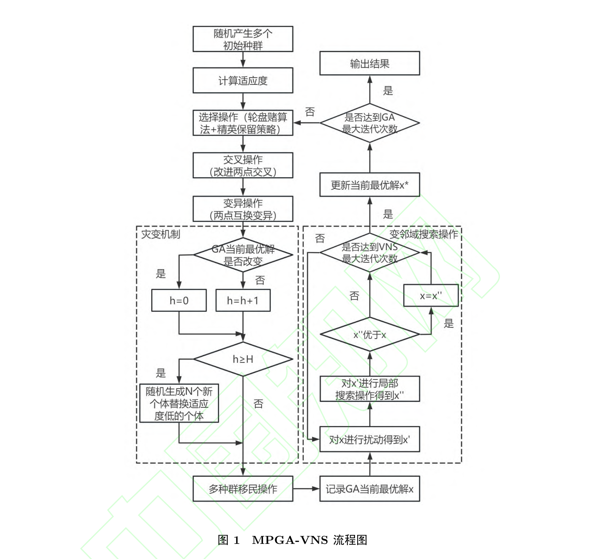

- 出处：陈雨蝶等（2025），《系统工程理论与实践》，图1“MPGA-VNS流程图”，9／8。
- 正文原句：“为应对这些挑战，设计一种具有变邻域搜索操作和动态灾变机制的多种群遗传算法（Multiple Population Genetic Algorithm with Variable Neighborhood Search and Dynamic Catastrophe Mechanism，MPGA-VNS），算法流程如图1所示。”
- 所在节：§3.1“算法流程图”。
- 结构：无横纵轴；1幅流程图；矩形步骤框、菱形判断框和循环箭头组成，没有曲线或柱。

## 实验设计和最终解分析

### 陈雨蝶等（2025）表2

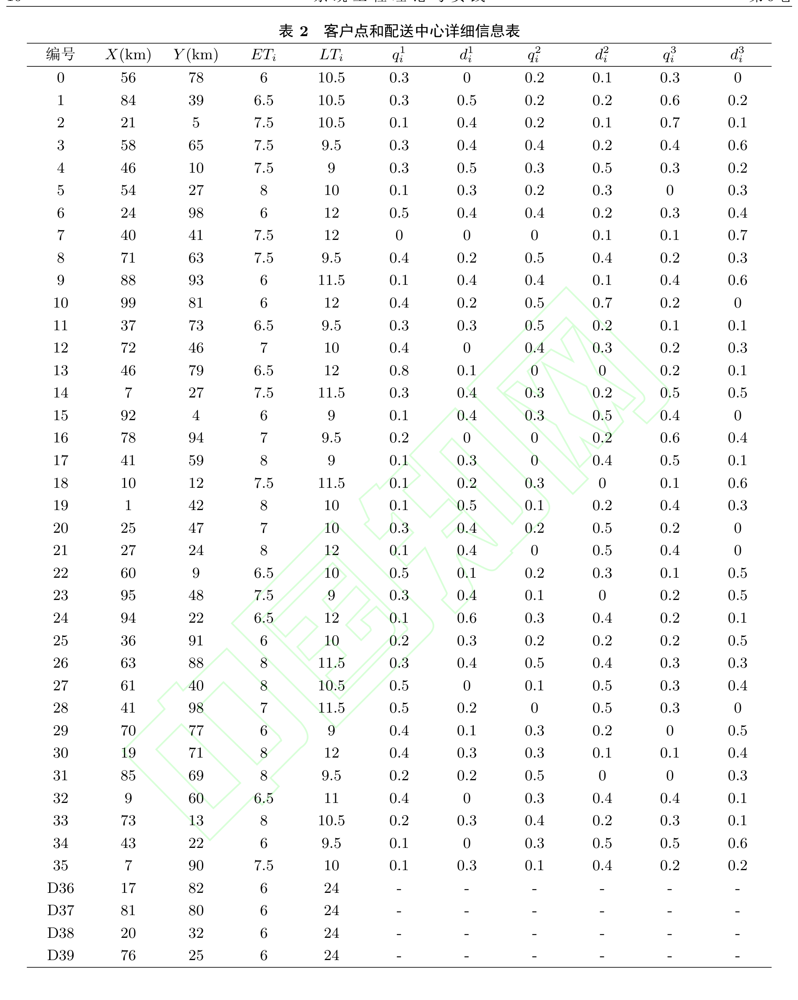

- 出处：陈雨蝶等（2025），《系统工程理论与实践》，表2“客户点和配送中心详细信息表”，11／10。
- 正文原句：“客户点和配送中心详细信息如表2所示，0～35是客户点，D36～D39是配送中心。”
- 所在节：§4.1.1“实验设计”。
- 结构：行是0～35号客户及D36～D39配送中心；列为编号、X、Y、ET_i、LT_i及三类货物的需求量和服务时间；无合计行、无变化率列。

### 唐坚强等（2023）表4

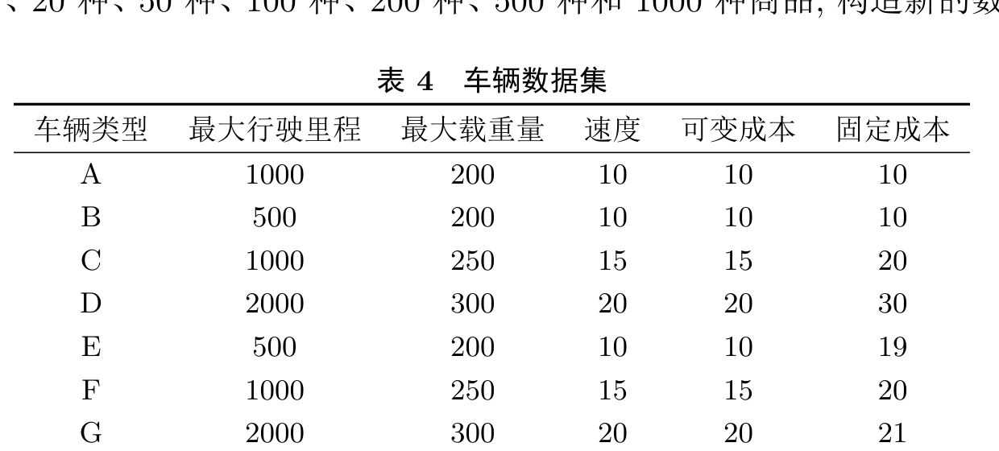

- 出处：唐坚强等（2023），《系统工程理论与实践》，表4“车辆数据集”，12／1457。
- 正文原句：“车辆类型、配送站数量、商品数量、仓库数量等数据见表4和表5。”
- 所在节：§4.1“算例设计”。
- 结构：A～G七类车辆为行；列为车辆类型、最大行驶里程、最大载重量、速度、可变成本和固定成本；无合计行、无变化率列。

### 唐坚强等（2023）表5

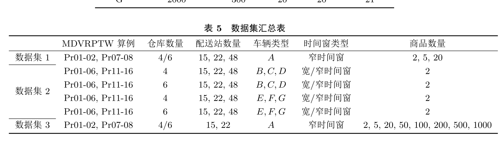

- 出处：唐坚强等（2023），《系统工程理论与实践》，表5“数据集汇总表”，12／1457。
- 正文原句：“车辆类型、配送站数量、商品数量、仓库数量等数据见表4和表5。”
- 所在节：§4.1“算例设计”。
- 结构：三类数据集的算例配置为行；列为MDVRPTW算例、仓库数量、配送站数量、车辆类型、时间窗类型和商品数量；无合计行、无变化率列。

### 王勇等（2025）表3

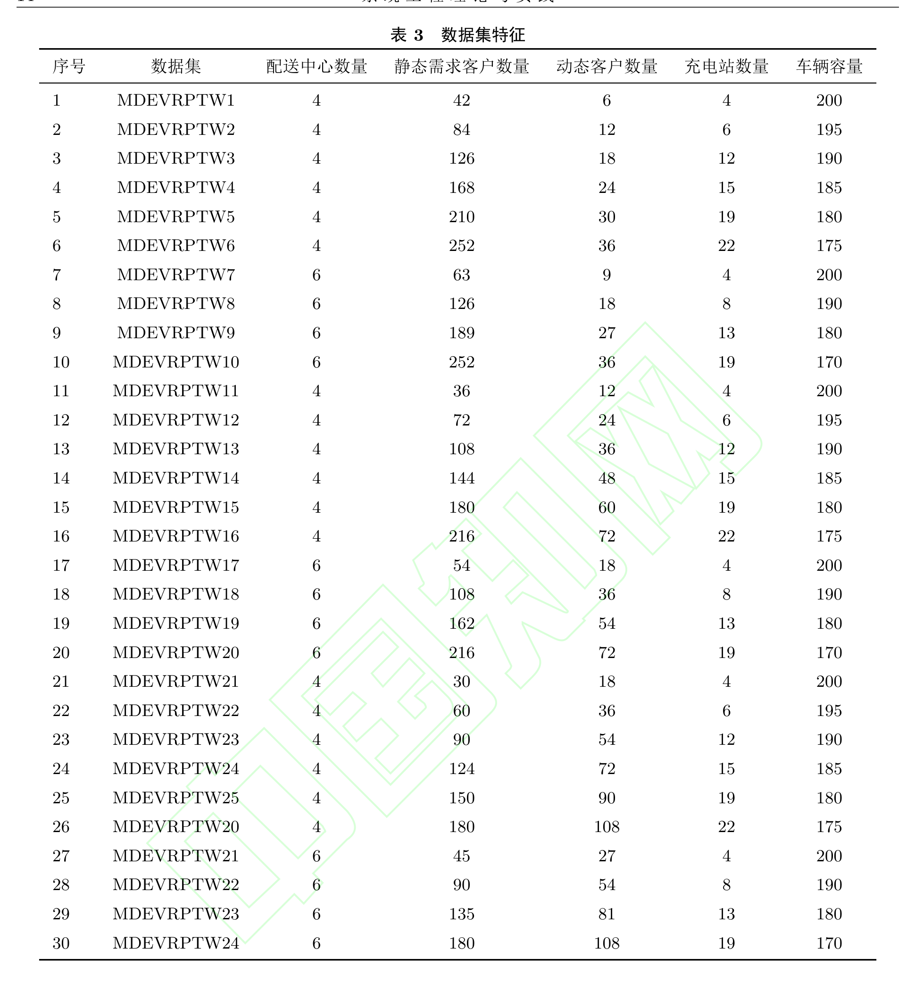

- 出处：王勇等（2025），《系统工程理论与实践》，表3“数据集特征”，15／14。
- 正文原句：“改进后的30组数据特征如表3所示。”
- 所在节：§3.5.2“算法有效性验证”。
- 结构：30个算例为行；列为算例、配送中心数、静态／动态客户数、充电站数及时间段等特征；无合计行、无变化率列。

## 算法有效性分析

### 陈雨蝶等（2025）图4

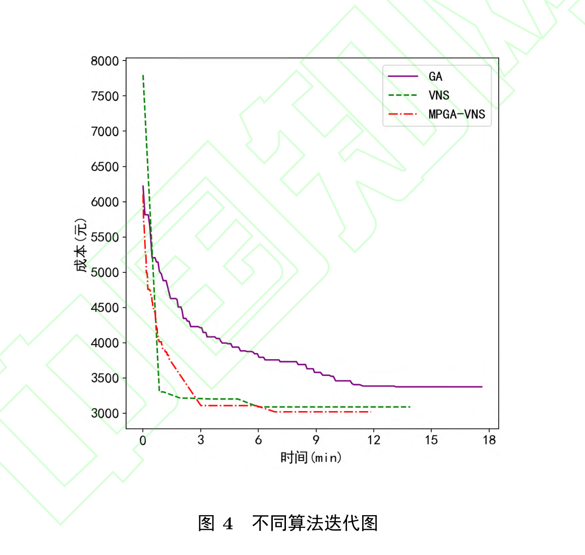

- 出处：陈雨蝶等（2025），《系统工程理论与实践》，图4“不同算法迭代图”，15／14。
- 正文原句：“实验结果如表6和图4所示，算法迭代次数不同，因此迭代图以时间（min）为横坐标。”
- 所在节：§4.2.2“算法对比”。
- 结构：横轴“时间/min”，纵轴“成本/元”；MPGA-VNS、GA、VNS共3条曲线；1个面板，无柱。

### 陈雨蝶等（2025）表5

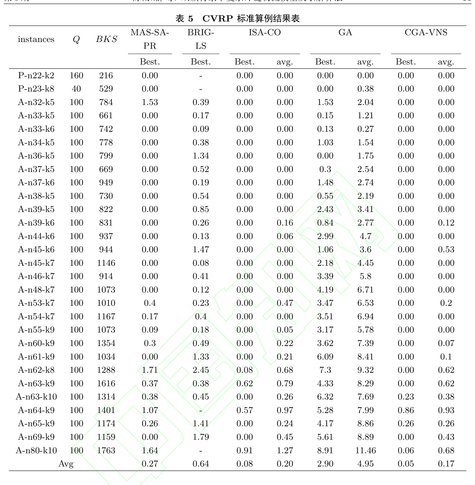

- 出处：陈雨蝶等（2025），《系统工程理论与实践》，表5“CVRP标准算例结果表”，14／13。
- 正文原句：“CVRP标准算例结果对比如表5所示，其中算例均为单配送中心，Q为车辆最大载重，BKS为已知最优解，Best.、Avg.为最终解、平均解误差（%）。”
- 所在节：§4.2.1“算法有效性分析”。
- 结构：29个算例行加1个Avg行；列为算例、规模、Q、BKS及本文与对比算法的Best、Avg和误差；有Avg汇总行，有误差百分比列。

### 陈婉茹等（2023）图2

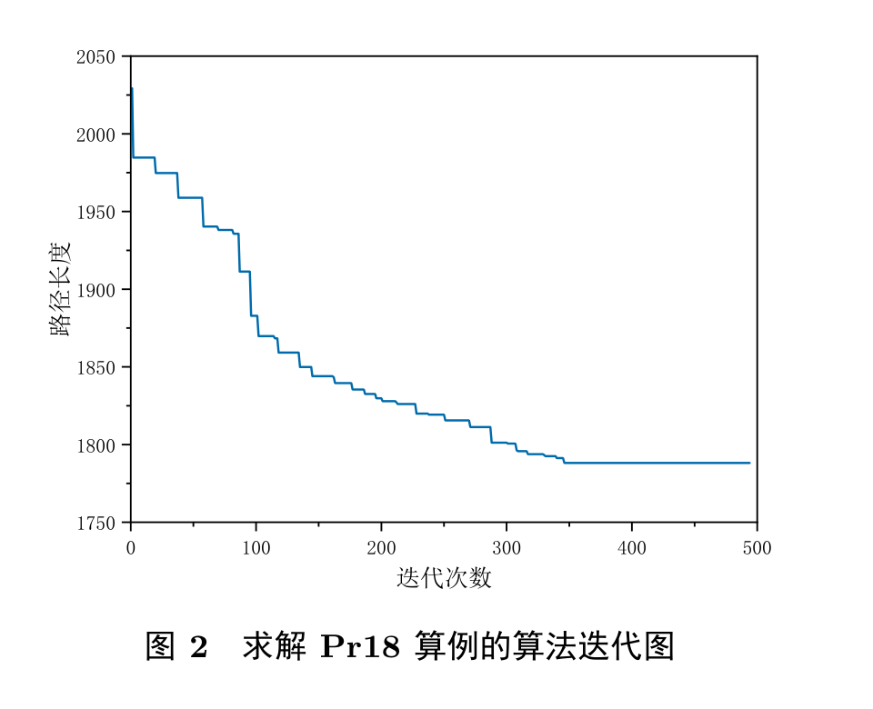

- 出处：陈婉茹等（2023），《系统工程理论与实践》，图2“求解Pr18算例的算法迭代图”，10／3329。
- 正文原句：“PIVNS求解Pr18算例得到的最优配送路径方案及算法迭代过程分别如表6和图2所示。由图2可以看出，算法在约350次迭代后收敛，并在约500次迭代时达到最大不改进迭代次数，寻优能力和效率俱佳。”
- 所在节：§4.1“基准测试算例实验”。
- 结构：横轴“迭代次数”，纵轴“路径长度”；1条收敛曲线；1个面板，无柱。

### 陈婉茹等（2023）表5

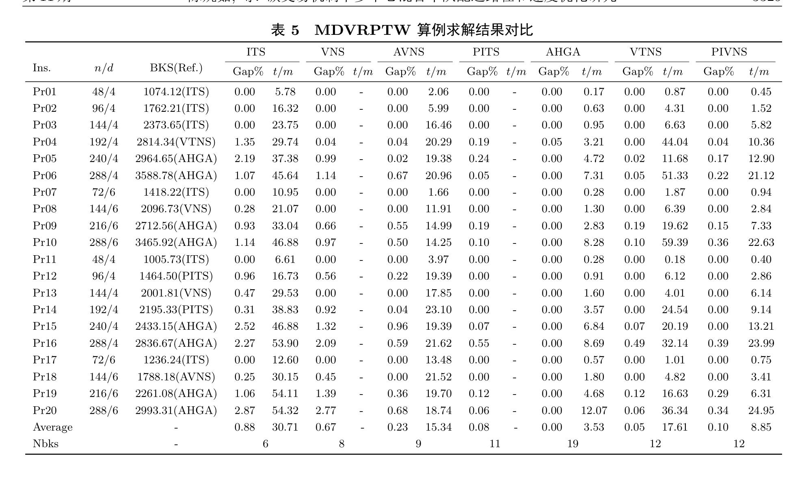

- 出处：陈婉茹等（2023），《系统工程理论与实践》，表5“不同算法求解MDVRPTW标准算例结果”，10／3329。
- 正文原句：“各算法的具体求解结果如表5所示，其中，Ins.为算例编号，n/d为当前算例的客户点数量/配送中心数量，BKS(Ref.)为当前算例的已知最优解（首次求得的文献）。”
- 所在节：§4.1“基准测试算例实验”。
- 结构：行是Pr系列算例，末有Average和Nbks；列按不同算法给最优值、平均值、误差和时间；有汇总行和Gap列。

### 陈婉茹等（2023）表6

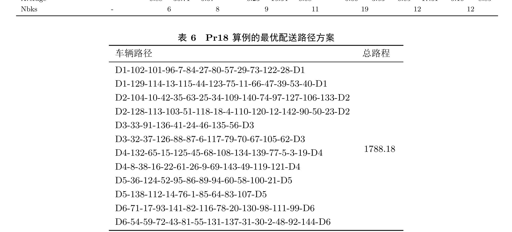

- 出处：陈婉茹等（2023），《系统工程理论与实践》，表6“Pr18算例的最优配送路径方案”，10／3329。
- 正文原句：“PIVNS求解Pr18算例得到的最优配送路径方案及算法迭代过程分别如表6和图2所示。”
- 所在节：§4.1“基准测试算例实验”。
- 结构：行是12条车辆路径；列为“车辆路径”和“总路程”；总路程以跨行单元格给出，无合计行、无变化率列。

### 唐坚强等（2023）表6

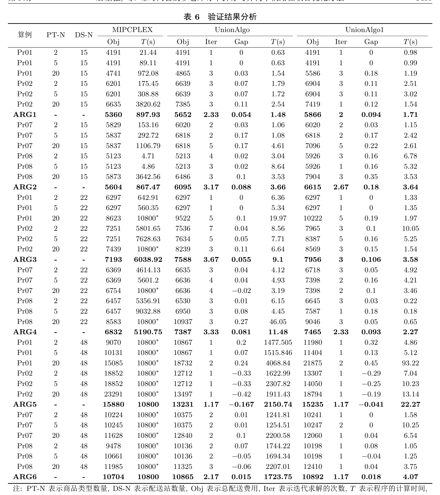

- 出处：唐坚强等（2023），《系统工程理论与实践》，表6“验证结果分析”，14／1459（表的引出文字始于13／1458）。
- 正文原句：“表6中Gap表示联合优化算法的迭代解与模型的最优解的差值百分比。”
- 所在节：§4.2.1“模型与算法的验证分析”。
- 结构：行是36个算例并分组设置ARG平均行；列为实例规模、MIP-CPLEX及UnionAlgo、UnionAlgo1的目标值、迭代、Gap和时间；有ARG汇总行和Gap列。

### 王勇等（2023）图10

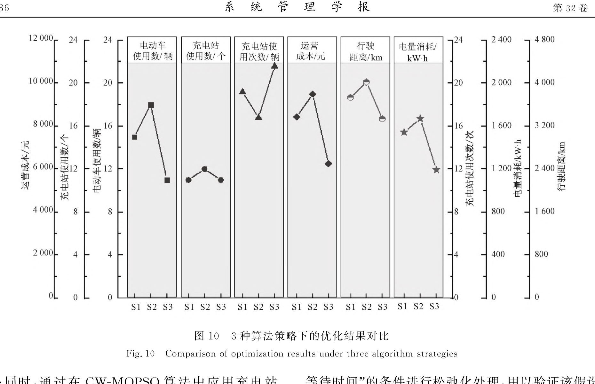

- 出处：王勇等（2023），《系统管理学报》，图10“3种算法策略下的优化结果对比”，18／1136。
- 正文原句：“由表10与图10可知，在同时应用充电站插入策略和外部存档更新策略（S3）时，算法的计算结果为运营成本6240.5元，低于仅使用充电站插入策略（S1）的运营成本8439.5元和仅采用外部存档更新策略（S2）的运营成本9488.0元。”
- 所在节：§4.3.1“算法消融实验对比”。
- 结构：横轴是S1～S3；6组指标各用独立纵轴刻度并以点线表示；1个组合面板，6个指标系列，无柱。

### 姜广田等（2024）图8

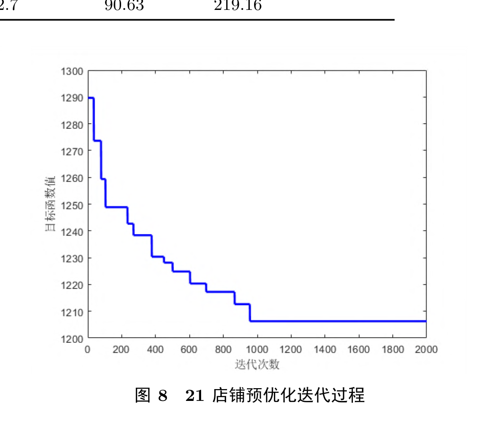

- 出处：姜广田等（2024），《系统工程理论与实践》，图8“21店铺预优化迭代过程”，12／2373。
- 正文原句：“预优化配送方案如表4所示，配送路径如图7所示，预优化迭代过程如图8所示，纵坐标为每一次迭代过程中目标函数取值，至960代左右基本收敛。”
- 所在节：§4.1“实验1：21个店铺”。
- 结构：横轴“迭代次数”，纵轴“目标函数值”；1条曲线；1个面板。

### 姜广田等（2024）图14

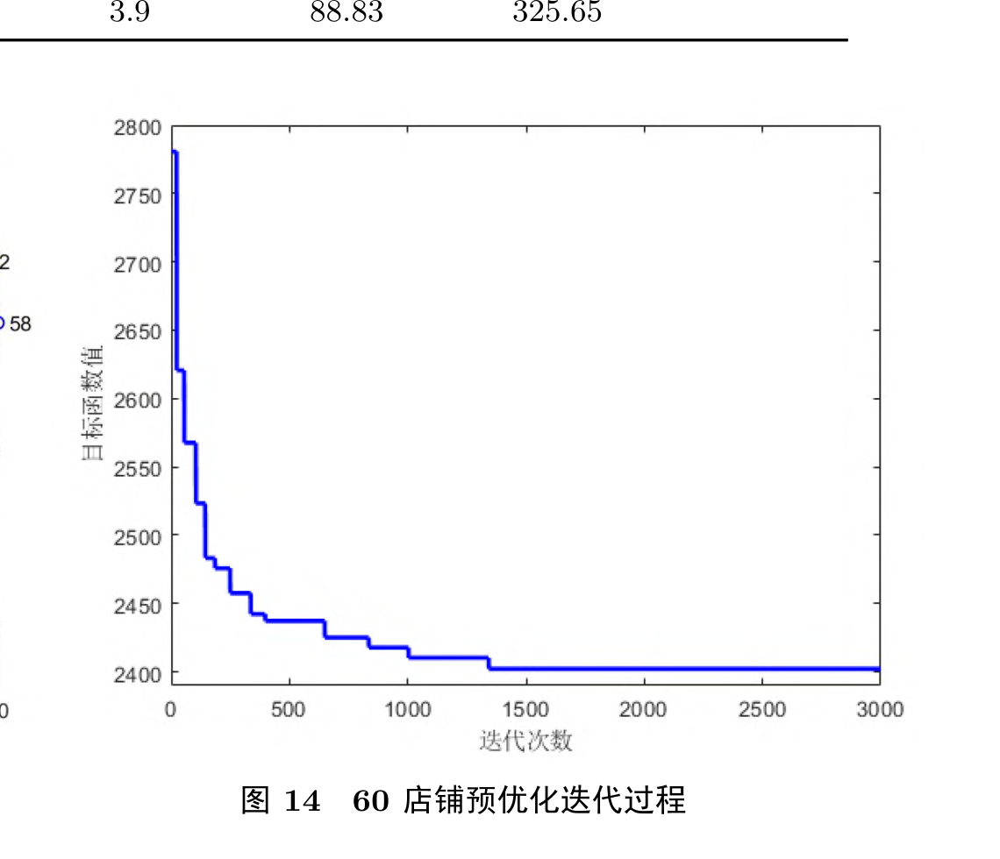

- 出处：姜广田等（2024），《系统工程理论与实践》，图14“60店铺预优化迭代过程”，14／2375。
- 正文原句：“预优化配送方案如表10所示，配送路径如图13所示，预优化迭代过程如图14所示，至1450代左右基本收敛。”
- 所在节：§4.2“实验2：60个店铺”。
- 结构：横轴“迭代次数”，纵轴“目标函数值”；1条曲线；1个面板。

### 姜广田等（2024）图18

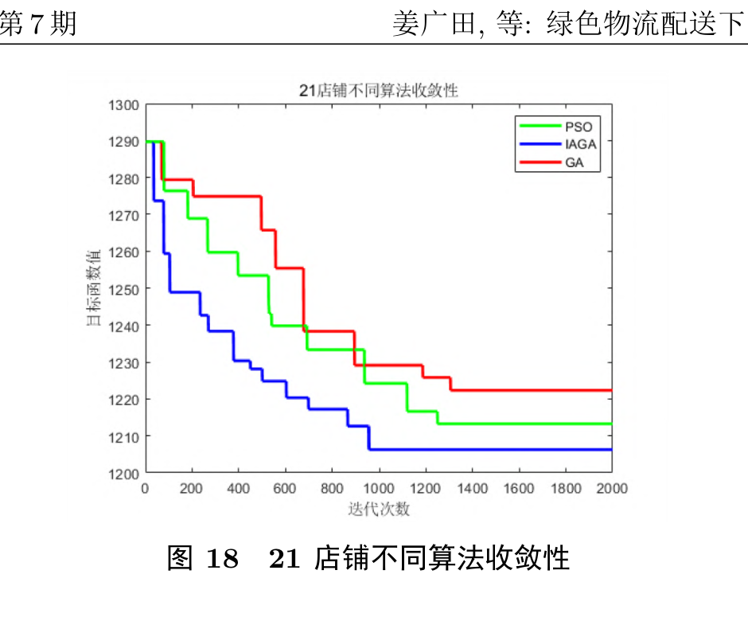

- 出处：姜广田等（2024），《系统工程理论与实践》，图18“21店铺不同算法收敛性”，18／2379。
- 正文原句：“图18为21店铺时GA、PSO与IAGA迭代次数的收敛情况对比图，图19为60店铺时GA、PSO与IAGA迭代次数的收敛情况对比图，21店铺和60店铺的IAGA收敛情况都优于GA和PSO。”
- 所在节：§5.2“算法分析”。
- 结构：横轴“迭代次数”，纵轴“目标函数值”；IAGA、PSO、GA共3条曲线；1个面板。

### 姜广田等（2024）图19

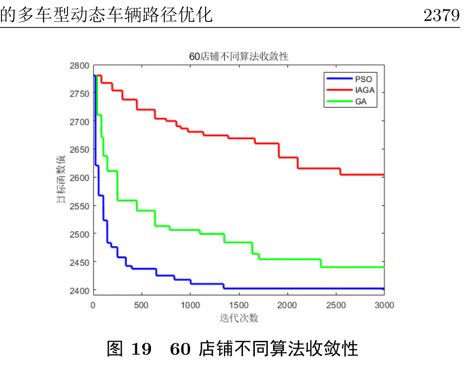

- 出处：姜广田等（2024），《系统工程理论与实践》，图19“60店铺不同算法收敛性”，18／2379。
- 正文原句：“图18为21店铺时GA、PSO与IAGA迭代次数的收敛情况对比图，图19为60店铺时GA、PSO与IAGA迭代次数的收敛情况对比图，21店铺和60店铺的IAGA收敛情况都优于GA和PSO。”
- 所在节：§5.2“算法分析”。
- 结构：横轴“迭代次数”，纵轴“目标函数值”；IAGA、PSO、GA共3条曲线；1个面板。

### 徐小峰等（2021）图8

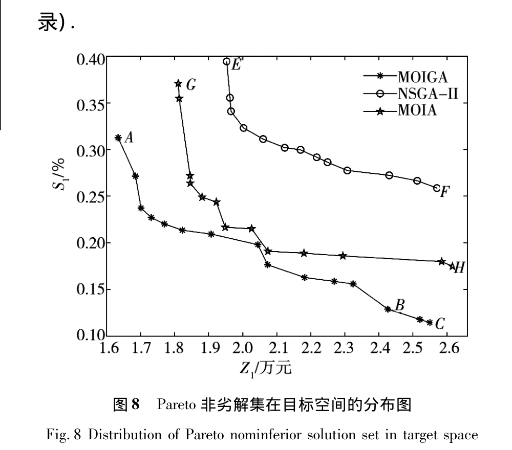

- 出处：徐小峰等（2021），《管理科学学报》，图8“Pareto非劣解集在目标空间的分布图”，9／114。
- 正文原句：“分别使用MOIGA算法、NSGA-II算法与MOIA算法进行求解，图8为得到的Pareto非劣解集分布，其中横坐标为目标函数Z1（企业总成本），纵坐标为S1（平均客户满意度）。”
- 所在节：§5.2“算例分析”。
- 结构：横轴“Z1/万元”，纵轴“S1/%”；3组散点／连线；1个面板。

### 徐小峰等（2021）图10

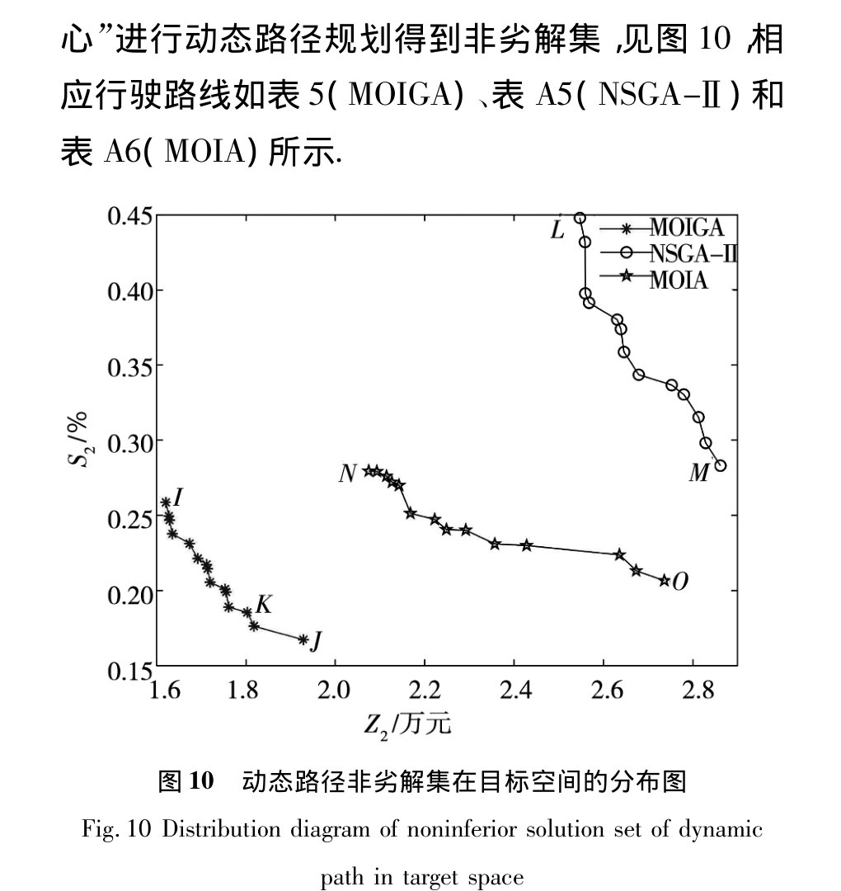

- 出处：徐小峰等（2021），《管理科学学报》，图10“动态路径非劣解集在目标空间的分布图”，11／116。
- 正文原句：“故可认为路线1、路线4已经行驶完毕，同时将客户点5、客户点23看作‘虚拟配送中心’进行动态路径规划得到非劣解集，见图10。”
- 所在节：§5.2“算例分析”。
- 结构：横轴“Z2/万元”，纵轴“S2/%”；MOIGA、NSGA-II、MOIA共3组散点／连线；1个面板。

## 最终解分析

### 陈雨蝶等（2025）表4

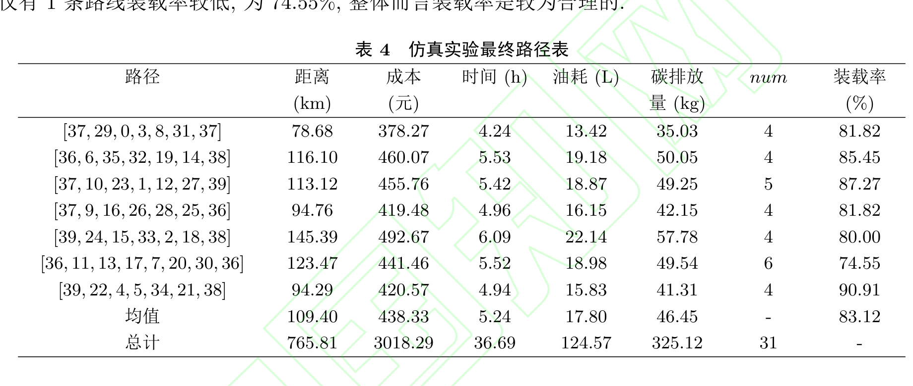

- 出处：陈雨蝶等（2025），《系统工程理论与实践》，表4“仿真实验最终路径明细”，13／12。
- 正文原句：“仿真实验最终路径明细如表4所示，其中num指满足时间窗客户数。”
- 所在节：§4.1.2“最终解分析”。
- 结构：行是车辆路径，末有均值和总计；列为路径、距离、成本、时间、油耗、碳排放量、num和装载率；有总计行，无变化率列。

### 陈婉茹等（2023）图3

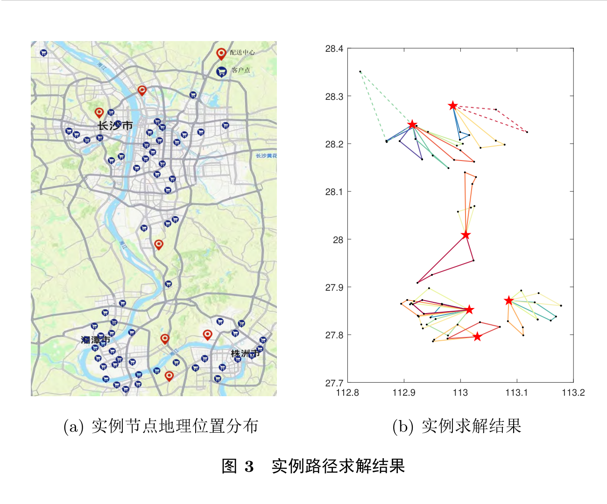

- 出处：陈婉茹等（2023），《系统工程理论与实践》，图3“实例路径求解结果”，11／3330。
- 正文原句：“图3（a）给出实例各节点地理分布，图3（b）给出求得的最优配送路线，其中，不同颜色的路线代表不同的车辆，实线为燃油车路径，虚线为电动车路径。”
- 所在节：§4.2.2“求解结果分析”。
- 结构：2个子图；横纵轴为经纬度；左图是节点分布，右图约24条路线；无柱。

### 王勇等（2025）表7

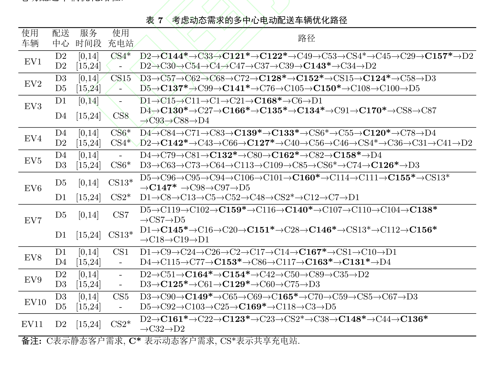

- 出处：王勇等（2025），《系统工程理论与实践》，表7“考虑动态需求的多中心电动配送车辆优化路径”，18／17。
- 正文原句：“表7出示了不同服务时间段内各配送中心电动配送车辆优化路径。”
- 所在节：§4.2“优化结果与分析”。
- 结构：21条路径为行；列为使用车辆、配送中心、服务时间段、使用充电站和路径；无合计行、无变化率列。

### 王勇等（2023）图9

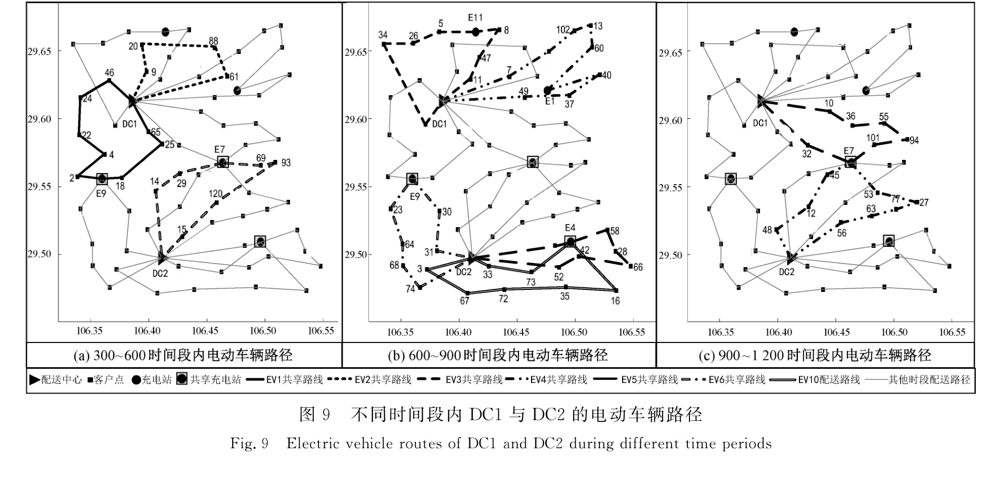

- 出处：王勇等（2023），《系统管理学报》，图9“不同时间段内DC1与DC2的电动车辆路径”，16／1134。
- 正文原句：“不同服务时间段内DC1与DC2的车辆路径见图9，EV1～EV4分别在不同时段内为DC1和DC2的客户提供服务，实现了电动车在多中心间的共享。”
- 所在节：§4.2.2“优化结果分析”。
- 结构：3个路线子图；横纵轴为经纬度；按服务时间段分面并用多色路线表示车辆；无柱。

### 王勇等（2023）表9

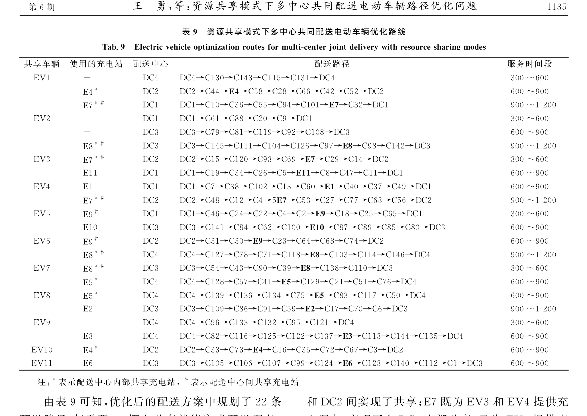

- 出处：王勇等（2023），《系统管理学报》，表9“资源共享模式下多中心共同配送电动车辆优化路线”，17／1135。
- 正文原句：“由表9可知，优化后的配送方案中规划了22条配送路径，仅需要11辆电动车就能完成配送服务。”
- 所在节：§4.2.2“优化结果分析”。
- 结构：22条路线为行；列为共享车辆、使用的充电站、配送中心、配送路径和服务时间段；无合计行、无变化率列。

### Wang et al.（2023）Fig. 14

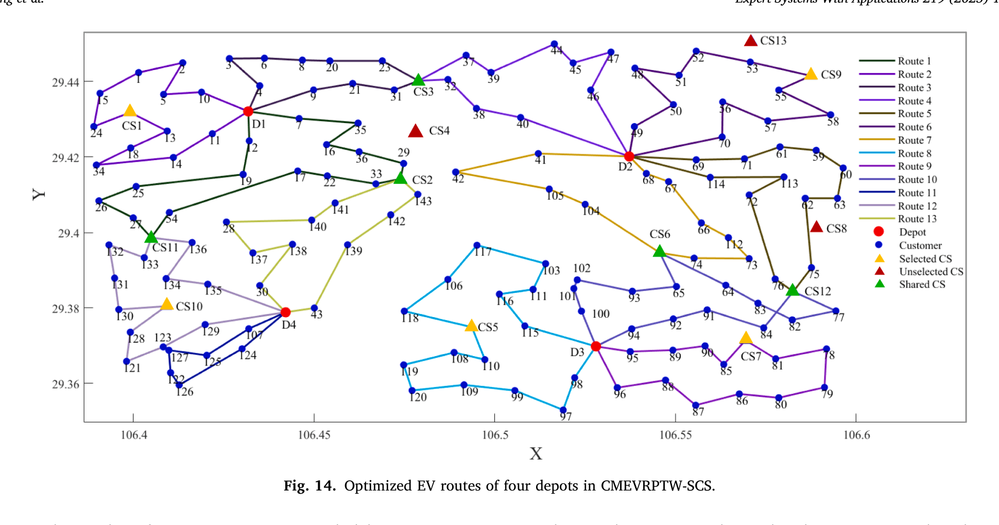

- 出处：Wang et al.（2023），*Expert Systems with Applications*，Fig. 14 “Optimized EV routes of four depots in CMEVRPTW-SCS”，21。
- 正文原句：“In Table 18 and Fig. 14, the total number of delivery routes is 13.”
- 所在节：§6.3.2 “Vehicle routing optimization with shared charging stations”。
- 结构：横轴“X”，纵轴“Y”；1幅路线图，13条路线；图例另列车场、客户、充电站和共享充电站。

### Wang et al.（2023）Table 18

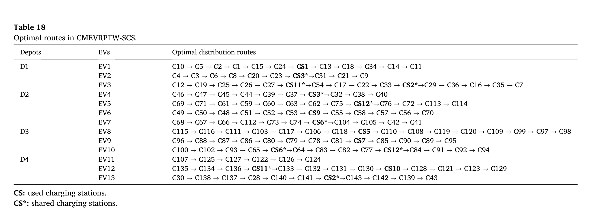

- 出处：Wang et al.（2023），*Expert Systems with Applications*，Table 18 “Optimal routes in CMEVRPTW-SCS”，20。
- 正文原句：“In Table 18 and Fig. 14, the total number of delivery routes is 13.”
- 所在节：§6.3.2 “Vehicle routing optimization with shared charging stations”。
- 结构：13条EV路线为行并按D1～D4分组；列为Depots、EVs、Optimal distribution routes；无合计行、无变化率列。

### Wang et al.（2024）Fig. 11

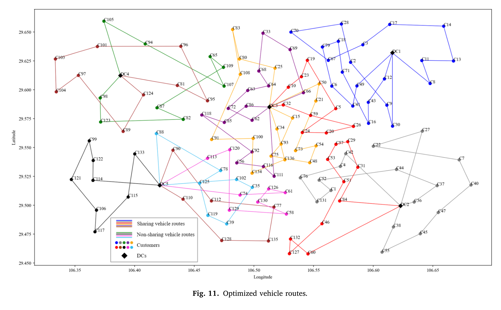

- 出处：Wang et al.（2024），*Transportation Research Part E*，Fig. 11 “Optimized vehicle routes”，29。
- 正文原句：“The optimized vehicle routes for the collaboration and sharing situation are shown in Fig. 11.”
- 所在节：§5.3.4 “Optimization results”。
- 结构：横轴“Longitude”，纵轴“Latitude”；1幅全网路线图，10条路线；无柱。

### Wang et al.（2024）Fig. 12

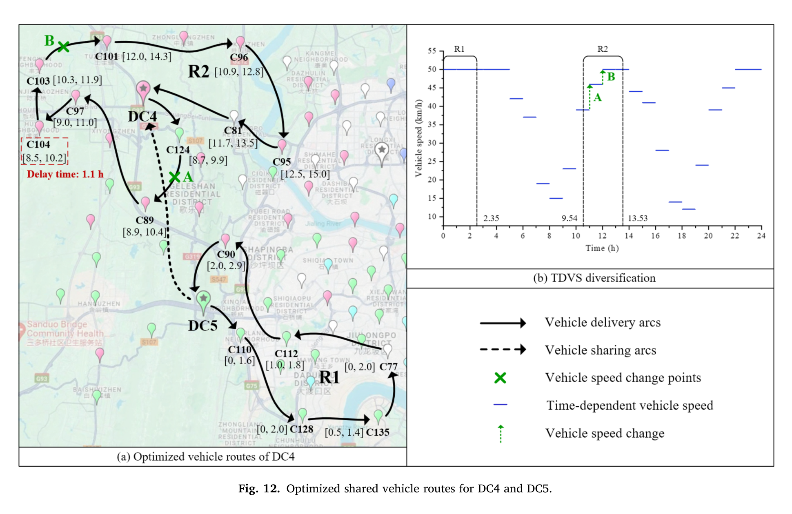

- 出处：Wang et al.（2024），*Transportation Research Part E*，Fig. 12 “Optimized shared vehicle routes for DC4 and DC5”，30。
- 正文原句：“To illustrate the actual delivery routes traveled with time-dependent vehicle scheduling and vehicle sharing, an example of a vehicle route is presented in Fig. 12.”
- 所在节：§5.3.4 “Optimization results”。
- 结构：2个子图；左图经纬度路线，右图横轴“Time (h)”、纵轴“Vehicle speed (km/h)”；含空间路线和速度分段线，无柱。

### 饶卫振等（2022）图5

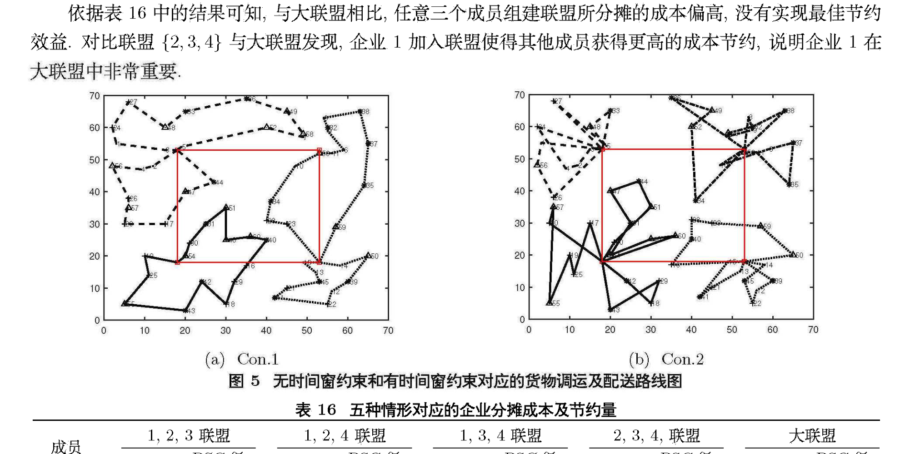

- 出处：饶卫振等（2022），《系统工程理论与实践》，图5“无时间窗约束和有时间窗约束对应的货物调运及配送路线图”，16／2736。
- 正文原句：“图5为Con.1和Con.2对应的配送路线图。”
- 所在节：§5.3.2“客户时间窗对协作配送成本的影响”。
- 结构：2个路线子图Con.1、Con.2；无正式横纵轴名；分别显示调运和配送连线，无柱。

### 徐小峰等（2021）表3

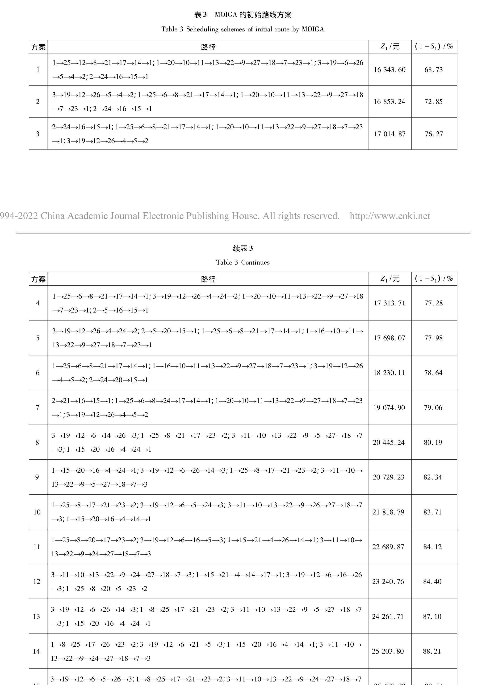

- 出处：徐小峰等（2021），《管理科学学报》，表3“MOIGA的初始路线方案”，9—10／114—115。
- 正文原句：“Pareto非劣解集的每一个点对应不同的车辆初始行驶路线，并按照成本递增规律对非劣解集的计划路线进行编制，MOIGA求得方案如表3。”
- 所在节：§5.2“算例分析”。
- 结构：15个Pareto方案为行；列为方案、车辆路径、成本和平均客户满意度；表跨两页拼接呈现，无合计行、无变化率列。

### 徐小峰等（2021）图9

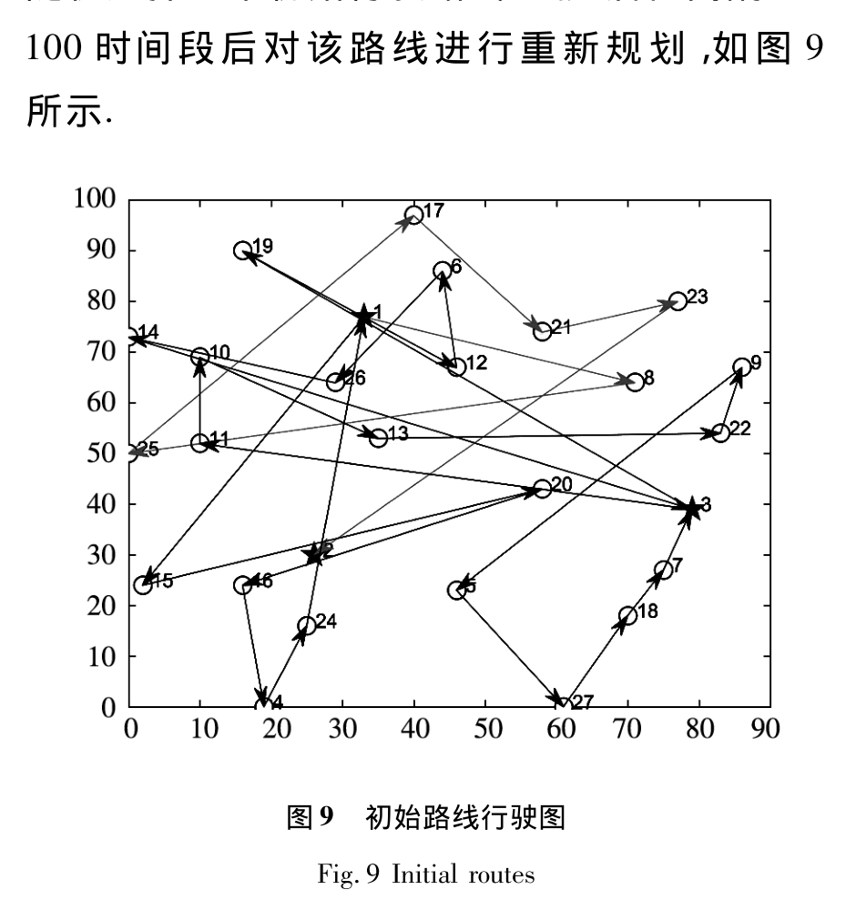

- 出处：徐小峰等（2021），《管理科学学报》，图9“初始路线行驶图”，11／116。
- 正文原句：“因此，在T0时刻从MOIGA求得的若干个决策中随机选择一个初始行驶路线B，然后在间隔t=100时间段后对该路线进行重新规划，如图9所示。”
- 所在节：§5.2“算例分析”。
- 结构：无轴名的二维坐标路线图；4条路线；1个面板，无柱。

### 徐小峰等（2021）表5

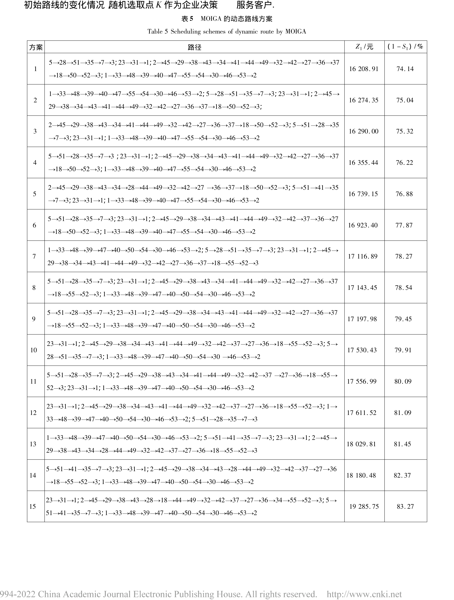

- 出处：徐小峰等（2021），《管理科学学报》，表5“MOIGA的动态路线方案”，12／117。
- 正文原句：“相应行驶路线如表5（MOIGA）、表A5（NSGA-II）和表A6（MOIA）所示。”
- 所在节：§5.2“算例分析”。
- 结构：15个Pareto方案为行；列为方案、车辆路径、成本和平均客户满意度；无合计行、无变化率列。

### 徐小峰等（2021）图11

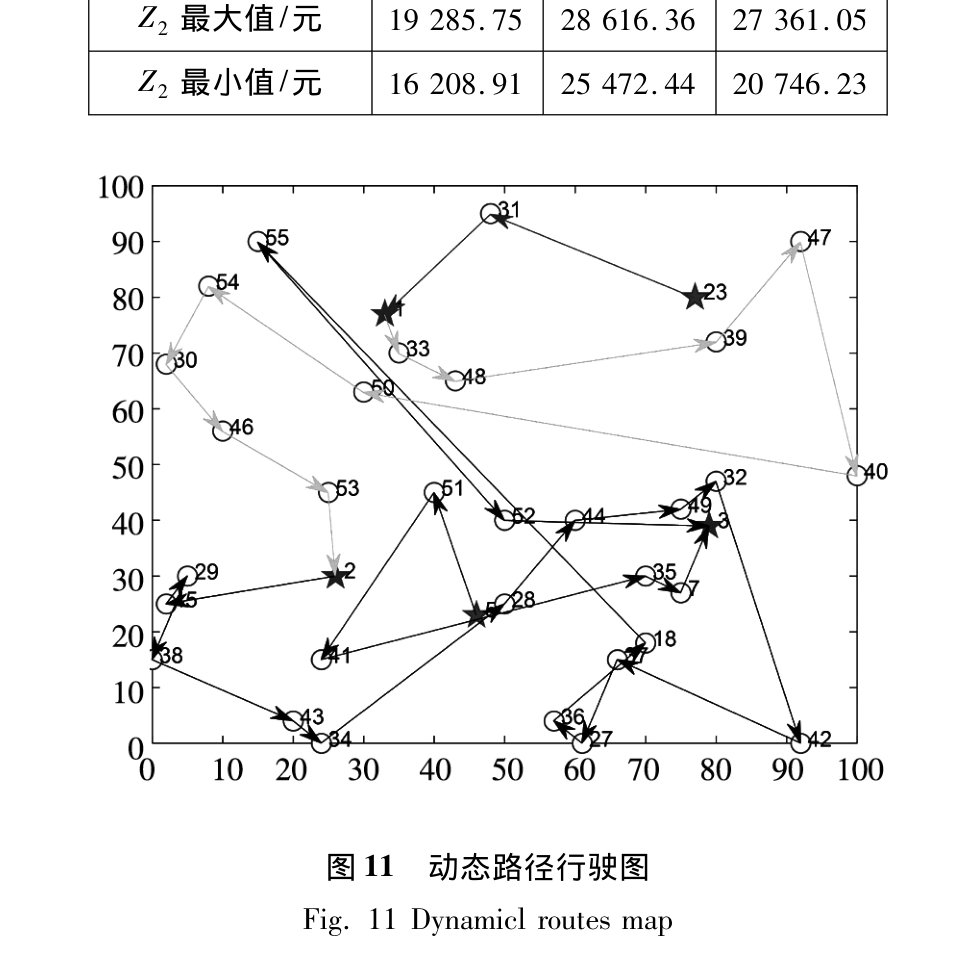

- 出处：徐小峰等（2021），《管理科学学报》，图11“动态路径行驶图”，13／118。
- 正文原句：“同时，为更明显的观察初始路线的变化情况，随机选取点K作为企业决策者在T1做出的决策方案，如图11所示。”
- 所在节：§5.2“算例分析”。
- 结构：无轴名的二维坐标路线图；4条路线；1个面板，无柱。

### 侯登凯（2022；Zotero标2023）图3.10

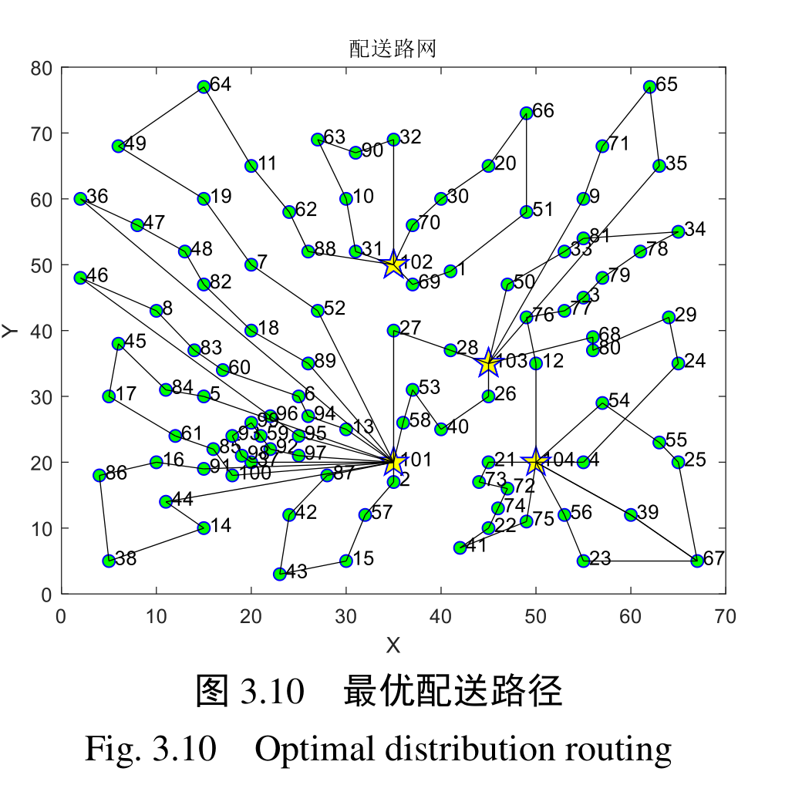

- 出处：侯登凯（2022；Zotero标2023），大连海事大学工学博士学位论文，图3.10“最优配送路径”，60／45。
- 正文原句：“图3.10给出了算例P04的最优配送路径，由图3.10可知：需要17辆车对这100个客户进行服务，配送成本为5047。”
- 所在节：§3.4.3“问题求解”。
- 结构：横轴“X”，纵轴“Y”；100个客户、4个配送中心、17条路线；1个面板，无柱。

### Bruglieri et al.（2025）Fig. 11

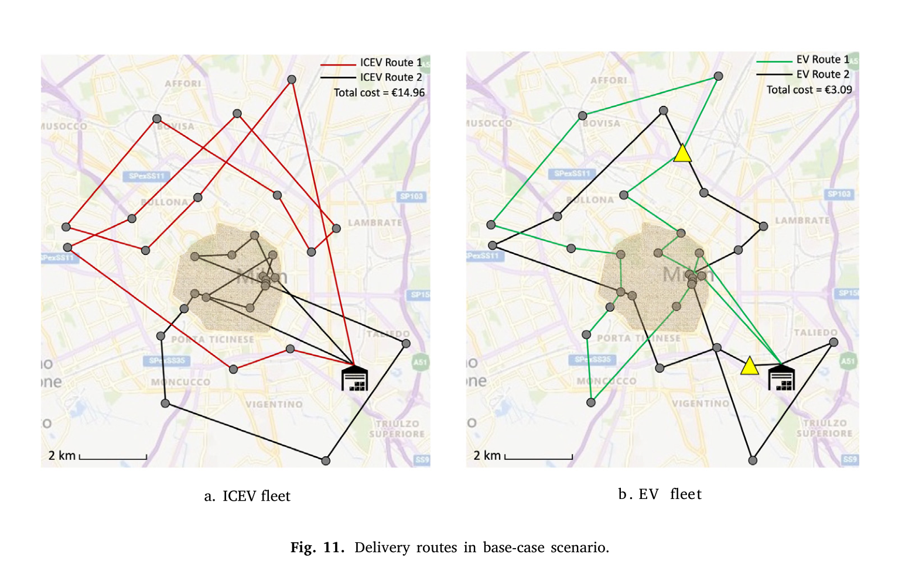

- 出处：Bruglieri et al.（2025），*Transportation Research Part E*，Fig. 11 “Delivery routes in base-case scenario”，23。
- 正文原句：“The solution is illustrated in Fig. 11.a.”
- 所在节：§6 “Case study in Milan”。
- 结构：2个地图子图；无正式横纵轴名；分别画ICEV fleet和EV fleet，各2条路线；无柱。

### Bruglieri et al.（2025）Fig. 12

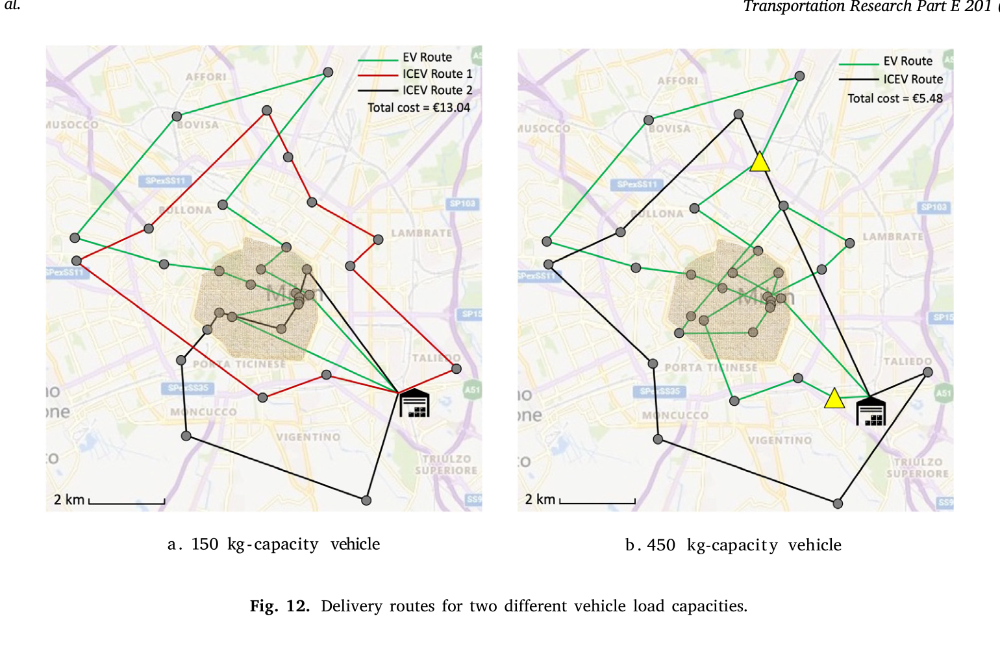

- 出处：Bruglieri et al.（2025），*Transportation Research Part E*，Fig. 12 “Delivery routes for two different vehicle load capacities”，24。
- 正文原句：“Since the total demand of the customers living in Area C exceeds 150 kg, one ICEV has to enter Area C and pay the €7.50 toll, resulting in a total cost of €13.04 (see Fig. 12.a).”
- 所在节：§6.1 “Effect of load capacity”。
- 结构：2个地图子图；无正式横纵轴名；比较150 kg与450 kg车辆容量下的路线，无柱。

### Bruglieri et al.（2025）Fig. 13

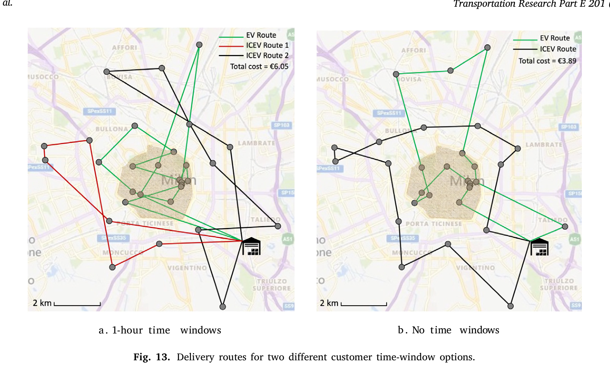

- 出处：Bruglieri et al.（2025），*Transportation Research Part E*，Fig. 13 “Delivery routes for two different customer time-window options”，25。
- 正文原句：“On the other hand, when the time windows are relaxed, a mixed-fleet of one ICEV and one EV incurs a total cost of €3.89 (see Fig. 13.b).”
- 所在节：§6.2 “Effect of time-window length”。
- 结构：2个地图子图；无正式横纵轴名；比较1-hour与4-hour time windows下的路线，无柱。

### Wang et al.（2026）Fig. 18

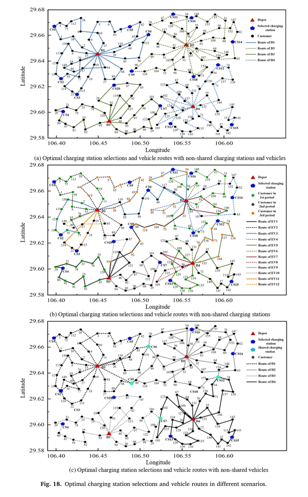

- 出处：Wang et al.（2026），*Transportation Research Part E*，Fig. 18 “Optimal charging station selections and vehicle routes in different scenarios”，33。
- 正文原句：“Fig. 18(a) shows that Case 1 requires the largest number of vehicles and charging stations.”
- 所在节：§6.5.2 “Comparison of optimization results under different resource sharing models”。
- 结构：3个纵向排列的经纬度路线子图；图例分别列出各模式路线；无柱。

## 优化结果与分析

### 王勇等（2025）图7

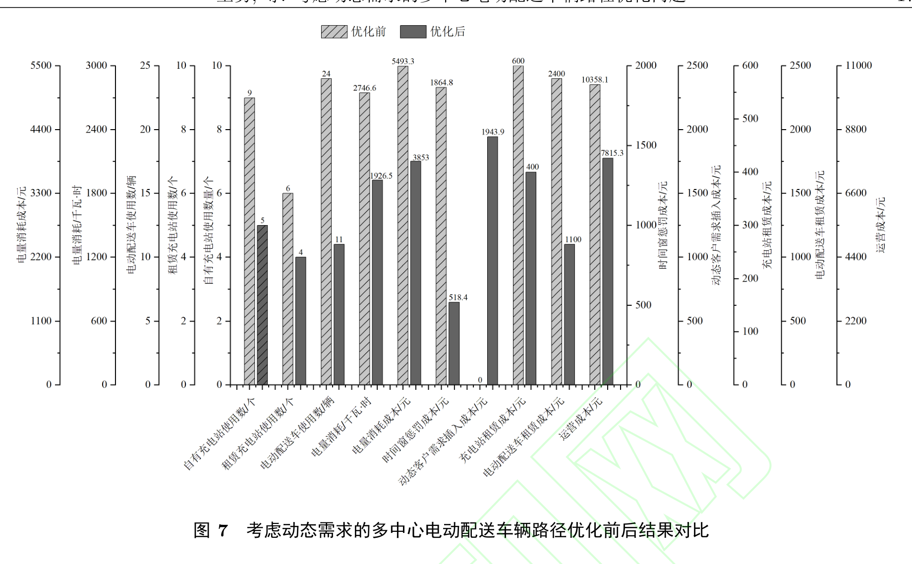

- 出处：王勇等（2025），《系统工程理论与实践》，图7“考虑动态需求的多中心电动配送车辆路径优化前后结果对比”，18／17。
- 正文原句：“由表6和图7可知，相较于优化前，优化后的电量消耗成本从5493.3元降低至3853.0元，时间窗惩罚成本从1864.8元减少至518.4元，自有充电站和租赁充电站使用数分别减少4个和2个，电动配送车使用数减少13辆，充电站和车辆的租赁成本分别节省了200元和1300元。”
- 所在节：§4.2“优化结果与分析”。
- 结构：横轴为11项成本、资源和服务指标；各指标使用原文独立纵轴刻度；优化前、优化后2组柱，1个组合面板。

### 王勇等（2023）表8

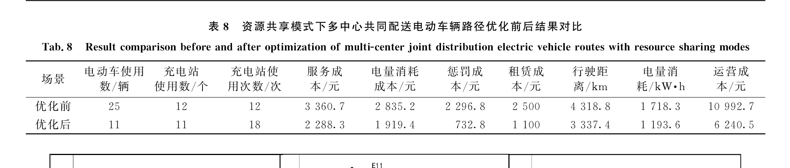

- 出处：王勇等（2023），《系统管理学报》，表8“资源共享模式下多中心共同配送电动车辆路径优化前后结果对比”，16／1134。
- 正文原句：“针对资源共享模式下多中心共同配送电动车辆路径优化问题，以多中心共同配送网络中运营成本最小与电动车辆使用数最小为目标函数，应用基于3D-K-means时空聚类的CW-MOPSO混合算法对优化模型进行求解，得到资源共享下多中心共同配送电动车辆路径优化前后运营成本、电动车使用数以及电量消耗等的变化情况。具体如表8所示。”
- 所在节：§4.2.2“优化结果分析”。
- 结构：优化前、优化后2行为比较对象；列为电动车与充电站数量／次数、4项成本、距离、电耗和运营成本；无合计行、无变化率列。

### Wang et al.（2023）Fig. 13

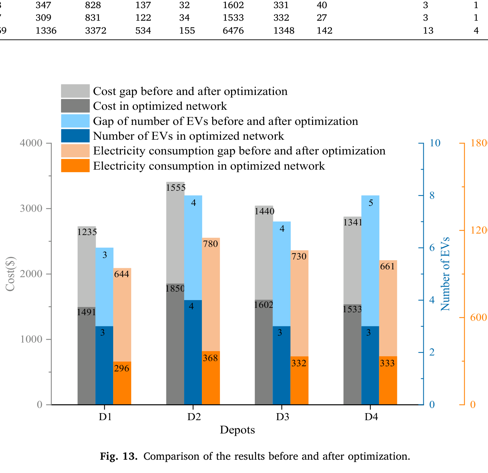

- 出处：Wang et al.（2023），*Expert Systems with Applications*，Fig. 13 “Comparison of the results before and after optimization”，20。
- 正文原句：“The specific optimization results, including facility operating cost (FOC), centralized transportation cost (CTC), electric delivery cost (EDC), penalty cost (PC), charging cost (CC), total operating cost (TOC), and electricity consumption (EC) are shown in Table 17 and Fig. 13.”
- 所在节：§6.3.2 “Vehicle routing optimization with shared charging stations”。
- 结构：横轴为D1～D4；多纵轴组合图；从Table 17抽取TOC、EV、EC及优化差额，以点线表示，1个面板，无柱。

### Wang et al.（2023）Table 17

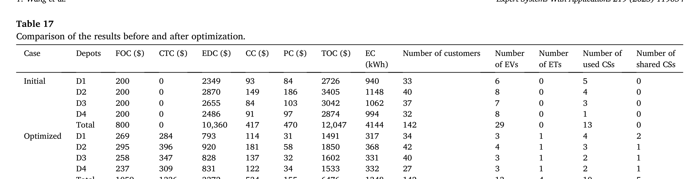

- 出处：Wang et al.（2023），*Expert Systems with Applications*，Table 17 “Comparison of the results before and after optimization”，20。
- 正文原句：“The specific optimization results, including facility operating cost (FOC), centralized transportation cost (CTC), electric delivery cost (EDC), penalty cost (PC), charging cost (CC), total operating cost (TOC), and electricity consumption (EC) are shown in Table 17 and Fig. 13.”
- 所在节：§6.3.2 “Vehicle routing optimization with shared charging stations”。
- 结构：Initial、Optimized两组，各按D1～D4和Total列行；14列含5项成本、TOC、EC、客户、EV、ET、已用及共享充电站数量；有Total行，无变化率列。

## 不同配送模式对比分析

### 陈雨蝶等（2025）图5

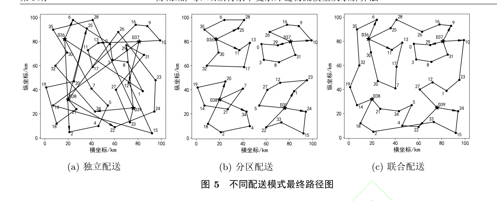

- 出处：陈雨蝶等（2025），《系统工程理论与实践》，图5“不同配送模式最终路径图”，18／17。
- 正文原句：“三种模式的求解结果如表9和图5。”
- 所在节：§4.5“不同配送模式对比分析”。
- 结构：3个等宽子图；横轴“横坐标/km”，纵轴“纵坐标/km”；独立配送、分区配送、联合配送分别约8、8、7条路线；无柱。

### 陈雨蝶等（2025）表9

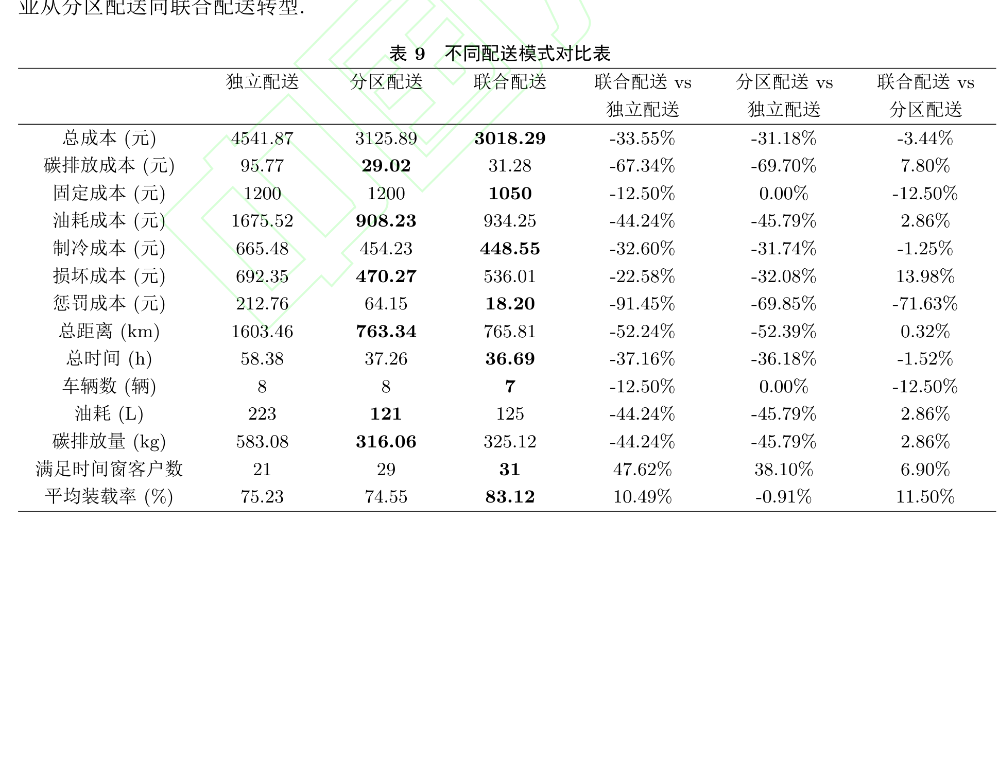

- 出处：陈雨蝶等（2025），《系统工程理论与实践》，表9“不同配送模式对比表”，17／16。
- 正文原句：“三种模式的求解结果如表9和图5。”
- 所在节：§4.5“不同配送模式对比分析”。
- 结构：14项成本、距离、时间、车辆、排放、服务和装载率为行；列含3种模式绝对值及3组两两变化率；无合计行，有变化率列。

### 陈雨蝶等（2023）表4

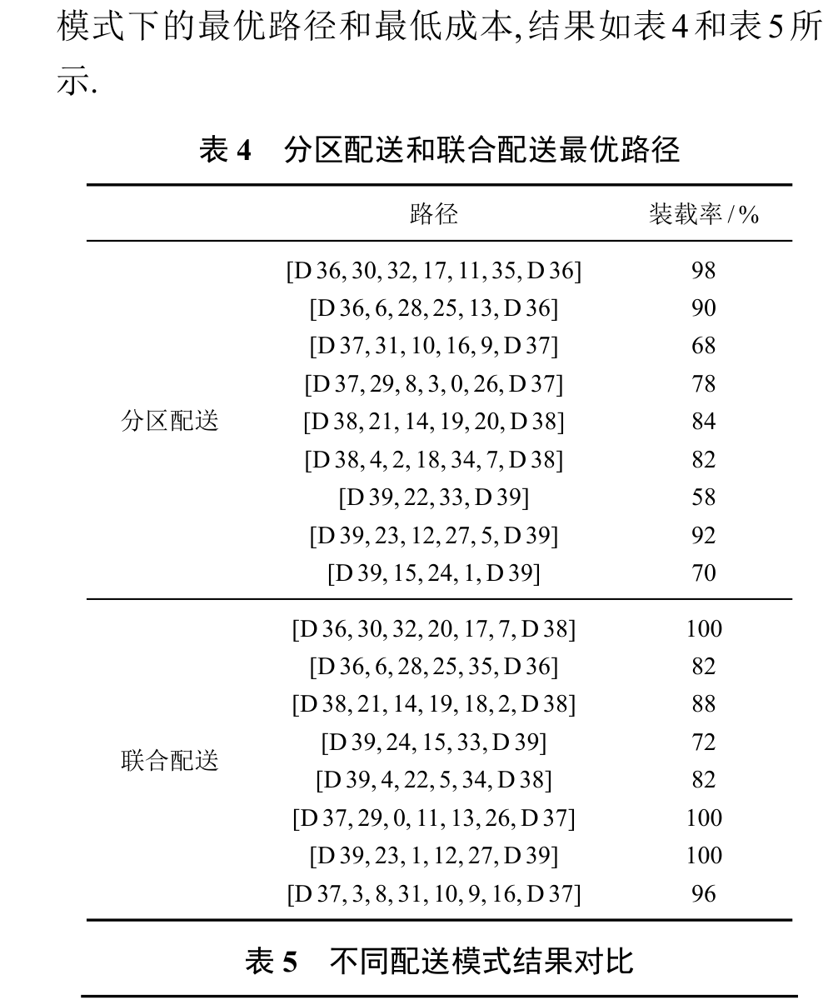

- 出处：陈雨蝶等（2023），《控制与决策》，表4“分区配送和联合配送最优路径”，7／1957。
- 正文原句：“采用CGA-VNS求解分区配送和联合配送两种模式下的最优路径和最低成本，结果如表4和表5所示。”
- 所在节：§3.2.1“实验结果分析”。
- 结构：17条路线按分区配送9条、联合配送8条分组；列为配送模式、路径和装载率；无合计行、无变化率列。

### 陈雨蝶等（2023）表5

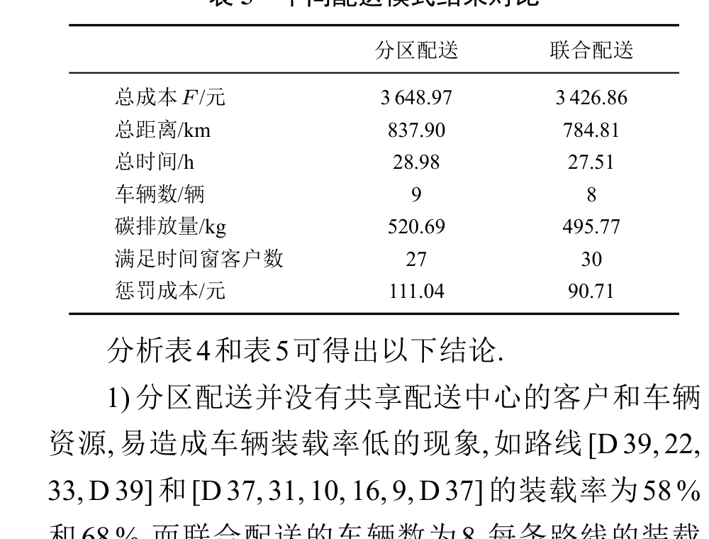

- 出处：陈雨蝶等（2023），《控制与决策》，表5“不同配送模式结果对比”，7／1957。
- 正文原句：“采用CGA-VNS求解分区配送和联合配送两种模式下的最优路径和最低成本，结果如表4和表5所示。”
- 所在节：§3.2.1“实验结果分析”。
- 结构：7项总成本、距离、时间、车辆、排放、服务和惩罚成本为行；列为分区配送、联合配送；无合计行、无变化率列。

### 王勇等（2025）图8

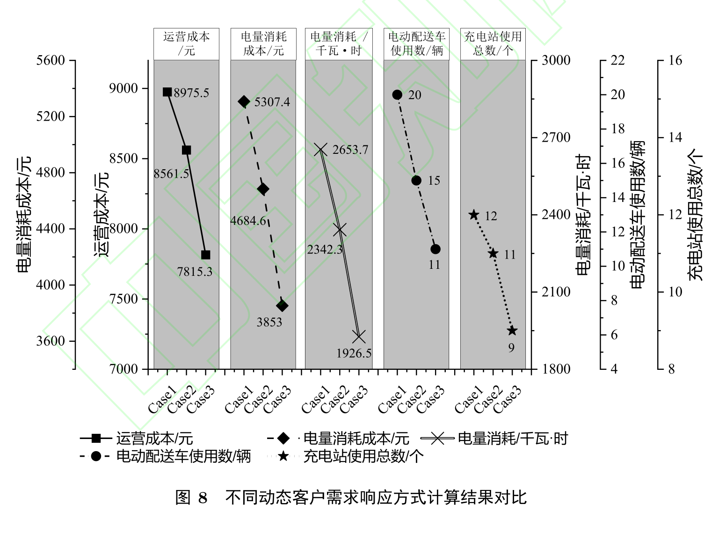

- 出处：王勇等（2025），《系统工程理论与实践》，图8“不同动态客户需求响应方式计算结果对比”，19／18。
- 正文原句：“为进一步探讨不同动态客户需求响应方式对电动车配送网络优化结果的影响，本研究分析了动态客户需求由归属配送中心单独服务响应（Case 1）、考虑动态客户需求插入策略的归属配送中心服务响应（Case 2）和考虑动态客户需求插入策略的多中心共同配送响应（Case 3）3种情景下对运营成本、电量消耗成本和电动配送车使用数等指标的变化情况，相关计算结果如表8和图8所示。”
- 所在节：§4.3.1“不同动态客户需求响应方式对比分析”。
- 结构：横轴为Case 1～3；各成本、能耗和资源指标分别使用纵轴刻度；约6个指标系列，1个组合面板。

### 王勇等（2025）图9

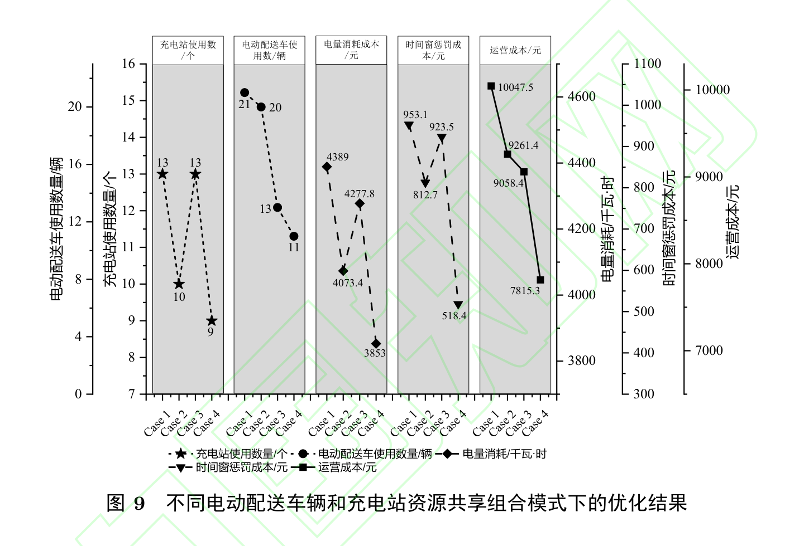

- 出处：王勇等（2025），《系统工程理论与实践》，图9“不同电动配送车辆和充电站资源共享组合模式下的优化结果”，20／19。
- 正文原句：“在4种资源共享组合模式下，多中心电动车配送网络的运营成本、电动配送车使用数、充电站使用数等的结果对比如表9和图9所示。”
- 所在节：§4.3.2“不同资源共享组合模式和算法消融实验对比分析”。
- 结构：横轴Case 1～4；5个相邻小面板分别画充电站数、车辆数、电耗成本、惩罚成本和运营成本；每面板1条折线。

### 王勇等（2025）表9

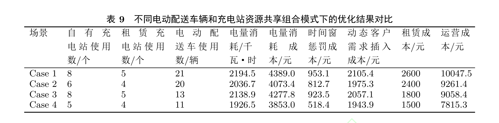

- 出处：王勇等（2025），《系统工程理论与实践》，表9“不同电动配送车辆和充电站资源共享组合模式下的优化结果对比”，20／19。
- 正文原句：“在4种资源共享组合模式下，多中心电动车配送网络的运营成本、电动配送车使用数、充电站使用数等的结果对比如表9和图9所示。”
- 所在节：§4.3.2“不同资源共享组合模式和算法消融实验对比分析”。
- 结构：4种Case为行；列为自有／租赁充电站、车辆、电耗及4项成本和运营成本；无合计行、无变化率列。

### 王勇等（2023）图11

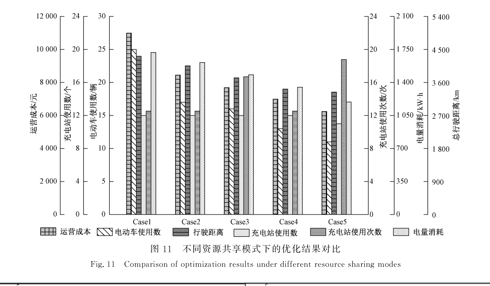

- 出处：王勇等（2023），《系统管理学报》，图11“不同资源共享模式下的优化结果对比”，20／1138。
- 正文原句：“不同资源共享模式下运营成本、车辆使用数以及充电站使用数等的对比结果如表13和图11所示。”
- 所在节：§4.3.4“不同资源共享模式下的优化结果对比”。
- 结构：横轴Case 1～5；运营成本、车辆、距离、充电站数／次数和电耗使用各自纵轴；6个并列柱系列，1个面板。

### 王勇等（2023）图12

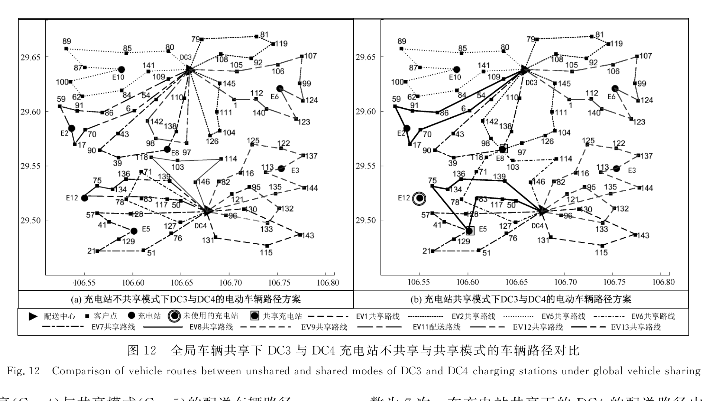

- 出处：王勇等（2023），《系统管理学报》，图12“全局车辆共享下DC3与DC4充电站不共享与共享模式的车辆路径对比”，20／1138。
- 正文原句：“由图12可见，在电动车全局共享且充电站共享模式（Case5）下，DC3与DC4充电站使用数为6个，使用次数为9次；在电动车全局共享且充电站不共享模式（Case4）下，充电站的使用数为7个，使用次数为7次。”
- 所在节：§4.3.4“不同资源共享模式下的优化结果对比”。
- 结构：2个经纬度路线子图；分别为充电站不共享、共享；多色路线，无柱。

### 王勇等（2023）表13

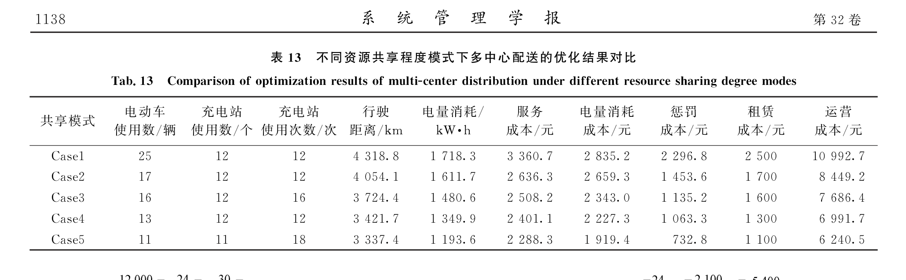

- 出处：王勇等（2023），《系统管理学报》，表13“不同资源共享程度模式下多中心配送的优化结果对比”，20／1138。
- 正文原句：“不同资源共享模式下运营成本、车辆使用数以及充电站使用数等的对比结果如表13和图11所示。”
- 所在节：§4.3.4“不同资源共享模式下的优化结果对比”。
- 结构：Case1～Case5为行；11列含车辆、充电站数量／次数、距离、电耗、4项成本和运营成本；无合计行、无变化率列。

### Soriano et al.（2023）Fig. 1

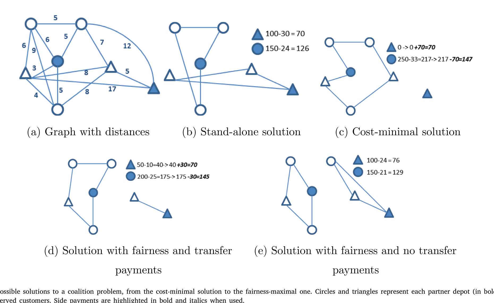

- 出处：Soriano et al.（2023），*International Journal of Production Economics*，Fig. 1 “Possible solutions to a coalition problem, from the cost-minimal solution to the fairness-maximal one”，3。
- 正文原句：“Fig. 1 depicts some possible solutions to an example of a coalition problem with two partners.”
- 所在节：§1 “Introduction”。
- 结构：5个概念子图；无横纵轴；复用2个车场、6个客户，路线数依次为不适用、2、1、2、2，并标利润算式和side payments。

### Soriano et al.（2023）Table 3

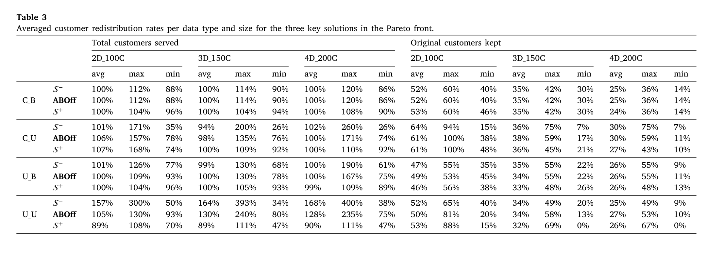

- 出处：Soriano et al.（2023），*International Journal of Production Economics*，Table 3 “Averaged customer redistribution rates per data type and size for the three key solutions in the Pareto front”，9。
- 正文原句：“To evaluate this effect, Table 3 presents calculations of customer change rates derived from MDVRP-PF single period results in Section 5.3.”
- 所在节：§5.4 “Analysing customer redistribution and number of vehicles”。
- 结构：4类实例各含S−、ABoff、S+，共12行；20个叶列按Total customers served与Original customers kept、规模及avg/max/min分层；无合计行，表内数值本身是变化／保留率。

### Soriano et al.（2023）Table 4

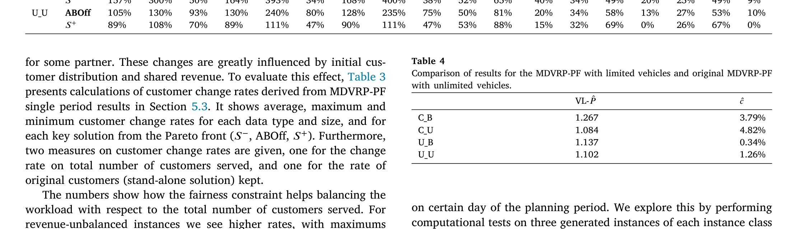

- 出处：Soriano et al.（2023），*International Journal of Production Economics*，Table 4 “Comparison of results for the MDVRP-PF with limited vehicles and original MDVRP-PF with unlimited vehicles”，9。
- 正文原句：“Results for each data type are summarized in Table 4 in two columns.”
- 所在节：§5.4 “Analysing customer redistribution and number of vehicles”。
- 结构：C_B、C_U、U_B、U_U为4行；列为实例类型、VL-P̂和ĉ；无合计行，ĉ是百分比成本差列。

### Soriano et al.（2023）Fig. 5

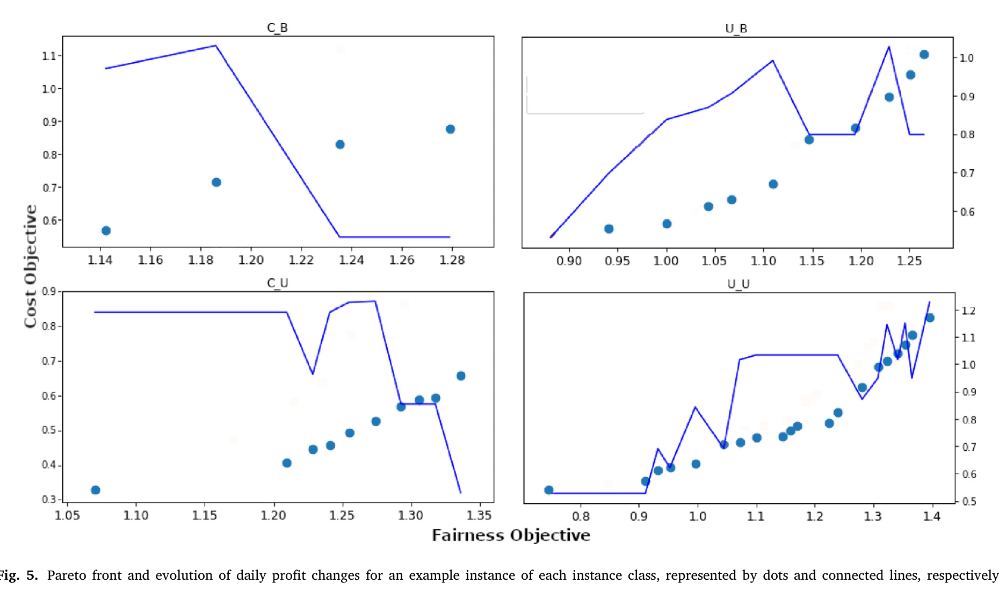

- 出处：Soriano et al.（2023），*International Journal of Production Economics*，Fig. 5 “Pareto front and evolution of daily profit changes for an example instance of each instance class”，10。
- 正文原句：“Fig. 5 shows the results for four instances, one for each instance class. The dots represent each solution in the approximated Pareto front, while the line represents the evolution of Π(S) for each solution S.”
- 所在节：§5.5 “Fairness in multiple periods”。
- 结构：4个子图；横轴“Fairness Objective”，左纵轴“Cost Objective”，右纵轴对应Π(S)；每面板有Pareto散点和1条连线。

### Soriano et al.（2023）Fig. 6

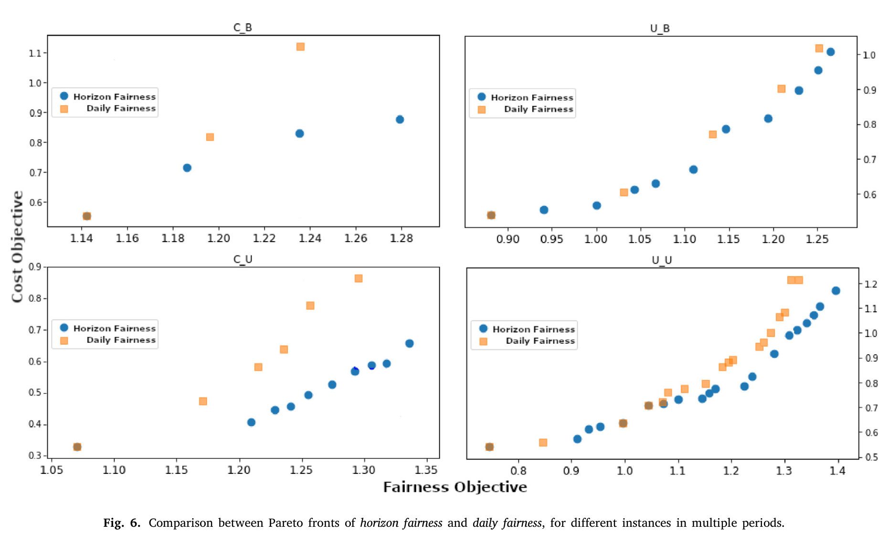

- 出处：Soriano et al.（2023），*International Journal of Production Economics*，Fig. 6 “Comparison between Pareto fronts of horizon fairness and daily fairness, for different instances in multiple periods”，10。
- 正文原句：“Fig. 6 depicts the Pareto fronts of both daily fairness and horizon fairness approaches on the same example instances as before.”
- 所在节：§5.5 “Fairness in multiple periods”。
- 结构：4个子图；横轴“Fairness Objective”，纵轴“Cost Objective”；每面板2组Pareto散点，无柱。

### Wang et al.（2023）Fig. 17

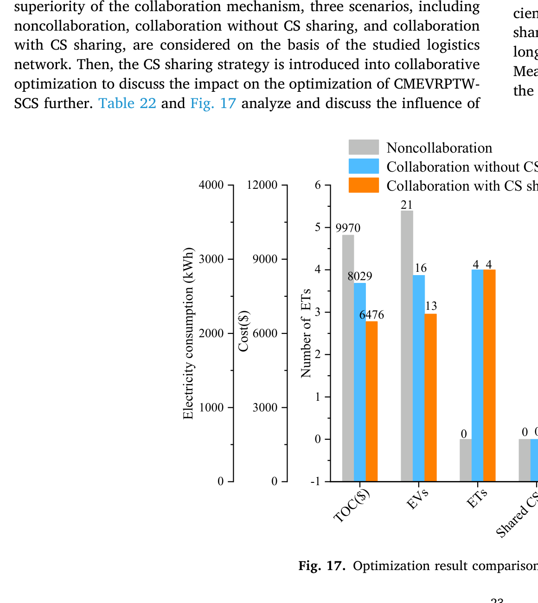

- 出处：Wang et al.（2023），*Expert Systems with Applications*，Fig. 17 “Optimization result comparison based on three scenarios”，23。
- 正文原句：“In Table 22 and Fig. 17, a comparison of the collaborative and non-collaborative optimized networks shows that the total cost is decreased from $9,970 to $8,029, achieving a 20 % cost-reduction.”
- 所在节：§6.4.1 “Comparison of various collaboration mechanisms”。
- 结构：横轴为TOC、EVs、ETs、Shared CSs、Used CSs、EC；各指标独立纵轴；3个情景柱系列，1个面板。

### Wang et al.（2023）Table 22

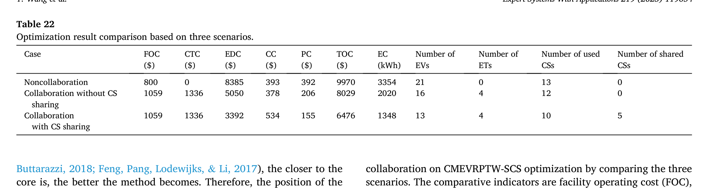

- 出处：Wang et al.（2023），*Expert Systems with Applications*，Table 22 “Optimization result comparison based on three scenarios”，23。
- 正文原句：“In Table 22 and Fig. 17, a comparison of the collaborative and non-collaborative optimized networks shows that the total cost is decreased from $9,970 to $8,029, achieving a 20 % cost-reduction.”
- 所在节：§6.4.1 “Comparison of various collaboration mechanisms”。
- 结构：3种协作／充电站共享情景为行；12列含5项成本、TOC、EC及车辆、行程、充电站数量；无合计行、无变化率列。

### Wang et al.（2023）Table 23

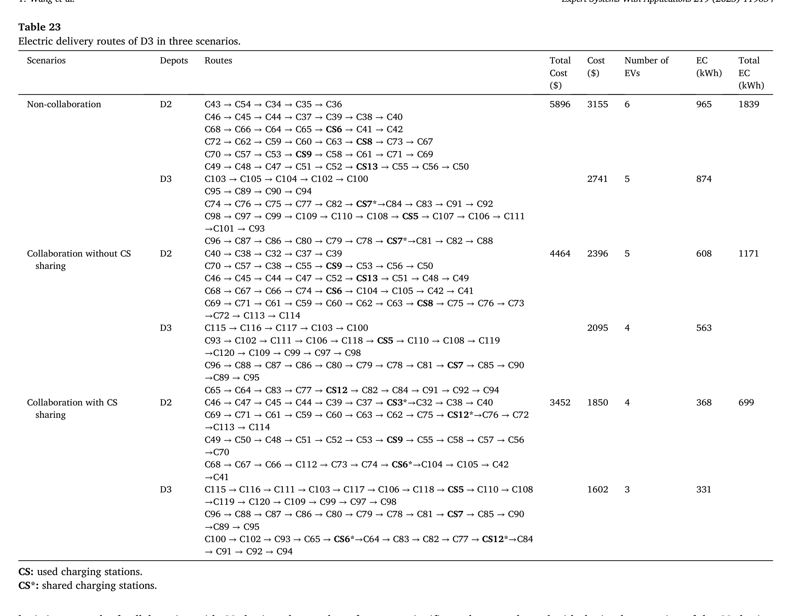

- 出处：Wang et al.（2023），*Expert Systems with Applications*，Table 23 “Electric delivery routes of D3 in three scenarios”，24。
- 正文原句：“In Table 23 and Fig. 18, the EV routes of three scenarios are presented.”
- 所在节：§6.4.1 “Comparison of various collaboration mechanisms”。
- 结构：27条情景路线为行；8列含情景、车场、路线及总成本、客户、EV、行程、充电站等；无合计行、无变化率列。

### Wang et al.（2023）Fig. 18

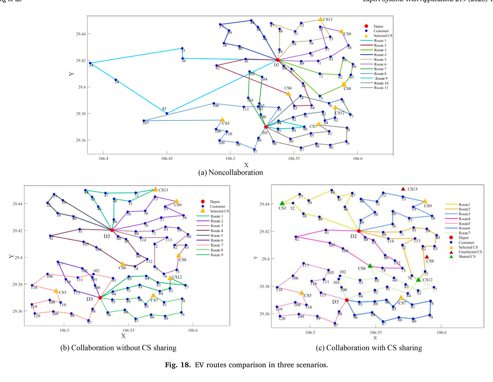

- 出处：Wang et al.（2023），*Expert Systems with Applications*，Fig. 18 “Electric delivery routes of D3 in three scenarios”，25。
- 正文原句：“In Table 23 and Fig. 18, the EV routes of three scenarios are presented.”
- 所在节：§6.4.1 “Comparison of various collaboration mechanisms”。
- 结构：3个X—Y路线子图；分别为不协作、协作但充电站不共享、协作且充电站共享；路线数约11、9、7。

### Wang et al.（2024）Fig. 9

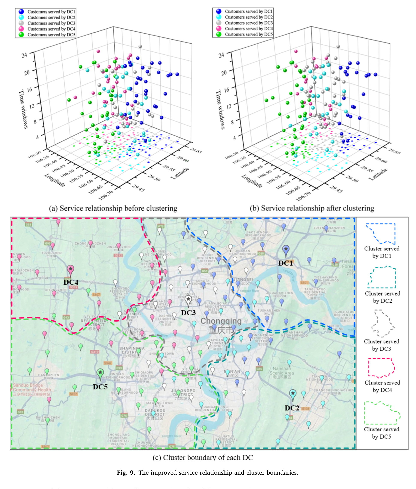

- 出处：Wang et al.（2024），*Transportation Research Part E*，Fig. 9 “The improved service relationship and cluster boundaries”，28。
- 正文原句：“Fig. 9 shows the improved service relationship and cluster boundaries before and after clustering.”
- 所在节：§5.3.4 “Optimization results”。
- 结构：3个子图；前两图用Longitude、Latitude、Time windows三轴显示客户—车场关系，第三图为边界地图；无路线柱。

### Wang et al.（2024）Fig. 10

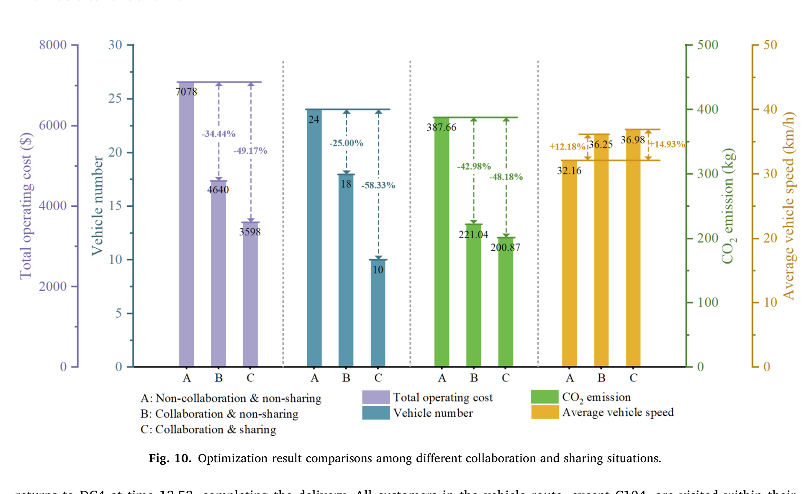

- 出处：Wang et al.（2024），*Transportation Research Part E*，Fig. 10 “Optimization result comparisons among different collaboration and sharing situations”，28。
- 正文原句：“The optimization results for the cost indicators (i.e., CTC, SC, OC, PCW, PCD, and TOC), VN, and CE under the different scenarios (i.e., non-collaboration and non-sharing, collaboration and non-sharing, and collaboration and sharing) are presented in Table 14, and optimization result comparisons are shown in Fig. 10.”
- 所在节：§5.3.4 “Optimization results”。
- 结构：横轴为Situations A、B、C；4组指标使用独立纵轴并画柱；1个组合面板。

### Wang et al.（2024）Table 14

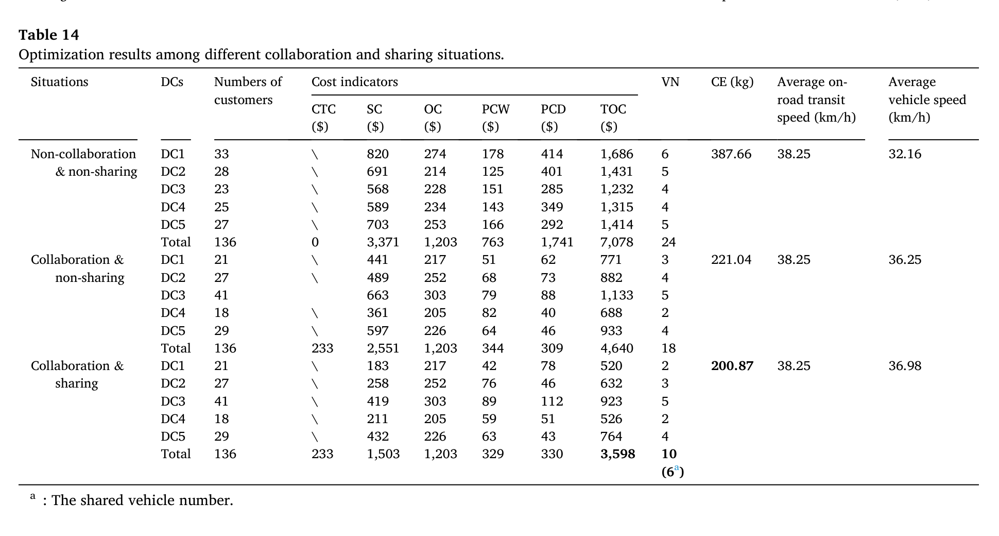

- 出处：Wang et al.（2024），*Transportation Research Part E*，Table 14 “Optimization results among different collaboration and sharing situations”，28。
- 正文原句：“The optimization results for the cost indicators (i.e., CTC, SC, OC, PCW, PCD, and TOC), VN, and CE under the different scenarios (i.e., non-collaboration and non-sharing, collaboration and non-sharing, and collaboration and sharing) are presented in Table 14, and optimization result comparisons are shown in Fig. 10.”
- 所在节：§5.3.4 “Optimization results”。
- 结构：3种Situation各含D1～D5和Total，共18行；13列含6项成本、TOC、客户数、车辆数、速度等；有Total行，无变化率列。

### Shi et al.（2025）Fig. 9

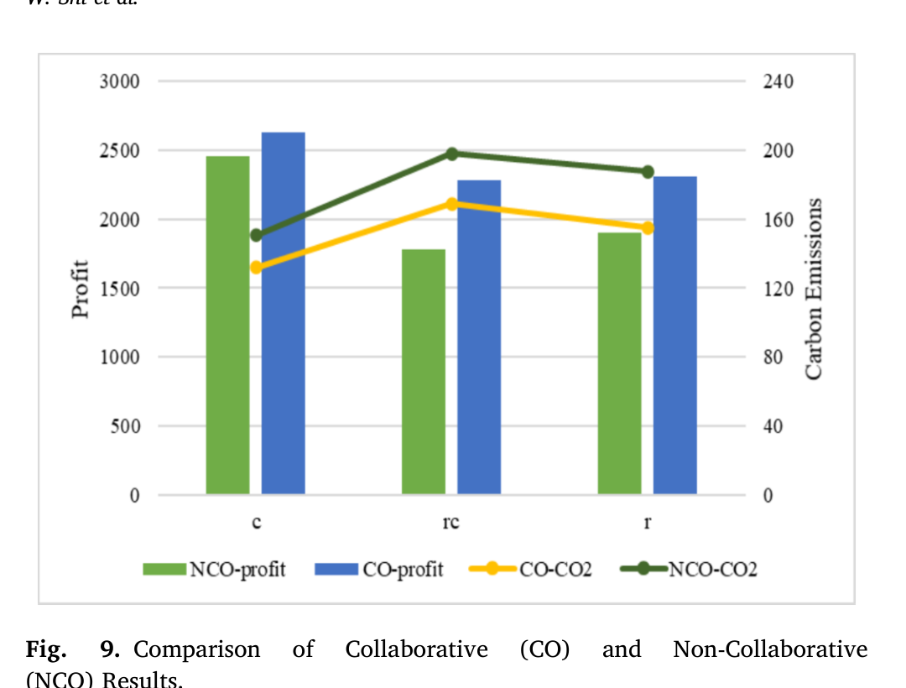

- 出处：Shi et al.（2025），*Expert Systems with Applications*，Fig. 9 “Comparison of collaborative and non-collaborative solutions”，14（正文引用在13）。
- 正文原句：“Comparisons were made between the most profitable solutions and their corresponding carbon emissions. Fig. 9 displays the average results across the three types of instances.”
- 所在节：§5.2.3 “Impact of collaboration”。
- 结构：横轴为c、rc、r三类实例；左纵轴Profit，右纵轴Carbon Emissions；2组柱和2条折线，1个面板。

### Shi et al.（2025）Fig. 10

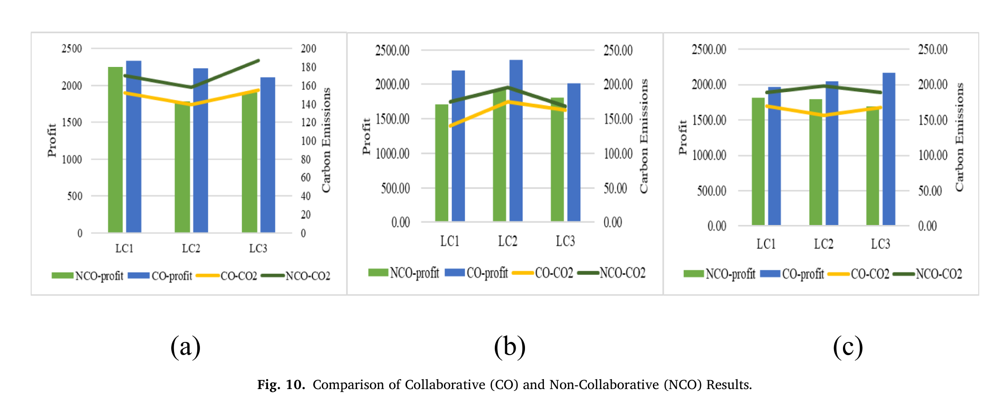

- 出处：Shi et al.（2025），*Expert Systems with Applications*，Fig. 10 “Comparison of collaborative and non-collaborative solutions for each logistics company”，14。
- 正文原句：“The results of the collaboration versus non-collaboration scenarios for the three logistics companies are illustrated in Fig. 10.”
- 所在节：§5.2.3 “Impact of collaboration”。
- 结构：3个子图；横轴LC1～LC3，左纵轴Profit，右纵轴Carbon Emissions；每图2组柱和2条折线。

### Wang et al.（2025）Fig. 1

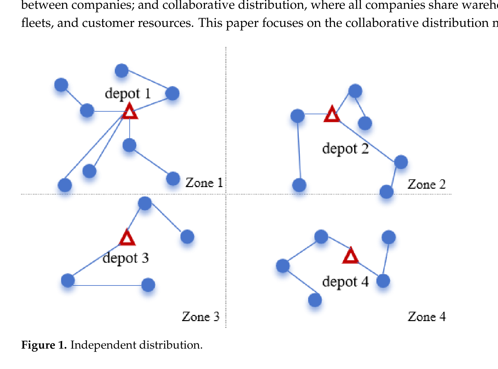

- 出处：Wang et al.（2025），*Sustainability*，Fig. 1 “Independent distribution”，4。
- 正文原句：“In practical operations, multiple cold-chain logistics companies typically operate their own warehouses and serve customers within designated regions, as illustrated in Figures 1 and 2.”
- 所在节：§3.1 “Problem Description”。
- 结构：无横纵轴；1幅概念画布，含4个Zone、车场、客户和分区内连接；路线条数无法唯一确定。

### Wang et al.（2025）Fig. 2

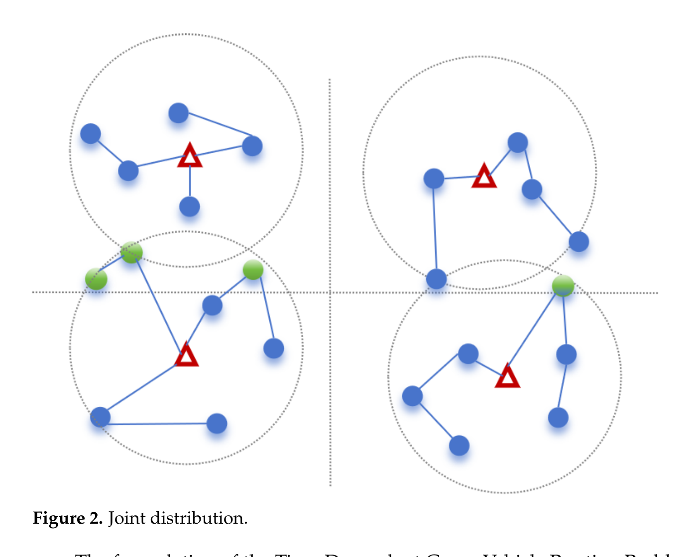

- 出处：Wang et al.（2025），*Sustainability*，Fig. 2 “Joint distribution”，5。
- 正文原句：“In practical operations, multiple cold-chain logistics companies typically operate their own warehouses and serve customers within designated regions, as illustrated in Figures 1 and 2.”
- 所在节：§3.1 “Problem Description”。
- 结构：无横纵轴；1幅概念画布，含4个Zone、车场、客户和跨原分区连接；路线条数无法唯一确定。

### Wang et al.（2025）Table 7

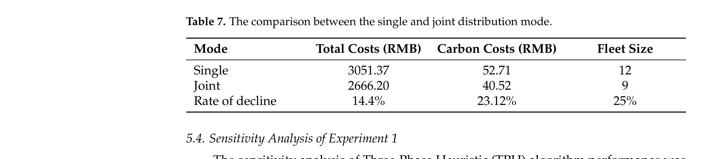

- 出处：Wang et al.（2025），*Sustainability*，Table 7 “The comparison between the single and joint distribution mode”，23。
- 正文原句：“The optimal results are summarized in Table 7.”
- 所在节：§5.3 “Computational Results of Experiment 2”。
- 结构：Single、Joint、Rate of decline三行；列为Mode、Total Costs、Carbon Costs、Fleet Size；有变化率汇总行。

## 碳交易机制分析

### 陈雨蝶等（2025）表7

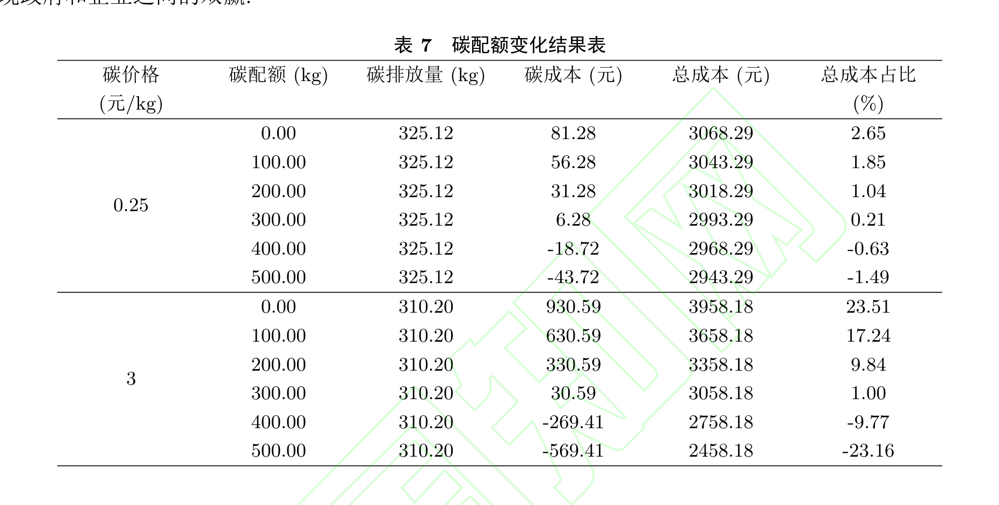

- 出处：陈雨蝶等（2025），《系统工程理论与实践》，表7“碳配额变化结果表”，16／15。
- 正文原句：“本文求解两种碳价格下六种不同碳配额对应的最终路线、碳排放和总成本，结果如表7所示。”
- 所在节：§4.3“碳交易机制分析”。
- 结构：2种碳价×6种配额，共12行；列为碳价格、碳配额、碳排放量、碳成本、总成本和总成本占比；无合计行，末列为占比列。

### 陈婉茹等（2023）图4

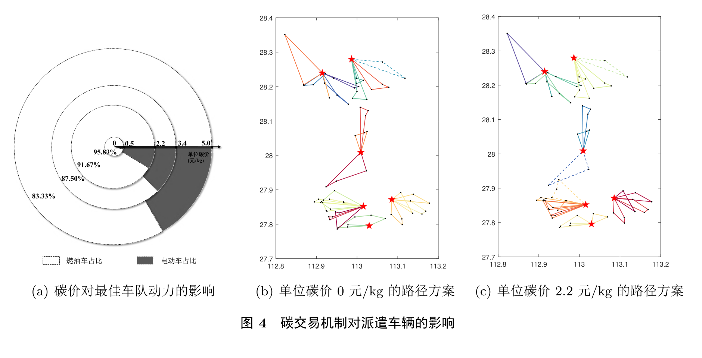

- 出处：陈婉茹等（2023），《系统工程理论与实践》，图4“碳交易机制对派遣车辆的影响”，13／3332。
- 正文原句：“为进一步探究碳交易机制对派遣车辆的影响，在碳限额为150 kg、各配送中心内配备1辆电动车和5辆燃油车的条件下，优化得到单位碳价在0元/kg到5元/kg内以0.1元/kg幅度变化下的最优配送方案，各方案派遣车辆总数均为24辆，其中电动车和燃油车的占比如图4（a）所示。”
- 所在节：§5.2.2“结果分析”。
- 结构：3个子图；左图为碳价节点下油车／电车构成的同心环带，无普通坐标轴；右两图为0元/kg、2.2元/kg的经纬度路线图。

### Wang et al.（2025）Table 8

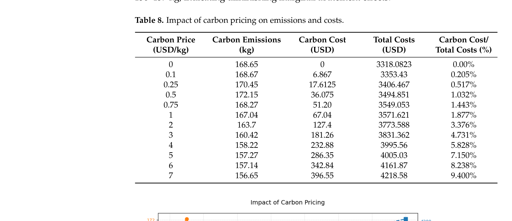

- 出处：Wang et al.（2025），*Sustainability*，Table 8 “Impact of carbon pricing on emissions and costs”，24。
- 正文原句：“As shown in Table 8 and Figure 10, when the carbon price is within the range [0, 0.5], carbon emissions exhibit an upward trend, peaking at 172.15 kg when the carbon price reaches 0.5 RMB/kg.”
- 所在节：§5.5 “Sensitivity Analysis of Experiment 2”。
- 结构：12个碳价为行；列为Carbon Price、Carbon Emissions、Carbon Cost、Total Costs及Carbon Cost/Total Costs；无合计行，末列是占比而非变化率。

### Wang et al.（2025）Fig. 10

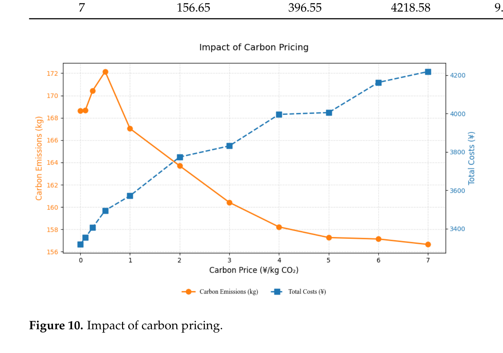

- 出处：Wang et al.（2025），*Sustainability*，Fig. 10 “Impact of carbon pricing”，24。
- 正文原句：“As shown in Table 8 and Figure 10, when the carbon price is within the range [0, 0.5], carbon emissions exhibit an upward trend, peaking at 172.15 kg when the carbon price reaches 0.5 RMB/kg.”
- 所在节：§5.5 “Sensitivity Analysis of Experiment 2”。
- 结构：横轴“Carbon Price (RMB/kg CO2)”；左纵轴“Carbon Emissions (kg)”，右纵轴“Total Costs (¥)”；2条折线，1个面板。

### Wang et al.（2025）Table 9

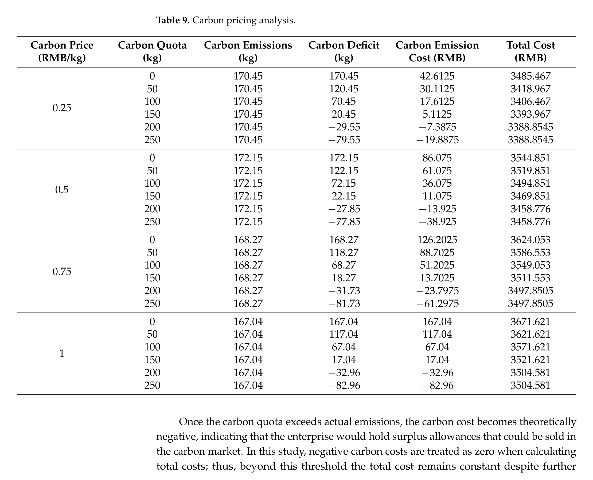

- 出处：Wang et al.（2025），*Sustainability*，Table 9 “Carbon pricing analysis”，25。
- 正文原句：“Table 9 and Figure 11 reveal that, regarding carbon pricing and carbon quotas, these two policy levers interact to shape enterprise logistics costs.”
- 所在节：§5.5 “Sensitivity Analysis of Experiment 2”。
- 结构：4种碳价×6种碳配额，共24行；列为Carbon Price、Carbon Quota、Emissions、Deficit、Emission Cost、Total Cost；无合计行、无变化率列。

### Wang et al.（2025）Fig. 11

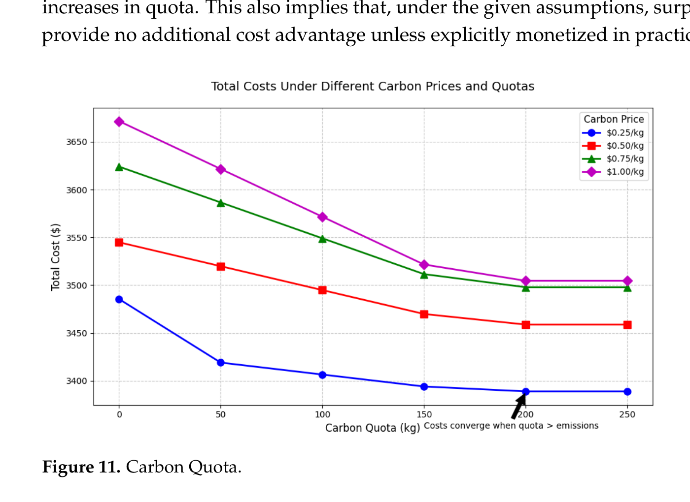

- 出处：Wang et al.（2025），*Sustainability*，Fig. 11 “Carbon Quota”，26。
- 正文原句：“Table 9 and Figure 11 reveal that, regarding carbon pricing and carbon quotas, these two policy levers interact to shape enterprise logistics costs.”
- 所在节：§5.5 “Sensitivity Analysis of Experiment 2”。
- 结构：横轴“Carbon Quota (kg)”，纵轴“Total Costs ($)”；4条碳价曲线；1个面板，无柱。

### Qiu et al.（2024）Fig. 4

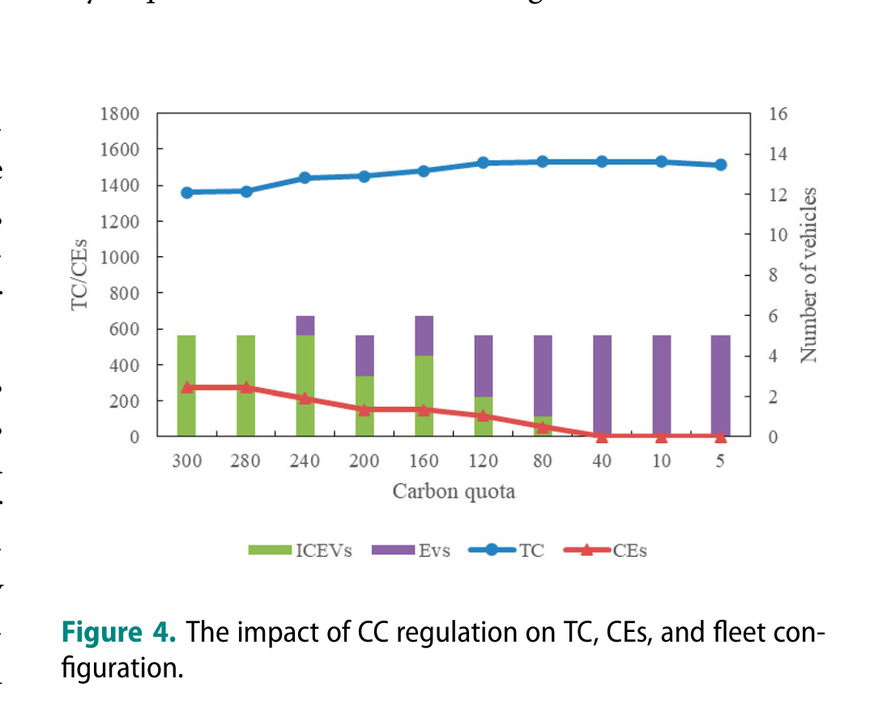

- 出处：Qiu et al.（2024），*International Journal of Production Research*，Fig. 4 “The impact of CC regulation on TC, CEs, and fleet configuration”，12／5730。
- 正文原句：“Figure 4 illustrates the impact of CC regulation on TC, CEs, and fleet configuration.”
- 所在节：§5.2.2 “Carbon cap regulation”。
- 结构：横轴“Carbon quota”；左纵轴“TC/CEs”，右纵轴“Number of vehicles”；ICEVs、EVs两段堆叠柱加TC、CEs两条折线。

### Qiu et al.（2024）Fig. 5

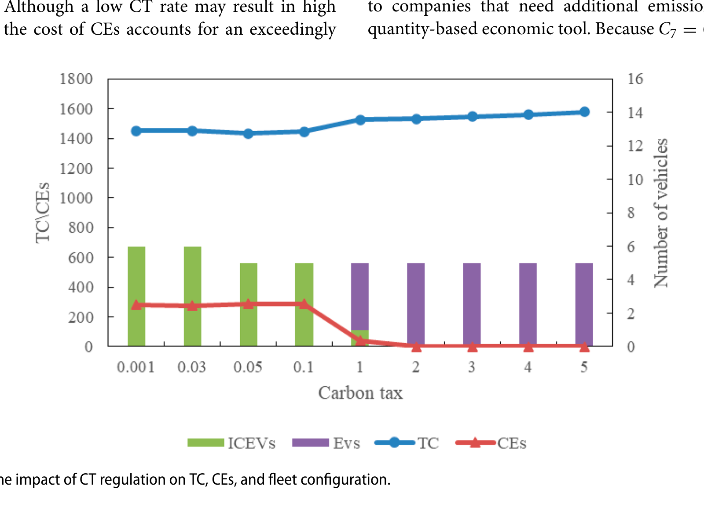

- 出处：Qiu et al.（2024），*International Journal of Production Research*，Fig. 5 “The impact of CT regulation on TC, CEs, and fleet configuration”，13／5731。
- 正文原句：“Figure 5 illustrates the impact of CT regulation on TC, CEs, and fleet configuration.”
- 所在节：§5.2.3 “Carbon tax regulation”。
- 结构：横轴“Carbon tax”；左纵轴“TC/CEs”，右纵轴“Number of vehicles”；2个堆叠柱段系列加2条折线。

### Qiu et al.（2024）Fig. 6

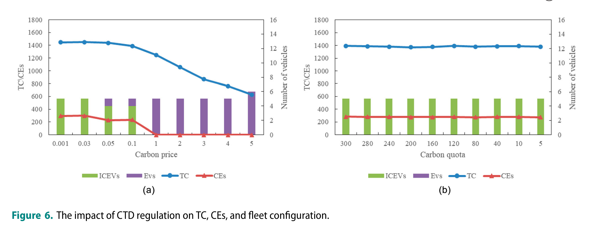

- 出处：Qiu et al.（2024），*International Journal of Production Research*，Fig. 6 “The impact of CTD regulation on TC, CEs, and fleet configuration”，15／5733（正文引用在14／5732）。
- 正文原句：“Figure 6(a) illustrates the impact of various carbon prices on TC, CEs, and fleet configuration, assuming a fixed CQ of 200 kg.”
- 所在节：§5.2.4 “Carbon trading regulation”。
- 结构：2个子图；横轴分别为carbon price、carbon quota；各有TC/CEs与车辆数双纵轴、2个堆叠柱段和2条折线。

### Qiu et al.（2024）Fig. 7

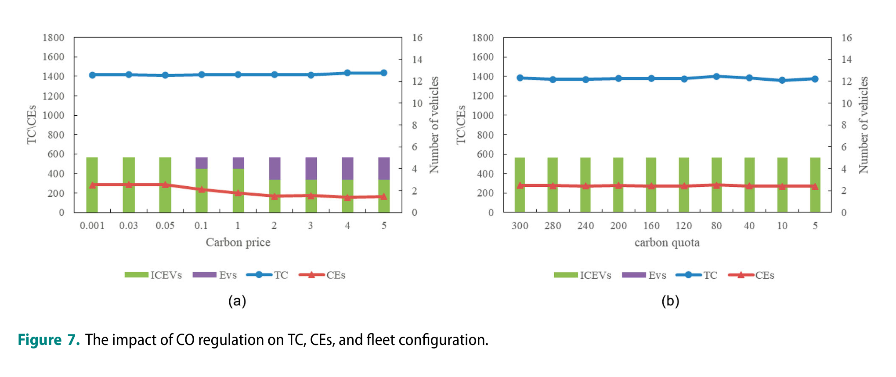

- 出处：Qiu et al.（2024），*International Journal of Production Research*，Fig. 7 “The impact of CO regulation on TC, CEs, and fleet configuration”，15／5733（正文引用在14／5732）。
- 正文原句：“Figure 7(a) illustrates the impact of different carbon prices on TC, CEs, and fleet configuration under a fixed CQ of 200 kg.”
- 所在节：§5.2.5 “Carbon offsetting regulation”。
- 结构：2个子图；横轴分别为carbon price、carbon quota；各有TC/CEs与车辆数双纵轴、2个堆叠柱段和2条折线。

## 车队动力配置

### 陈婉茹等（2023）表9

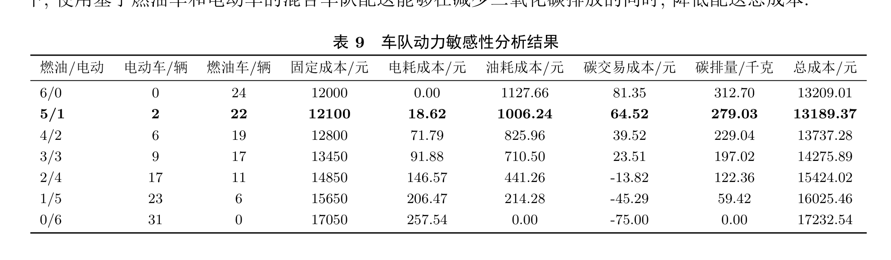

- 出处：陈婉茹等（2023），《系统工程理论与实践》，表9“车队动力敏感性分析结果”，12／3331。
- 正文原句：“表9中给出不同动力配置下配送方案派遣电动车和燃油车的数量及固定成本、电耗成本、油耗成本、碳交易成本、碳排放量和总成本。”
- 所在节：§5.1“车队动力配置”。
- 结构：7种燃油／电动车配置为行；列为两类车辆数、固定／电耗／油耗／碳交易成本、碳排量和总成本；无合计行、无变化率列。

### 陈婉茹等（2023）图5

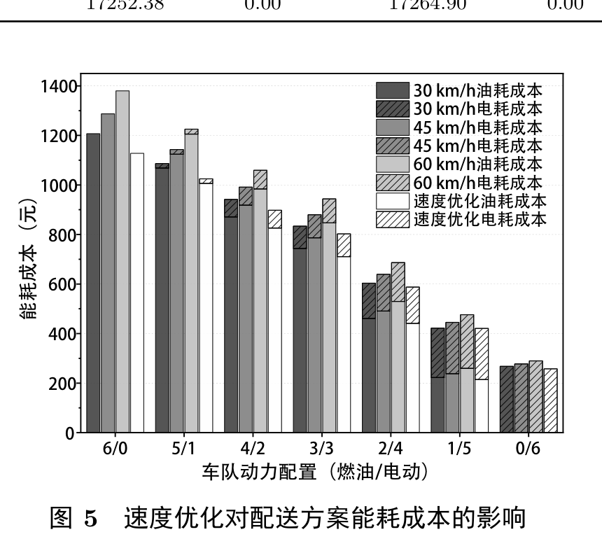

- 出处：陈婉茹等（2023），《系统工程理论与实践》，图5“速度优化对配送方案能耗成本的影响”，14／3333。
- 正文原句：“由图5可得，当车队动力配置一定时，考虑速度优化的配送方案能耗成本要低于固定速度下配送方案的能耗成本。”
- 所在节：§5.3“速度优化”。
- 结构：横轴为燃油／电动车队动力配置，纵轴“能耗成本/元”；固定速度与速度优化下的油耗、电耗共8个柱系列，1个面板。

### 李得成等（2021）图6

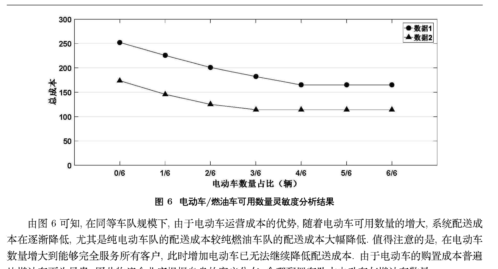

- 出处：李得成等（2021），《系统工程理论与实践》，图6“电动车/燃油车可用数量灵敏度分析结果”，13／1007。
- 正文原句：“由图6可知，在同等车队规模下，由于电动车运营成本的优势，随着电动车可用数量的增大，系统配送成本在逐渐降低，尤其是纯电动车队的配送成本较纯燃油车队的配送成本大幅降低。”
- 所在节：§5.3.1“电动车/燃油车可用数量”。
- 结构：横轴“电动车数量占比（辆）”，纵轴“总成本”（原图未给货币单位）；数据1、数据2共2条折线，1个面板。

### Al-dal’ain & Celebi（2021）Fig. 4

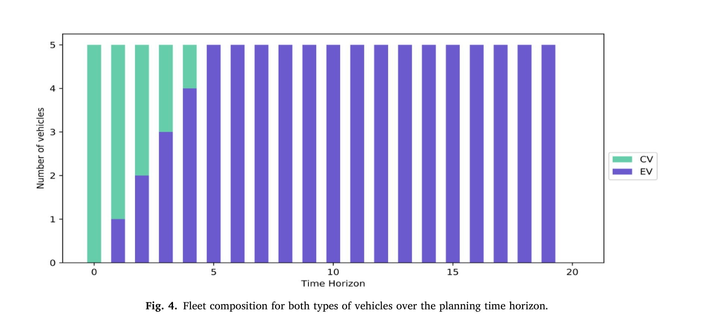

- 出处：Al-dal’ain & Celebi（2021），*Sustainable Cities and Society*，Fig. 4 “Fleet composition for both types of vehicles over the planning time horizon”，7。
- 正文原句：“Fig. 4 illustrates the fleet compositions over the planning time horizon of each type of vehicle in each year.”
- 所在节：§4.2 “Results and discussion”。
- 结构：横轴“Time Horizon”，纵轴“Number of vehicles”；约20根堆叠柱，CV、EV共2个柱段系列；1个面板。

### 李英等（2020）图4

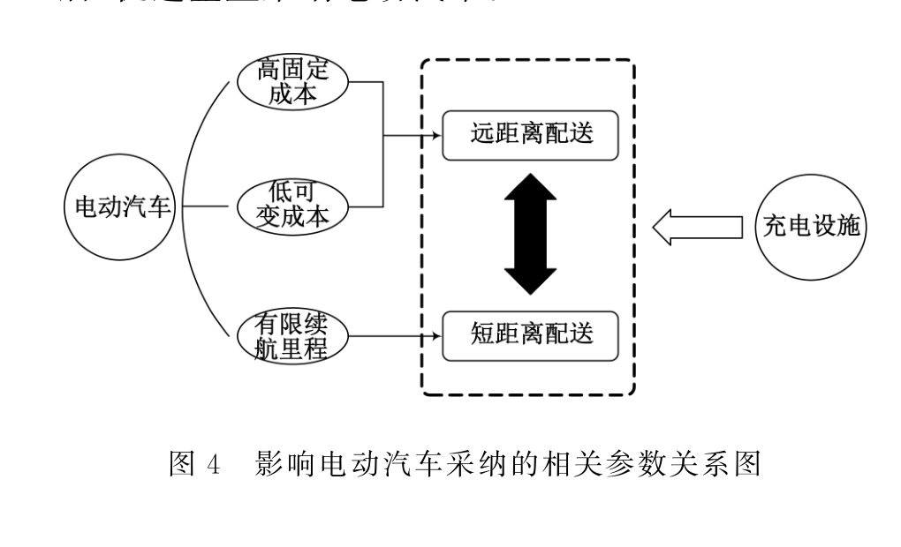

- 出处：李英等（2020），《系统管理学报》，图4“影响电动汽车采纳的相关参数关系图”，8／529。
- 正文原句：“基于上述分析结果，可以得到如图4所示的关系图。”
- 所在节：§3.2“不同参数设定下的路径结果”。
- 结构：无横纵轴；1幅关系图；电动汽车、高固定成本、低可变成本、有限续航、远／短距离配送、充电设施等节点及箭头，无曲线或柱。

## 不同速度函数对比分析

### 陈雨蝶等（2025）图3

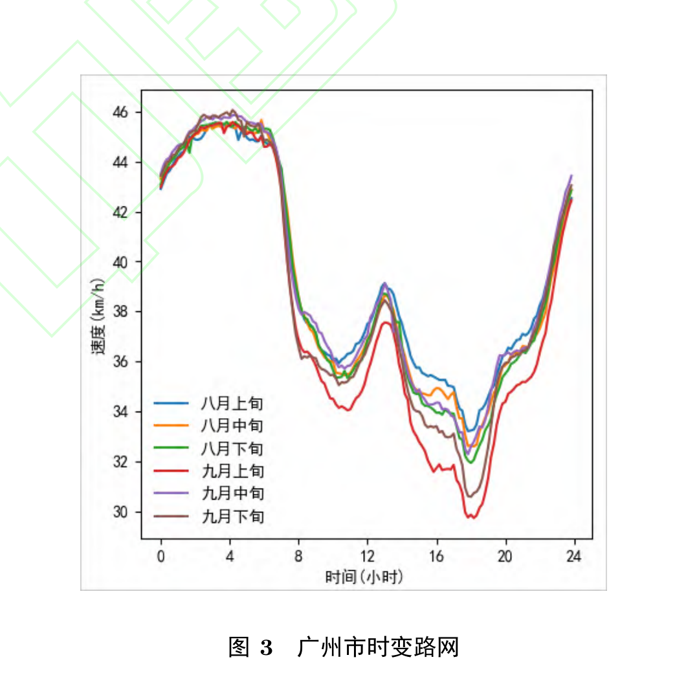

- 出处：陈雨蝶等（2025），《系统工程理论与实践》，图3“广州市时变路网”，12／11。
- 正文原句：“删除前5%和后5%的极端数据及缺失数据，将剩余数据分为六个时段分别绘制速度函数图像，如图3所示。”
- 所在节：§4.1.1“实验设计”。
- 结构：横轴“时间（小时）”，纵轴“速度（km/h）”；六个日期组共6条曲线；1个面板。

### 陈雨蝶等（2025）图6

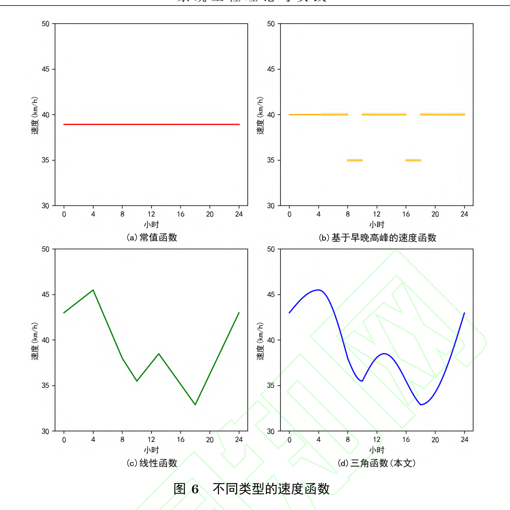

- 出处：陈雨蝶等（2025），《系统工程理论与实践》，图6“不同类型的速度函数”，19／18。
- 正文原句：“图6是VRP常见的四种速度函数，其中常值函数中速度恒为38.93 km/h（本文三角函数的平均速度）。”
- 所在节：§4.6“不同速度函数对比分析”。
- 结构：2×2共4个子图；横轴“小时”，纵轴“速度（km/h）”；常值、离散分段、线性、三角函数每图1条曲线。

### 陈雨蝶等（2025）表10

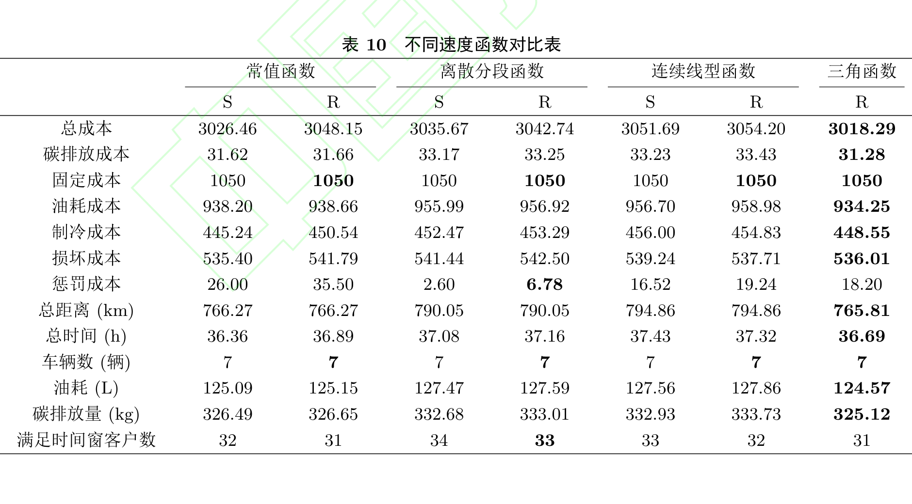

- 出处：陈雨蝶等（2025），《系统工程理论与实践》，表10“不同速度函数对比表”，19／18。
- 正文原句：“本小节求出这三种速度函数下的最终路径，将路径代入到对应的速度函数求出其各项指标，即S列。再将路径带入到本文模型中，计算该路径实际的各项指标，即R列，结果如表10所示。”
- 所在节：§4.6“不同速度函数对比分析”。
- 结构：13项路径及成本指标为行；列按三种速度函数分别给S、R值；无合计行、无变化率列。

### Wang et al.（2024）Fig. 13

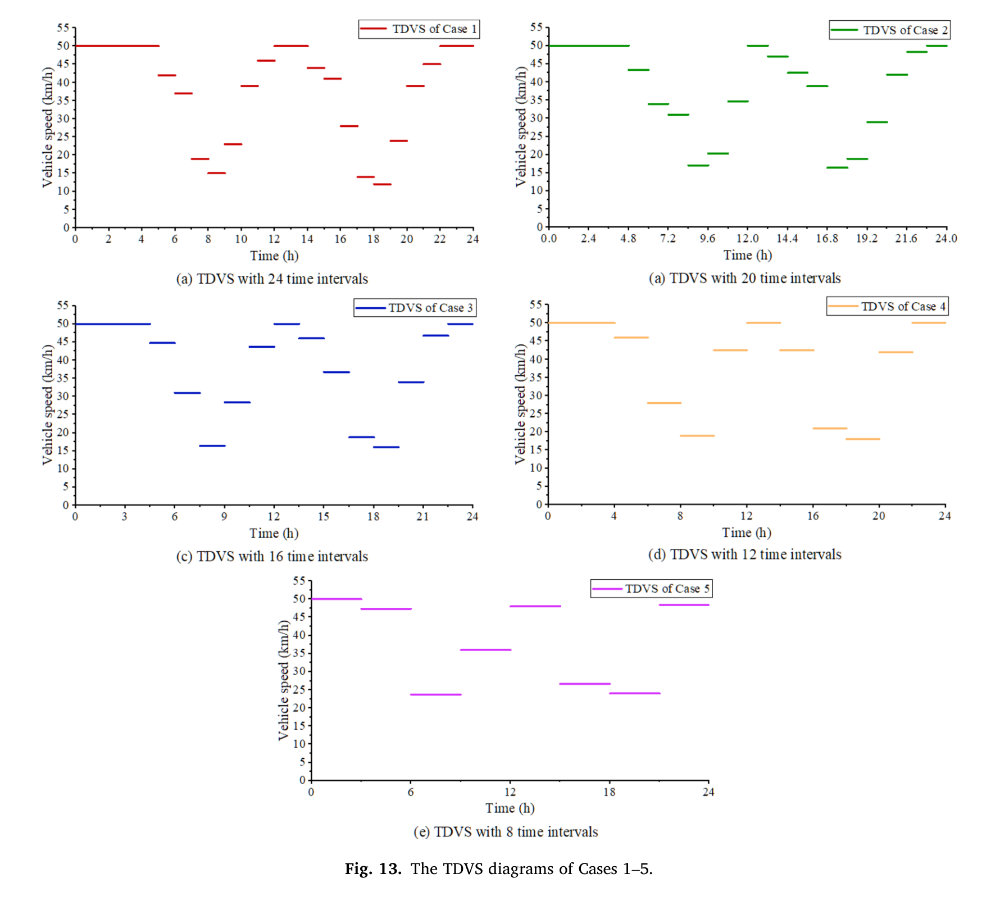

- 出处：Wang et al.（2024），*Transportation Research Part E*，Fig. 13 “The TDVS diagrams of Cases 1–5”，32。
- 正文原句：“The TDVS diagrams of each case are shown in Fig. 13.”
- 所在节：§5.4.1 “Impact of the time interval number”。
- 结构：5个子图；横轴“Time (h)”，纵轴“Vehicle speed (km/h)”；分别以24、20、16、12、8个离散区间画1组水平线段。

### 侯登凯（2022；Zotero标2023）表3.7

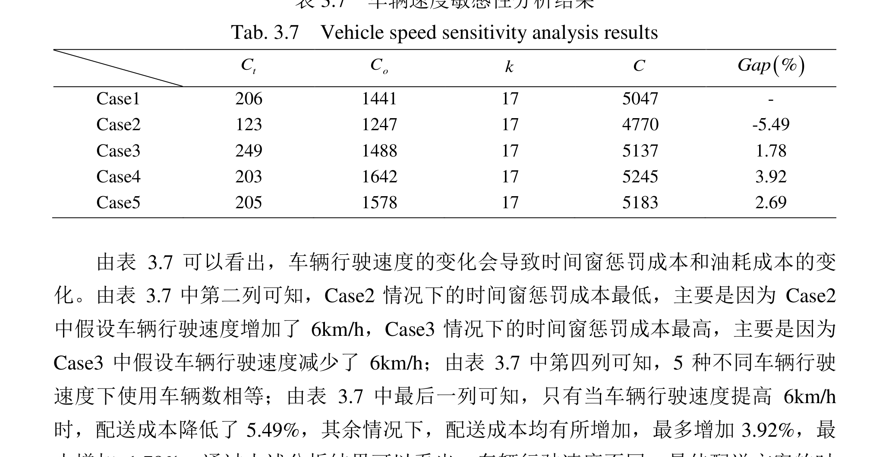

- 出处：侯登凯（2022；Zotero标2023），大连海事大学工学博士学位论文，表3.7“车辆速度敏感性分析结果”，61／46。
- 正文原句：“表3.7给出了不同车辆行驶速度下所求出的最优解。”
- 所在节：§3.4.4“敏感性分析”。
- 结构：5种车辆速度为行；列为速度、时间窗惩罚成本C_t、油耗成本C_o、车辆数k、总成本C和Gap；无合计行，有Gap列。

## 不同决策目标对比分析

### 陈雨蝶等（2025）表8

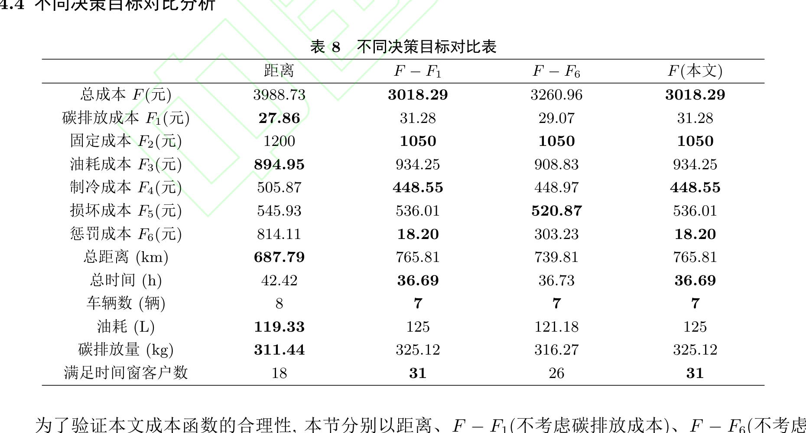

- 出处：陈雨蝶等（2025），《系统工程理论与实践》，表8“不同决策目标对比表”，16／15。
- 正文原句：“为了验证本文成本函数的合理性，本节分别以距离、F−F1（不考虑碳排放成本）、F−F6（不考虑惩罚成本）、F（本文）为目标求解最终路线，然后将最终路线带入到本文模型中求解实际总成本，结果如表8所示。”
- 所在节：§4.4“不同决策目标对比分析”。
- 结构：路径、成本分项、距离、时间、服务等指标为行；列为4个决策目标；无合计行、无变化率列。

## 分摊成本偏差结果

### Wang et al.（2023）Table 20

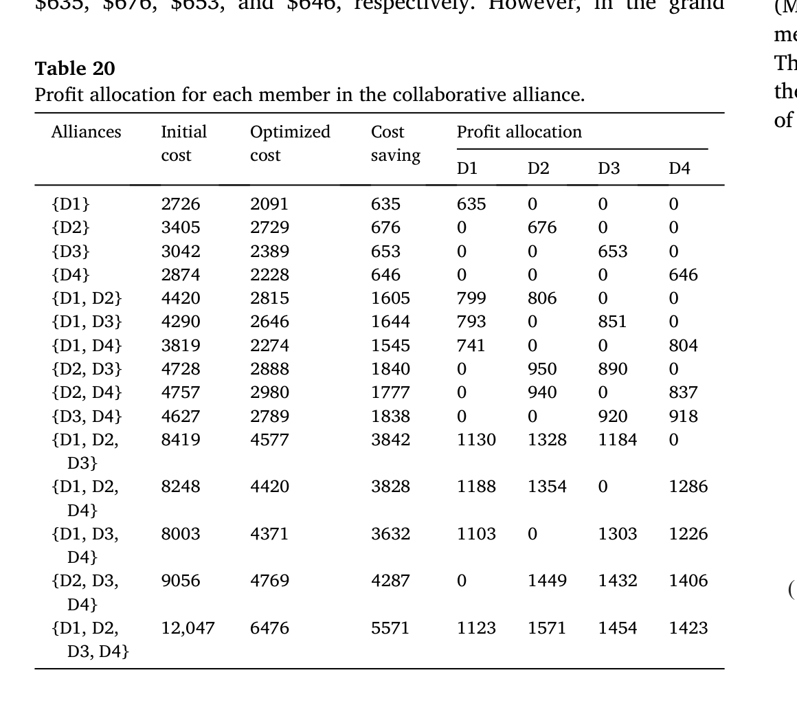

- 出处：Wang et al.（2023），*Expert Systems with Applications*，Table 20 “Profit allocation for each member in the collaborative alliance”，22。
- 正文原句：“Table 20 shows the profit allocation to each participant as the alliance is formed on the basis of the Shapley value model.”
- 所在节：§6.3.3 “Profit allocation results”。
- 结构：15个子联盟为行；列为联盟、成本／节约及D1～D4的分配组成；含全联盟行但不是合计行，无变化率列。

### Wang et al.（2023）Table 21

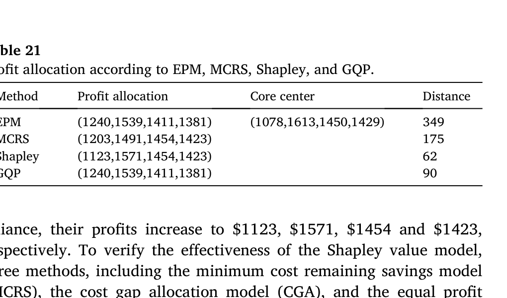

- 出处：Wang et al.（2023），*Expert Systems with Applications*，Table 21 “Profit allocation according to EPM, MCRS, Shapley, and GQP”，22。
- 正文原句：“In Table 21 and Fig. 16, the numbers in parentheses represent the profit allocation results for D1, D2, D3, and D4, respectively.”
- 所在节：§6.3.3 “Profit allocation results”。
- 结构：4种分配方法为行；列为方法及D1～D4分配结果；无合计行、无变化率列。

### 饶卫振等（2022）表8

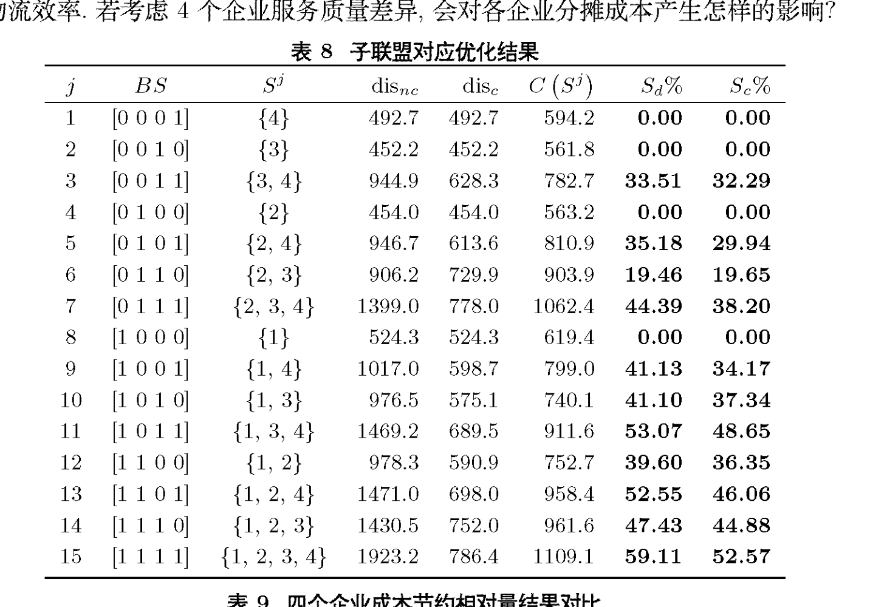

- 出处：饶卫振等（2022），《系统工程理论与实践》，表8“子联盟对应优化结果”，12／2732。
- 正文原句：“单位配送费用及车辆固定成本求得各子联盟配送成本C(S)，计算配送距离及成本节约百分比，求解结果如表8所示。”
- 所在节：§5.2“依据企业服务质量差异调整成本分摊值”。
- 结构：15个子联盟为行；列为联盟、协作前后配送距离／成本及距离、成本节约百分比；无合计行，有S_d%、S_c%变化率列。

### 饶卫振等（2022）表9

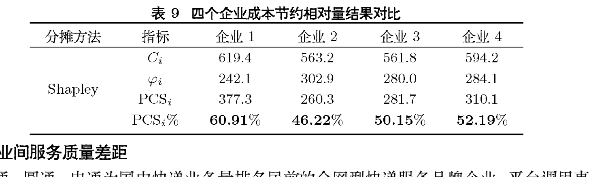

- 出处：饶卫振等（2022），《系统工程理论与实践》，表9“四个企业成本节约相对量结果对比”，12／2732。
- 正文原句：“运用Excel工具和Shapley值法，计算4个企业分摊成本及节约量，如表9所示。”
- 所在节：§5.2“依据企业服务质量差异调整成本分摊值”。
- 结构：4个企业为行；列为单独成本、边际贡献、分摊成本、节约量和PCS_i%；无合计行，有百分比列。

### 饶卫振等（2022）表13

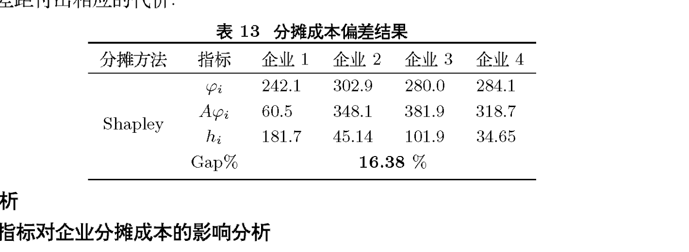

- 出处：饶卫振等（2022），《系统工程理论与实践》，表13“分摊成本偏差结果”，14／2734。
- 正文原句：“设惩罚成本系数μ=1，根据式（22）对2^n−2个子联盟成本进行调整得AC(S)，利用Shapley值法计算最终分摊值Aφ_i，借助式（25）计算与初始分摊值之间的偏差，结果如表13所示。”
- 所在节：§5.2.3“有无企业服务质量差异时的分摊成本偏差计算”。
- 结构：4个企业为行；列为初始／调整分摊值及偏差，另给总体Gap%；无合计行，有偏差百分比列。

## 未收录清单及原因

1. 指定调查中的“未找到”项没有用近似展品顶替：其中包括按时间槽展开的充电量／充电负荷图、外生时变参数与充电负荷同图、两个不同原生时间分辨率叠在同一面板的图。
2. 收敛图调查中明确记为“无”的论文没有强行收录机制示意图或算法结果表冒充收敛轨迹；本册只收入调查确认存在的陈婉茹图2、陈雨蝶图4、姜广田图8／14／18／19。
3. 陈婉茹等（2023）没有协同／共享模式的结果对比展品；图3、表9和图4按其原本的“求解结果”“车队动力配置”“碳交易机制”功能收录，没有改称协同对比。
4. Wang et al.（2025，joint distribution）的实验部分没有客户重分配表或最终路线图；Fig. 1／2只是问题描述概念图，已按原身份收录并注明路线条数无法唯一确定。
5. Shi et al.（2025）的协同结果没有结果表或路线图；只收录原文实际给出的Fig. 9／10。
6. Al-dal’ain & Celebi（2021）Fig. 3没有收录：图面是C problem／R problem客户点分布，题注却误印为与Fig. 4相同的车队构成题名；Fig. 4已正常收录。
7. Guan et al.（2026）Figure 7没有收录：既有调查记录其图题、可见坐标／图例及正文指代不一致，无法在不替作者纠错的情况下给出可靠条目。
8. Soriano et al.（2023）Fig. 1的单个子图物理宽高与密度“量不出”，但展品本身确实存在，所以保留整幅原图；没有人为切出五个不存在的物理边界。
9. 姜广田等（2024）图19的原图曲线颜色与图例对应存在调查所记的辨认风险；本册保留原图，不替作者改色或重绘。
10. 只有Zotero元数据而没有本地PDF、以及报告未核实图号／页码的题名均未收录；没有依据题名或摘要猜图。

## 文件与完整性记录

- 图片数：94张PNG。
- 图片生成方式：按PDF物理页直接渲染裁切；除徐小峰等（2021）表3因原表跨物理页9—10而按原顺序纵向拼接外，其余均为单页直接裁切。
- 受保护文件任务开始时SHA-256：`cost.py`=`525e91f7bd2cf7a4b6610ee1c8f662e8a4233c5daec800dcae5e5f21ac727989`；`check.py`=`1cdb6236a662eec7363dfdf99c0c0df287b32aeffbc7bd48572320696c0b1072`；`search/evaluation.py`=`c7215263c39d1d5a1429b41ca8ac40d950dbdf2bdc288337e56fbe9733406fc3`。
- 受保护文件任务结束时SHA-256：`cost.py`=`525e91f7bd2cf7a4b6610ee1c8f662e8a4233c5daec800dcae5e5f21ac727989`；`check.py`=`1cdb6236a662eec7363dfdf99c0c0df287b32aeffbc7bd48572320696c0b1072`；`search/evaluation.py`=`c7215263c39d1d5a1429b41ca8ac40d950dbdf2bdc288337e56fbe9733406fc3`。
