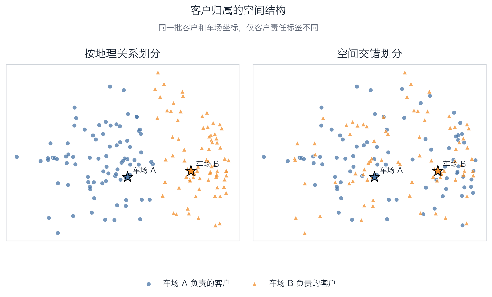
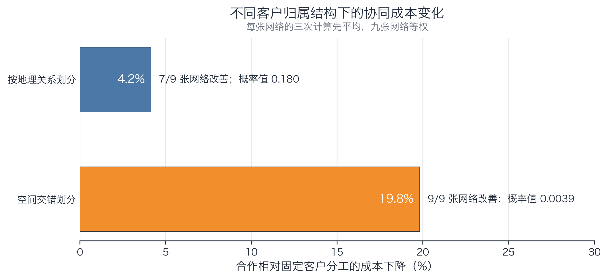
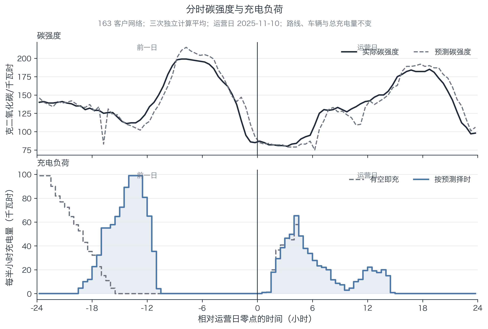

# 论文正文预览：空间组织、协同与充电时机

本预览展示当前可直接进入论文结果章的两个小节。所有数字来自已封存的九张配送网络和正式充电复算；三次独立计算先在每张网络内平均，不当成三个现实样本。尚未完成的公平与动态检验不在此预设结论。

## 4.2 客户归属的空间组织与协同价值

### 4.2.1 客户归属的地理组织

正式算例继承 Goeke 与 Schneider 的混合车队算例；该算例又建立在污染路径基准上，原始论文明确说明其节点代表英国城市[[1]](https://doi.org/10.1016/j.ejor.2015.01.049)[[7]](https://doi.org/10.1016/j.trb.2011.02.004)。本项目随后合并三班配送任务、增加第二车场并重新计算坐标间欧氏距离。从原始坐标逐网络复算的最大点间距离约为 169–248 公里，因此本文将其界定为“基于英国城市坐标构造的区域/城际配送场景”，而不解释成真实道路轨迹、真实企业订单或城市末端配送。

为分离客户责任的空间组织，本文在每张网络上保留完全相同的客户坐标、需求和时间窗，只改变客户由哪一家车场负责。图 1 左侧按客户与车场的地理关系划分责任；右侧在配送班次和需求档内保持两家车场的客户数量基本一致，但让客户责任在空间上交错。后者是一次锁死的合成强对照，可以表示历史业务关系与当前地理位置不一致的极端情形，但不是真实企业客户账本。该并列类别地图沿用 Soriano 等 Fig. 3 的展示思路[[2]](https://doi.org/10.1016/j.ijpe.2022.108669)。

**图 1　客户归属的空间结构**

表 1 先在每张网络内平均三次独立计算，再比较两类客户归属下的固定客户分工方案。按地理关系组织客户责任后，平均总成本下降 25.002%，总行驶距离下降 35.478%，燃油车直接排放下降 41.729%，用电量下降 23.869%；四项指标均在九张网络上同向。这个比较表明，地理组织本身已经提前获取了大量成本与能源效率，而不是等到开放合作后才第一次产生价值。表格采用王勇等“优化前后—运营指标”的三线表逻辑，但因为九张网络规模不同，本文报告可比的相对变化，不平均没有可比意义的绝对总量[[3]](https://xtglxb.sjtu.edu.cn/CN/10.3969/j.issn.1005-2542.2023.06.001)。

**表 1　客户归属方式与运营指标变化**

| 运营指标 | 按地理关系划分后的平均下降（%） | 改善网络 | 概率值 |
| --- | --- | --- | --- |
| 总成本 | 25.002 | 9/9 | 0.0039 |
| 总行驶距离 | 35.478 | 9/9 | 0.0039 |
| 燃油直接排放 | 41.729 | 9/9 | 0.0039 |
| 用电量 | 23.869 | 9/9 | 0.0039 |

注：正值表示按地理关系划分后下降。燃油直接排放与燃油消耗同方向；用电量不含电网时点差异，充电时间的作用在下一节单独计量。

### 4.2.2 协同的增量价值

在每一种客户归属结构下，两组方案都从逐字相同的各自经营排班出发，计算次数和约束完全相同；唯一差别是客户能否改由另一车场服务。图 2 只比较这一项权利带来的成本变化，不混入车辆、空档、公平或碳排放。

**图 2　不同客户归属结构下的协同成本变化**

按地理关系划分时，合作平均再降低成本 4.157%，九张网络中七张改善，双侧精确符号检验的概率值为 0.180，说明剩余收益存在但不稳定。客户责任在空间上交错时，合作平均降低成本 19.826%，九张网络全部改善，概率值为 0.0039。同一网络内，两类归属的协同价值平均相差 15.669 个百分点，九张网络方向完全一致。

这组结果支持的不是“合作具有固定收益率”，而是“地理组织先拿走容易获得的效率，合作主要修复仍然空间交错的客户责任”。Fernández、Roca-Riu 与 Speranza 已在协同配送算例中报告聚集客户通常留下较少协同节省，因此这一方向本身不是本文的首次发现[[4]](https://doi.org/10.1016/j.ejor.2017.08.051)。本文增加的证据是：在区域/城际尺度、油电混合车队和严格实体车多趟排班下，该差异仍然存在，并且可以拆到账目和能源上。

空间交错情境的成本改善主要来自里程费、燃油费和电费，分别贡献 11.907、6.798 和 1.247 个百分点；每趟固定费反而增加 0.126 个百分点。因而，合作不是靠稳定减少实体车辆赚钱，而是通过重新划分服务范围减少不必要行驶。实体车只在九张网络中的 2 张减少、4 张增加、3 张不变，正文不得写“合作省车”。

合作后趟间空档在空间交错情境下有 6 张网络缩短、3 张增加。结合相同客户服务下路程、成本和能源的下降，空档缩短可以描述为排班衔接更紧；但它单独既不能证明效率，也不能推出充电选择空间增加。后一问题由充电时机实验直接回答。

## 4.3 预测驱动的充电时机与排放

本节固定上一节的 108 份严格可执行配送方案，在 28 个拥有完整前一日和运营日数据的英国全国电网日上复算三种充电规则。正文比较“有空即充”和“按次日预测选择合法时刻”；路线、客户服务关系、实体车辆、每次充电电量和总电量全部不变。预测碳强度用于作出决定，实际估计碳强度用于结算排放。由于配送基准没有唯一电网分区身份，本文使用全国数据，不把地区平均冒充某个具体地区[[5]](https://www.neso.energy/data-portal/national-carbon-intensity-forecast/national_carbon_intensity_forecast_methodology)。

图 3 使用 163 客户网络、按地理关系划分且固定客户分工的方案。展示日不是按结果挑选，而是 28 个运营日中实际碳强度日内极差最接近中位数的 2025-11-10。图形沿用 Cheng 等 Fig. 6 的“碳强度—基线/低碳充电负荷”上下对照形式，并因首趟充电发生在前夜而把横轴扩展到连续两个自然日[[6]](https://arxiv.org/abs/2209.12373)。

**图 3　分时碳强度与充电负荷**

表 2 给出全部九张网络和 28 个电网日的正式结果。按预测择时使充电环节排放下降 4.664%–4.877%（按地理关系划分）和 3.888%–4.107%（空间交错）。但把燃油车直接排放放回分母后，运营总排放只下降 0.352%–0.523%。这两个百分比必须并列出现：前者说明充电环节确有可利用的时间弹性，后者说明它在整个油电混合配送系统中只是补充性收益。

**表 2　充电时机与运营排放变化**

| 客户归属方式 | 经营方式 | 充电排放下降（%） | 运营总排放下降（%） |
| --- | --- | --- | --- |
| 按地理关系划分 | 固定客户分工 | 4.664 | 0.518 |
| 按地理关系划分 | 允许跨车场重分工 | 4.877 | 0.523 |
| 空间交错划分 | 固定客户分工 | 3.888 | 0.352 |
| 空间交错划分 | 允许跨车场重分工 | 4.107 | 0.476 |

四种情境均在九张网络上取得聚合改善，但只在 28 个电网日中的 18–20 天改善，日中位数仅约 0.10%–0.25%。净节省的 95.5%–99.7% 来自前夜首趟充电，当天两趟之间的调整很小。这说明当前严格排班下，最现实的时间杠杆不是在紧凑的日间行程中频繁“搬动充电”，而是利用出车前夜的较长窗口。

Cheng 等在真实充电站数据上报告过 3.81% 的平均充电排放改善，因此“约 4%”这个量级本身也不能作为原创主张[[6]](https://arxiv.org/abs/2209.12373)。本文更可辩护的贡献是：在同一批严格可执行的区域/城际配送排班上，同时量出预测决策、实际结算、运营总排放份量和前夜/趟间来源，并发现合作没有稳定放大这一时间收益。

按地理关系划分时，允许跨车场重分工相对固定归属的充电择时收益只多 0.251 个百分点，九张网络中六张同向；空间交错时平均多 0.514 个百分点，九张网络同向，但只有 28 个电网日中的 16 天同向。运营场景和电网日没有共同给出稳定方向，因此正文写“未发现合作稳定放大或削弱充电择时收益”，不写“合作释放充电空档”。

## 4.4 尚未由当前证据回答的问题

上一小节已回答系统价值如何产生，本小节已回答固定配送方案后充电时间还能减少多少排放。双方是否都愿意接受这些方案，需要公平检验量出参与要求的代价；订单变化后收益还能剩多少，需要动态检验继承已经执行的车辆、时间和电量状态。两项均未完成，当前正文不提前写方向，也暂不强行决定公平内容是否并入协同价值章节。

## 附表 A1　逐网络协同成本变化

| 实际客户数 | 按地理关系划分（%） | 空间交错划分（%） | 空间交错多出的协同价值（百分点） | 按地理关系划分的改善次数（3 次） | 空间交错划分的改善次数（3 次） |
| --- | --- | --- | --- | --- | --- |
| 22 | 9.2 | 20.355 | 11.155 | 3/3 | 3/3 |
| 34 | -1.571 | 25.556 | 27.128 | 1/3 | 3/3 |
| 45 | 8.716 | 27.441 | 18.724 | 3/3 | 3/3 |
| 55 | 6.248 | 28.655 | 22.406 | 3/3 | 3/3 |
| 114 | 8.024 | 28.514 | 20.489 | 3/3 | 3/3 |
| 163 | 7.683 | 12.798 | 5.115 | 2/3 | 3/3 |
| 221 | 3.855 | 16.205 | 12.351 | 2/3 | 3/3 |
| 322 | -5.418 | 9.797 | 15.215 | 1/3 | 3/3 |
| 449 | 0.674 | 9.114 | 8.44 | 3/3 | 3/3 |

注：客户数只标识网络规模，不是连续处理变量，因此不得连成规模趋势线。

## 附表 A2　协同成本变化构成

| 成本账目 | 按地理关系划分（百分点） | 空间交错划分（百分点） |
| --- | --- | --- |
| 每趟固定费 | 2.309 | -0.126 |
| 里程费 | 1.561 | 11.907 |
| 燃油费 | -0.394 | 6.798 |
| 电费 | 0.680 | 1.247 |
| 总成本 | 4.157 | 19.826 |

注：正值表示该账目帮助降低总成本，负值表示该账目反而增加成本。按地理关系划分情境的燃油费贡献为负值，必须原样保留。

## 附表 A3　充电时机的逐日变化

| 电网日 | 按地理划分·固定归属（%） | 按地理划分·跨场重分工（%） | 空间交错·固定归属（%） | 空间交错·跨场重分工（%） |
| --- | --- | --- | --- | --- |
| 2025-11-02 | 0.591 | 0.643 | 0.078 | 0.323 |
| 2025-11-03 | -0.656 | -0.614 | -0.467 | -0.472 |
| 2025-11-04 | 0.163 | 0.386 | 1.623 | 1.033 |
| 2025-11-05 | -0.037 | 0.062 | -0.030 | 0.054 |
| 2025-11-06 | 0.221 | 0.291 | 0.012 | 0.222 |
| 2025-11-07 | 0.027 | 0.016 | 0.106 | 0.004 |
| 2025-11-08 | -1.347 | -1.173 | -0.831 | -0.793 |
| 2025-11-09 | -0.123 | -0.174 | -0.321 | -0.202 |
| 2025-11-10 | 7.234 | 7.129 | 3.251 | 4.911 |
| 2025-11-11 | -0.391 | -0.557 | 0.847 | -0.274 |
| 2025-11-12 | 26.736 | 27.468 | 24.074 | 24.425 |
| 2025-11-13 | -0.009 | -0.005 | -0.001 | -0.015 |
| 2025-11-14 | 0.503 | 0.569 | 0.018 | 0.538 |
| 2025-11-15 | -1.790 | -1.726 | -0.177 | -0.934 |
| 2025-11-16 | 0.345 | 0.548 | -0.289 | 0.371 |
| 2025-11-17 | 0.978 | 1.093 | 0.002 | 0.925 |
| 2025-11-18 | -0.539 | -0.559 | 0.163 | -0.225 |
| 2025-11-19 | 1.704 | 2.380 | 1.366 | 2.638 |
| 2025-11-20 | -0.317 | -0.337 | 0.033 | -0.219 |
| 2025-11-21 | 0.305 | 0.140 | 0.890 | 0.012 |
| 2025-11-22 | 21.404 | 21.809 | 18.225 | 19.409 |
| 2025-11-23 | 0.251 | 0.209 | 0.091 | 0.215 |
| 2025-11-24 | 14.353 | 14.937 | 8.920 | 11.326 |
| 2025-11-25 | -0.039 | -0.028 | -0.002 | -0.049 |
| 2025-11-26 | 0.226 | 0.141 | 0.898 | 0.000 |
| 2025-11-27 | 27.235 | 27.609 | 22.877 | 24.665 |
| 2025-11-28 | 0.678 | 0.672 | 0.160 | 0.349 |
| 2025-11-29 | 8.486 | 8.376 | 5.519 | 6.457 |

注：负值表示该日按预测择时后按实际碳强度结算反而增加充电排放；28 天全部报告。

## References

[1] Goeke, D., & Schneider, M. (2015). Routing a mixed fleet of electric and conventional vehicles. *European Journal of Operational Research*, 245(1), 81–99. https://doi.org/10.1016/j.ejor.2015.01.049

[2] Soriano, A., Gansterer, M., & Hartl, R. F. (2023). The multi-depot vehicle routing problem with profit fairness. *International Journal of Production Economics*, 255, 108669. https://doi.org/10.1016/j.ijpe.2022.108669

[3] 王勇, 李慧星, 罗思妤, 周景欣, 许茂增. (2023). 资源共享模式下多中心共同配送电动车辆路径优化问题. *系统管理学报*, 32(6), 1119–1141. https://doi.org/10.3969/j.issn.1005-2542.2023.06.001

[4] Fernández, E., Roca-Riu, M., & Speranza, M. G. (2018). The Shared Customer Collaboration Vehicle Routing Problem. *European Journal of Operational Research*, 265(3), 1078–1093. https://doi.org/10.1016/j.ejor.2017.08.051

[5] National Energy System Operator. (2025). National Carbon Intensity Forecast Methodology. https://www.neso.energy/data-portal/national-carbon-intensity-forecast/national_carbon_intensity_forecast_methodology

[6] Cheng, K.-W., Bian, Y., Shi, Y., & Chen, Y. (2022). Carbon-Aware EV Charging. *IEEE Electrical Power and Energy Conference*. https://arxiv.org/abs/2209.12373

[7] Bektaş, T., & Laporte, G. (2011). The Pollution-Routing Problem. *Transportation Research Part B: Methodological*, 45(8), 1232–1250. https://doi.org/10.1016/j.trb.2011.02.004
