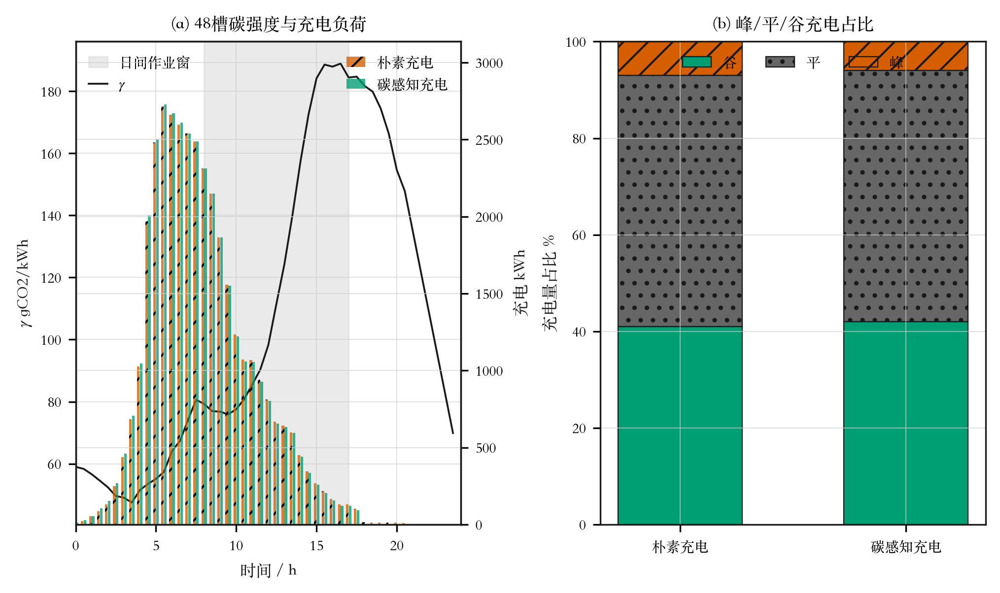
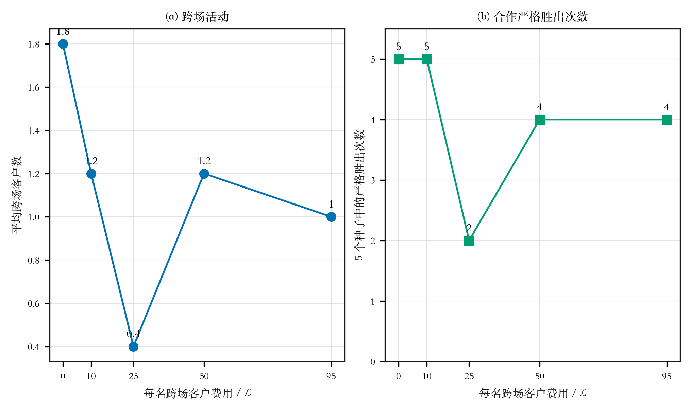

# E3 论文正文完整预览：严格排班下的协同、充电择时、公平与归属错配

本预览只使用封存的 E3 正式主线和两档新增错配证据。开发期旧实验只交代演进原因，不进入论文结果表。

## 1. 从第一份计划到正式主线，再到支线

| 阶段 | 当时要回答的问题 | 发生了什么 | 论文地位 |
|---|---|---|---|
| 第一份六层计划 | 逐层加入协同、电网碳核算、择时充电、碳交易和收益公平 | 早期 30 次结果只得到部分机制支持；随后严格排班审计发现旧路线不能按真实实体车连续多趟执行 | 开发史，不进正式数字 |
| 严格多趟重建 | 同一实体车一天可跑多趟，趟间时间、地点和电量必须接上 | 先过短门和 4 000 次模型门，再完成 70 次并按预注册规则自动扩至 100 次 | 正式主线 v11 |
| 正式主线 | 最近车场归属下，协同、低碳充电和公平是否真实生效 | 合作 6/10 严格胜出、平均节省 0.353%；充电择时仅 3/10 可移动；公平 10/10 满足 | 正文主结果 |
| 理想化支线 | 主线收益小是算法没找到，还是最近车场归属本来就没有错配可修 | 暖启动门没有打开零错配合作空间；随后预先锁死 25% 和 50% 历史归属错配表 | 条件性敏感分析 |

## 2. 实验设计

主线采用 200 规模标签算例（实际 449 个客户节点）作为旗舰场景，并以 100 规模标签算例（实际 221 个客户节点）作缩减规模复核。每次正式搜索均执行 4 000 次完整评价。六层设置如下。

| 层级 | 论文名称 | 相对上一层新增内容 | 200 规模种子数 |
|---|---|---|---|
| M0 | 独立经营基线 | 客户只能由原归属车场服务；不计电网充电间接排放 | 10 |
| M1 | 多车场协同 | 允许客户跨场服务 | 10 |
| M2 | 协同与平均电网碳核算 | 按日均电网碳强度计入充电间接排放 | 10 |
| M3 | 协同与时变低碳充电 | 使用 48 个时段碳强度并重排允许移动的充电 | 10 |
| M4 | 协同、时变碳与碳交易 | 加入线性碳交易成本 | 10 |
| M5 | 完整模型 | 从搜索阶段要求双方收益均不低于独立经营 | 10 |

## 3. 六层正式主线总结果

| 设置 | 总成本均值 ± 标准差 / £ | 相对上一层 | 总排放 / kg | 充电间接排放 / kg | 平均跨场客户 | 平均实体车 | 最低收益比 |
|---|---|---|---|---|---|---|---|
| 独立经营基线 | 12930.225 ± 148.872 | — | 4293.008 | 0.000 | 0.0 | 28.0 | — |
| 多车场协同 | 12845.209 ± 181.588 | -0.657% | 4022.365 | 0.000 | 2.5 | 28.0 | 0.9489 |
| 平均电网碳核算 | 12845.209 ± 181.588 | +0.000% | 4413.060 | 390.696 | 2.5 | 28.0 | 0.9489 |
| 时变低碳充电 | 12851.324 ± 170.192 | +0.048% | 4335.241 | 329.185 | 2.4 | 28.0 | 0.9863 |
| 碳交易 | 13092.354 ± 161.481 | +1.876% | 4333.848 | 344.950 | 2.6 | 27.9 | 0.9765 |
| 完整模型（含公平） | 12719.942 ± 294.918 | -2.845% | 4006.223 | 293.990 | 1.4 | 28.0 | 1.0034 |

表中的层间成本不要求单调：六层从各自合同下独立搜索，M0/M1 不计电网充电间接排放，M2 起才加入这本碳账；M4 加入碳交易成本，M5 又改变了可接受解范围。真正的协同、充电和公平结论分别使用下面的同种子或同路线证据。

## 4. 协同机制：能换客户，但最近车场归属下收益很小

| 种子 | 各自经营成本 / £ | 合作搜索成本 / £ | 节省率 | 真实换场客户 | 实体车变化 | 严格胜出 |
|---|---|---|---|---|---|---|
| 1 | 13043.77 | 13028.27 | +0.119% | 1 | 0 | 是 |
| 2 | 12679.34 | 12557.69 | +0.959% | 8 | 0 | 是 |
| 3 | 13041.95 | 13030.41 | +0.088% | 1 | 0 | 是 |
| 4 | 13035.88 | 12657.57 | +2.902% | 7 | 0 | 是 |
| 5 | 12993.36 | 13028.59 | -0.271% | 1 | 0 | 否 |
| 6 | 13042.22 | 13030.41 | +0.091% | 1 | 0 | 是 |
| 7 | 12765.11 | 13030.41 | -2.078% | 1 | 0 | 否 |
| 8 | 13023.60 | 12712.25 | +2.391% | 7 | 0 | 是 |
| 9 | 12714.72 | 12732.77 | -0.142% | 7 | 0 | 否 |
| 10 | 12962.30 | 13030.41 | -0.525% | 1 | 0 | 否 |

10 个种子中有 6/10 次同时满足“成本更低且确有客户换场”，平均节省 0.353%，单侧配对检验 p=0.348。因此只能写方向多数有利，不能写稳定显著。实体车变化全部为 0，不能写合作减少车辆。

成本来源如下。差额定义为“合作减去各自经营”；负数表示合作节省。

| 成本项目 | 平均差额 / £ | 含义 |
|---|---|---|
| 固定派遣 | +200.000 | 合作更贵 |
| 里程 | -133.065 | 合作更省 |
| 燃油 | -111.838 | 合作更省 |
| 电费 | -1.444 | 合作更省 |
| 充电占用 | +0.000 | 无差异 |
| 跨场费 | +0.000 | 无差异 |
| 碳交易 | +0.000 | 无差异 |
| 合计 | -46.347 | 合作平均少支出 46.347 £ |

合作平均多付 200 £ 的派遣固定成本，但平均少付 133.065 £ 里程成本和 111.838 £ 燃油成本，净节省 46.347 £。这说明主线的收益来自路线和燃油重组，不来自少用实体车。

## 5. 充电择时：方向正确，但严格排班留下的移动空间很少

**图 1  48 个时段的电网碳强度与充电负荷。** 图式沿用 Cheng 等（2022）图 6 的上下游逻辑：碳强度作为外生时序，比较立即充电与碳感知择时充电。两种方案固定相同路线和总充电量。

| 种子 | 总充电量 / kWh | 立即充电排放 / kg | 择时排放 / kg | 减少 / kg | 减少率 | 移动充电动作 |
|---|---|---|---|---|---|---|
| 1 | 3616.8 | 269.895 | 269.895 | 0.000 | 0.000% | 0 |
| 2 | 4093.7 | 357.437 | 338.838 | 18.598 | 5.203% | 1 |
| 3 | 3620.9 | 270.277 | 270.277 | 0.000 | 0.000% | 0 |
| 4 | 3827.0 | 315.287 | 315.247 | 0.040 | 0.013% | 2 |
| 5 | 3618.3 | 270.054 | 270.054 | 0.000 | 0.000% | 0 |
| 6 | 3620.9 | 270.277 | 270.277 | 0.000 | 0.000% | 0 |
| 7 | 3620.9 | 270.277 | 270.277 | 0.000 | 0.000% | 0 |
| 8 | 3852.9 | 314.440 | 311.037 | 3.403 | 1.082% | 1 |
| 9 | 3446.5 | 277.076 | 277.076 | 0.000 | 0.000% | 0 |
| 10 | 3620.9 | 270.277 | 270.277 | 0.000 | 0.000% | 0 |

只有 3/10 个种子存在可测的充电移动，合计移动 4 次充电动作；总计减少 22.041 kg，占立即充电排放的 0.764%。这说明方法方向正确，但严格排班已压缩大部分可移动空档。

## 6. 收益公平：约束确实在搜索中工作

| 种子 | 双方中较低收益比 | 因伤害一方而拒绝的候选 | 公平方案换场客户 | 公平搜索严格胜出 |
|---|---|---|---|---|
| 1 | 1.0056 | 2846 | 1 | 是 |
| 2 | 1.0134 | 1858 | 2 | 是 |
| 3 | 1.0060 | 2469 | 1 | 是 |
| 4 | 1.0119 | 2557 | 4 | 是 |
| 5 | 1.0061 | 2688 | 1 | 是 |
| 6 | 1.0062 | 2488 | 1 | 是 |
| 7 | 1.0054 | 2155 | 0 | 否 |
| 8 | 1.0071 | 2356 | 0 | 否 |
| 9 | 1.0208 | 2241 | 1 | 是 |
| 10 | 1.0034 | 2016 | 3 | 是 |

十个结果的最低收益比全部大于 1，搜索累计拒绝 23,674 个会使至少一方吃亏的候选。这证明公平规则不是事后检查。不过，公平搜索与不加公平搜索是两次随机搜索，二者成本差不能直接解释为精确的公平代价；公平代价曲线应由后续专门实验回答。

## 7. 跨场费用：活动水平有波动，不能声称单调下降

**图 2  跨场费用变化下的合作活动与严格胜出次数。** 采用普通响应曲线壳，只连接五个实际测量均值，不做平滑拟合。每个费率档包含五个固定种子。

| 跨场费 / £·客户⁻¹ | 平均换场客户 | 严格胜出 | 平均采用成本 / £ | 最低收益比 |
|---|---|---|---|---|
| 0 | 1.8 | 5/5 | 12818.06 | 1.0056 |
| 10 | 1.2 | 5/5 | 12853.24 | 1.0013 |
| 25 | 0.4 | 2/5 | 12897.72 | 1.0019 |
| 50 | 1.2 | 4/5 | 12859.17 | 1.0019 |
| 95 | 1.0 | 4/5 | 12877.77 | 1.0013 |

换场客户均值依次为 1.8、1.2、0.4、1.2、1.0，并不单调。样本量只有每档五个，论文应写“跨场活动随费用变化的实测响应”，不能写成费用越高换场必然越少。

## 8. 缩减规模复核

| 设置 | 平均总成本 / £ | 平均换场客户 | 平均实体车 | 严格胜出 |
|---|---|---|---|---|
| 各自经营 | 6414.954 | 0.0 | 14.0 | 0/5 |
| 允许合作 | 6379.166 | 2.8 | 14.0 | 1/5 |
| 合作并择低碳时段充电 | 6379.166 | 3.0 | 14.0 | 1/5 |
| 合作、择时充电且双方不吃亏 | 6274.808 | 1.8 | 14.0 | 3/5 |

100 规模复核仍能观察到换场和公平可行方案，但严格胜出次数不多，不能用小规模结果强化主线的稳定性主张。

## 9. 支线启动门：先排除“只换一个搜索起点就能救回来”

| 对照臂 | 最终成本 / £ | 跨场尝试 | 合法 | 采纳 |
|---|---|---|---|---|
| A_no_cross | 12988.081705061768 | 0 | 0 | 0 |
| B_cross | 13162.564061413286 | 368 | 0 | 0 |

两臂使用同一起点和同一 4 000 次预算。允许跨场的一侧虽然尝试了 368 次，但没有形成合法并被采纳的跨场方案，因此没有继续烧十个种子的暖启动正式批次。

## 10. 归属错配支线：车辆可行性结论成立，成本差需要保留预算边界

| 错配比例 | 归属表 | 严格胜出 | 相对独立测量起点平均成本差 | 范围 | 精确符号检验 p | 独立侧排班测量车辆 | 合作实际车辆 |
|---|---|---|---|---|---|---|---|
| 25% | 固定一张，共用十个种子 | 10/10 | 16.553% | 16.065%–19.000% | 0.001953 | 31 | 27–28 |
| 50% | 固定一张，共用十个种子 | 10/10 | 24.719% | 22.336%–27.237% | 0.001953 | 35 | 28 |

25% 和 50% 两档各只生成一张归属表，生成后锁死，十个种子全部报告。两档独立经营均无法在每场原有 7 辆油车加 7 辆电车内闭合，而合作始终受联合 14 辆油车加 14 辆电车上限约束。这一车辆可行性差异是直接证据。

成本差的比较条件并不完全对称：独立侧每个车场用 200 次评价构造排班测量起点，合作侧使用 4 000 次评价。因此 16.553% 和 24.719% 可以报告为相对独立测量起点的观察差异，但不能单独声称是同预算条件下完全由合作造成的净因果效应。

### 附表：错配支线逐种子结果

| 错配 | 种子 | 独立测量成本 / £ | 合作成本 / £ | 成本差 | 换场客户 | 合作车辆 | 双方不吃亏 |
|---|---|---|---|---|---|---|---|
| 25% | 1 | 15832.53 | 13286.01 | 16.084% | 108 | 28 | 是 |
| 25% | 2 | 15831.46 | 13288.17 | 16.065% | 108 | 28 | 是 |
| 25% | 3 | 15832.53 | 12824.40 | 19.000% | 110 | 28 | 是 |
| 25% | 4 | 15832.53 | 13288.17 | 16.070% | 108 | 28 | 是 |
| 25% | 5 | 15832.53 | 13286.34 | 16.082% | 108 | 28 | 是 |
| 25% | 6 | 15832.53 | 13288.17 | 16.070% | 108 | 28 | 是 |
| 25% | 7 | 15832.53 | 13288.17 | 16.070% | 108 | 28 | 是 |
| 25% | 8 | 15832.53 | 12991.61 | 17.944% | 108 | 27 | 是 |
| 25% | 9 | 15832.53 | 13288.17 | 16.070% | 108 | 28 | 是 |
| 25% | 10 | 15832.53 | 13288.17 | 16.070% | 108 | 28 | 是 |
| 50% | 1 | 17564.96 | 13287.34 | 24.353% | 218 | 28 | 是 |
| 50% | 2 | 17352.85 | 13289.17 | 23.418% | 218 | 28 | 是 |
| 50% | 3 | 17530.40 | 13289.17 | 24.194% | 218 | 28 | 是 |
| 50% | 4 | 17530.89 | 13045.87 | 25.584% | 218 | 28 | 是 |
| 50% | 5 | 17541.61 | 13043.05 | 25.645% | 218 | 28 | 是 |
| 50% | 6 | 17564.96 | 12780.71 | 27.237% | 218 | 28 | 是 |
| 50% | 7 | 17564.96 | 13289.17 | 24.343% | 218 | 28 | 是 |
| 50% | 8 | 17381.43 | 13119.37 | 24.521% | 219 | 28 | 是 |
| 50% | 9 | 17111.13 | 13289.17 | 22.336% | 218 | 28 | 是 |
| 50% | 10 | 17492.84 | 13021.19 | 25.563% | 216 | 28 | 是 |

## 11. 论文正文的最终论证

严格多趟排班下，最近车场归属已经消除了大部分可重分配空间，因此协同主线只表现出有限、统计上不稳定的成本改善，并未减少实体车辆。协同仍通过真实客户换场改变了里程、燃油和派遣成本构成；公平约束也在搜索阶段拒绝了大量伤害单方收益的候选。固定路线和总充电量后，碳感知择时充电从未增加排放，但只有少数种子具有可移动空档，说明运营排班会限制低碳充电潜力。

进一步的固定历史归属错配场景表明，当客户归属与空间位置不一致并使局部车场超过原有资产能力时，跨场服务能够恢复联合系统的可行性，并伴随较大的观察成本差。由此，E3 的核心贡献不是证明合作在任何条件下均产生大收益，而是识别合作价值的来源与边界：地理上已经合理的客户归属只留下有限重组收益，历史归属错配则为客户重新分配和车场容量互济打开空间。

## 12. 能写与不能写

| 可以写 | 不能写 |
|---|---|
| 最近车场归属下，合作 6/10 严格胜出，平均改善 0.353%，方向多数有利 | 合作稳定、显著或普遍有效 |
| 成本改善主要来自里程和燃油重组 | 合作减少了实体车辆（主线 0/10） |
| 同路线同电量下，择时充电合计减排 0.764% | E3 中择时充电稳定带来大幅减排 |
| 公平约束累计拒绝 23,674 个伤害一方的候选，10/10 最低收益比大于 1 | 两次随机搜索的成本差就是精确公平代价 |
| 固定错配表下，合作恢复了原车队内的排班可行性 | 16%–25% 是同预算纯合作因果效应，或可外推到所有企业 |
| 五个摩擦档如实呈现非单调响应 | 费用越高换场数理论上严格单调下降 |

## 13. 数据质量

| 检查项 | 结果 |
|---|---|
| 正式运行 | 100 行、100 个唯一任务 |
| 完整成本复算 | 100/100 通过 |
| 实体车排班证书 | 100/100 通过 |
| 同路线充电方案 | 60 对通过 |
| 阶段证据指纹 | 470 项一致 |
| 预算、参数、违规 | 全部跑满；22 kW、280 kWh 未漂移；零违规 |
| 封存保护 | E2 与 v11 原目录未改；支线只新增文件 |
